#### 安全模式

- 什么时候进入安全模式：
  
      -   当HDFS集群中的部分datnode节点宕机之后，HDFS后台会启动一些服务，做自我恢复
  
  - 当丢失的数据块的比例超过一定数据（0.1%）的时候就会自动的进入安全模式
  - 某个文件的某个数据块的副本丢失了以后，相当于文件损坏。

```shell
hdfs dfsadmin -safemode leave //强制那么node退出安全模式
hdfs dfsadmin -safemode enter //进入安全模式
hdfs dfsadmin -safemode get  //查看安全模式的状态
hdfs dfsadmin -safemode wait //等待  
```

        在HDFS启动的过程中，datanode会一个启动并汇报，数据完整的比例在提高
        当识别到整个集群的数据99.9%，会自动退出安全模式

- 什么时候推出安全模式
  - 找出问题所在，进行修复
  - 手动强制退出安全模式
    ```hdfs dfsadmin -safemode leave``` //强制那么node退出安全模式

### 副本存储策略

1、任意一个节点上面不可能存储两个一样的副本块

2、如果我们要存储完整的三个副本块，必须至少需要3个节点

副本存放策略：
    1、第一个副本块选取和客户端相同的节点上
    2、第二个副本块选取跟第一个存储节点相邻机架的任意一个节点
    3、第三个副本存储在和第二个副本块所在的机架不同的节点上

### HDFS的读写流程

##### HDFS的原理概述：

1. HDFS集群有三个角色：**NameNode**、**DataNode**、**SecondNameNode**
2. **NameNode**负责管理整个文件系统的元数据，并且负责响应客户端的请求
3. **Datanode**负责管理用户的文件数据块，并且通过**心跳**机制汇报给NameNode
   文件会按照固定的大小（blocksize）切成块分布式存储在DataNode节点上
4. 每一个数据块都有多个副本，并存放在不同的DataNode节点上
5. DataNode会定期向NameNode虎豹自身所保存的文件的block块的信息
6. HDFS的内部工作机制对客户端保持透明，客户端请求方面HDFS时候都是向**NameNode**申请。

##### 上传

1、客户端向namenode请求上传文件
2、NameNode检查权限并做出响应
3、客户端拿到namenode的响应之后，请求上传第一个block块，并请求namenode返回可用的datanode列表
4、namenode依据客户端的请求返回可用的datanode列表
5、客户端请求与datanode列表建立数据传输管道，进行数据传输
6、datanode依次返回响应，正式建立起来了数据传输管道
7、客户端以package为单位进行数据的传输，知道讲第一个block块传输完毕
8、其他的块以此类推。

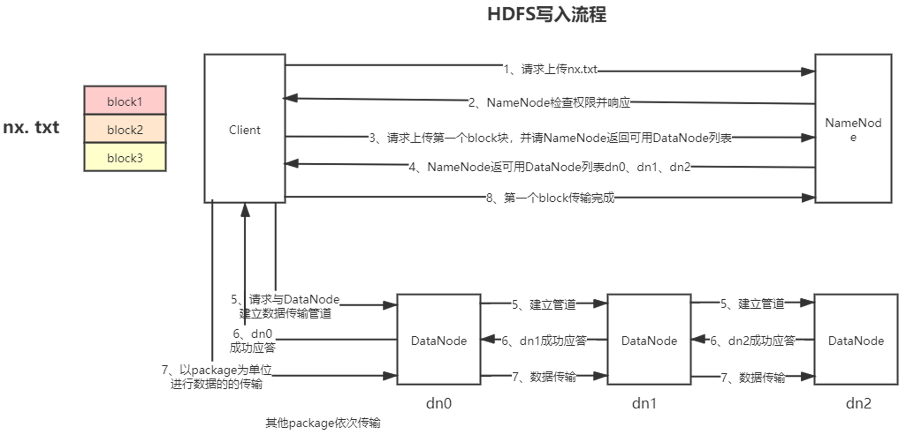

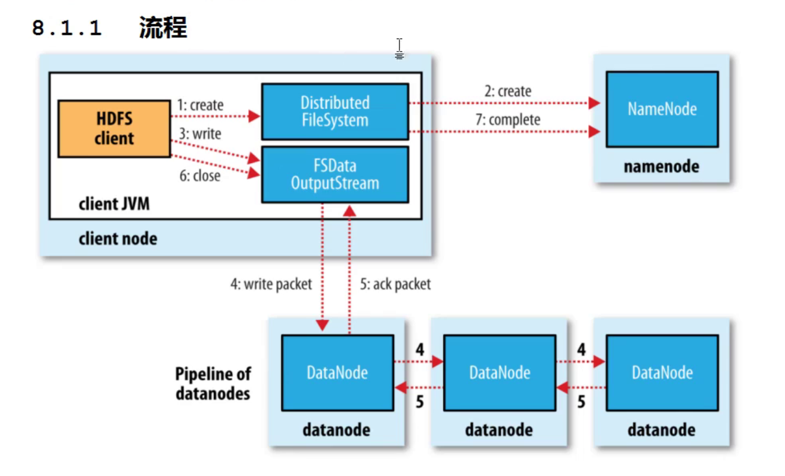


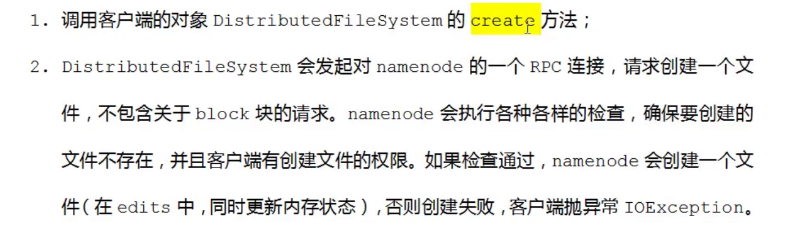

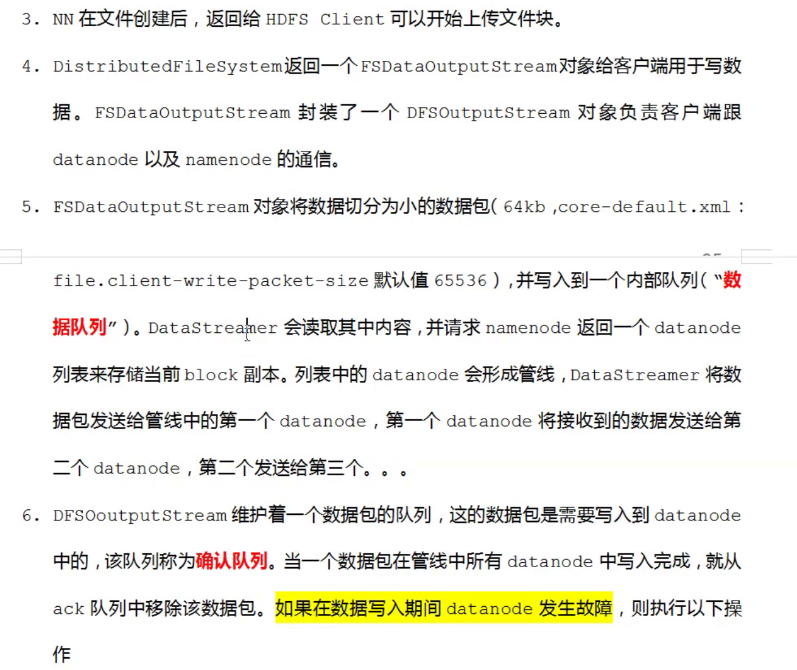

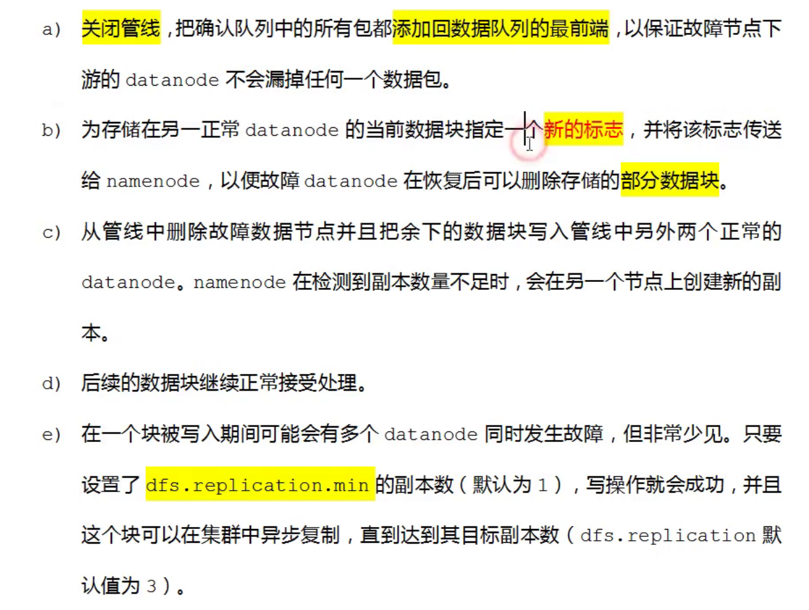

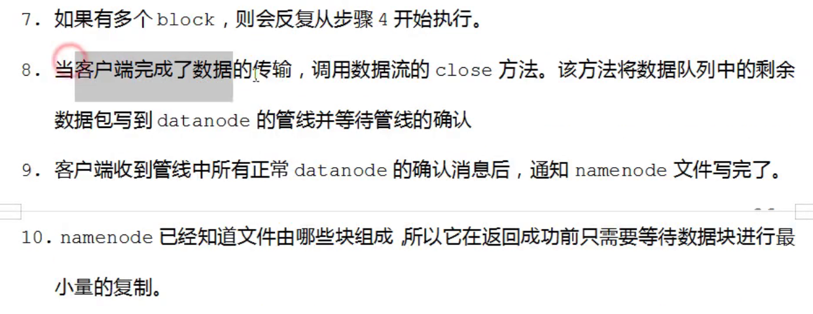


##### 下载

1、客户端向NameNode请求下载文件nx.txt 
2、NameNode返回目标文件的元数据信息
            {blk1:dn1 blk2:dn2 blk3:dn1}
3、客户端和每一个block块所在的主机建立连接
4、以package为单位进行数据的读取
5、读取完毕之后，将block块合并成完整的文件。

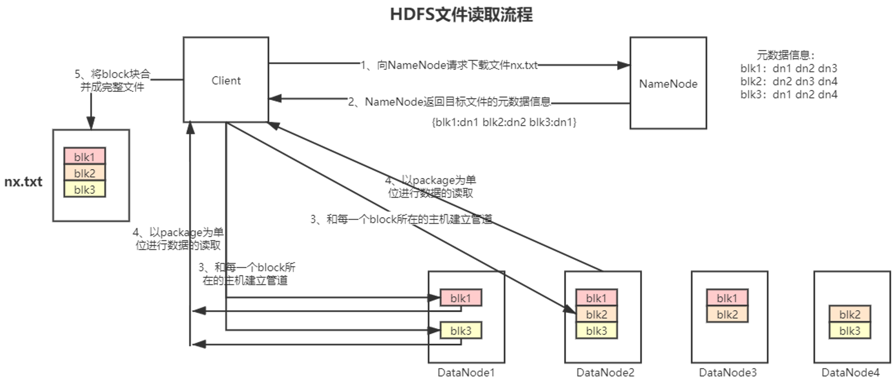

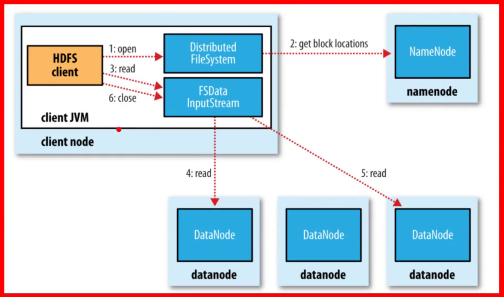

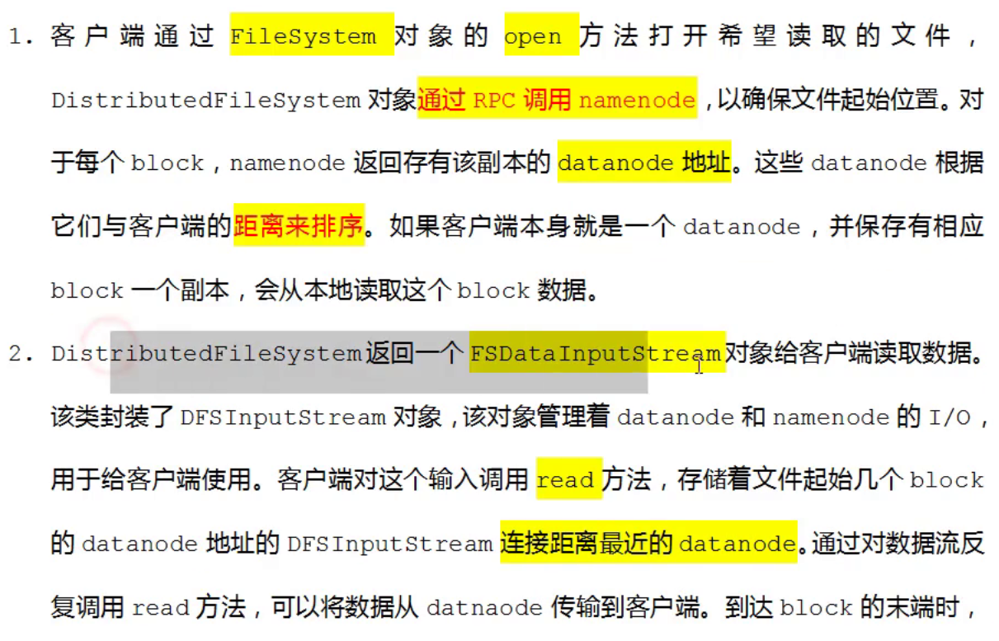

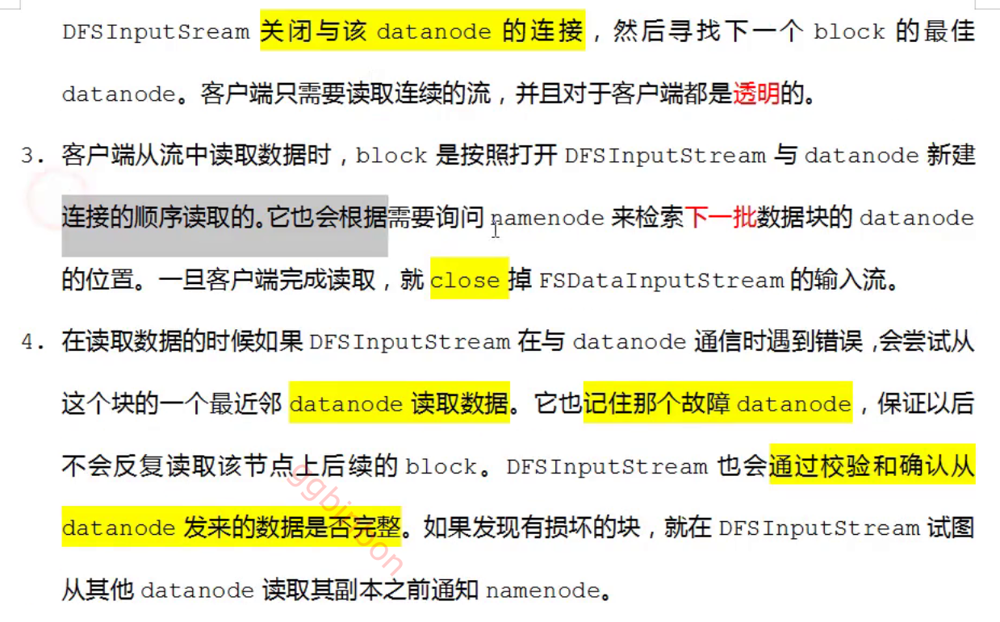


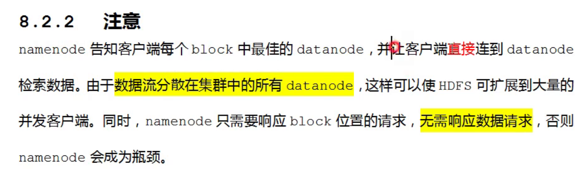


### 三大组件

##### NameNode

1、维护元数据信息
2、响应客户端的读写请求

**机制**：WAL write ahead log 预写日志系统，如果一个存储系统实现了WAL，所有的事务操作肯定会被记录日志

在客户端进行每一次事务操作的时候，先记录日志，然后再真正的执行事务操作

元数据信息以下几个部分：

- 目录树结构：文件地址目录信息
- 文件块映射：文件切分成哪几个块
- 数据块和datanode的映射：当前块属于那些原始文件

在磁盘当中也存有一份：
    **fsimage + edits + edits_inprogress**
目录树结构：文件地址目录信息
文件块映射：文件切分成哪几个块

预写日志（WAL）：把最新的事务操作都做日志记录，就是把当前的事务操作信息记录在磁盘的日志文件中
磁盘的日志文件：**edits_inprogress_0000000000000000274**

fsimage_0000 + edits ====> 新的镜像文件
meta_0000（内存文件） + edits =====》新的镜像文件

元数据合并：checkpoint 检查点

1、Version
    最开始初始化的时候生成的版本信息文件

```
集群启动的时间
#Wed Jul 15 20:38:48 CST 2020
文件系统的唯一的标识符
namespaceID=1627567114

集群唯一标识符
clusterID=CID-292fc31f-141c-4fb7-8437-4d822057948a
fsimage创建的时间，初始的时候是0，更新
cTime=0
节点类型
storageType=NAME_NODE
数据块池的id
blockpoolID=BP-1975095161-192.168.22.128-1594812783322
hdfs持久化数据架构的版本号
layoutVersion=-63
```

2、seen_txid
    存放事务的id，format之后是0

3、edits文件信息

```
hdfs oev -i edits_0000000000000000272-0000000000000000273 -o edits.xml
cat edits.xml
```

4、fsimage

```
hdfs oiv -i fsimage_0000000000000000139 -p XML -o fsimage.xml
cat fsimage.xml
```

##### DataNode

- datanode的职责：
  
      1、维护NameNode分配给他的数据块
      2、通过心跳机制汇报自身所有的block块的信息，发送给namenode
      3、真正为客户端读写数据提供辅助的。

- 讲datanode的工作机制其实就是带领大家看datanode是如何管理数据块的？

- 数据块有两个最重要的参数：
  
  - 块的大小
  - 副本的个数

- 把数据存储到HDFS的时候就要考虑清楚，到底采用多大的块存储

- **datanode的上线和下线：**
  举个例子：
  
      HDFS集群有500个节点，现在增加10个节点
      HDFS会如何表现？
      1、新加的datanode节点启动之后，就会按照配置文件去寻找对应的HDFS集群的namenode进行汇报
  
  ​     2、新上线的datanode，没有任何的数据块，只有自身的状态信息
  
  ​     3、原来的datanode和现在新加入的datanode之间存在数据倾斜的问题，做负载均衡

- 负载均衡：
  
      1、服务器之间的负载均衡
      2、磁盘之间的负载均衡
      比如说：
      假如一个节点有4块磁盘，每块大小2t
  
  ​    如果说存储1t的数据，这1t的数据就存储在第一个磁盘中，其他三个磁盘都没有利用到
  ​     磁盘之间要进行负载均衡
  
  HDFS集群有500个节点，现在减少10个节点
  
      相当于宕机了10个节点，这10个节点上面的数据是不是都丢失了。
      HDFS集群会利用自身的恢复机制恢复原来的数据块的副本的个数。

##### SecondaryNameNode

SecondNameNode工作机制：

- ​    分担namenode**合并元数据**的压力
- ​    配置SecondNameNodede的时候不要和namenode放到一个节点上面去。

##### 高可用与联邦

**高可用**

- 分布式集群中，只有一个namenode
- 集群对外提供服务，首先要保证namenode要启动起来。
- 集群中有多个datanode节点，损失其中较少的一部分节点不影响整个集群的运行
- NameNode不能断掉，在企业当中24小时提供服务。    要保证NameNode实时提供服务，就可以使用一套机制

主备架构

1. 监控所有namenode状态
2. 选举算法--zookeeper
3. 元数据信息时刻保持一致

zookeeper作用

1. 监控namenode的状态
2. 自生选举算法
3. 节点主备快速切换
4. 提供类似于共享存储的方案

联邦集群==当中使用多个active的节点联合管理元数据，解决内存受限问题

1. HDFS集群扩展性
   - 多个Namenode分管一部分的目录，一个集群可拓展到更多的节点
2. 性能更高效
   - 多个namnode管理不同的数据，并且同时对外提供服务，为客户提供更高的读写效率
3. 良好的隔离性
   - 用户可以根据自己的需要将不同的业务数据交给不同的NameNode节点管理，这样不同的业务之间影响很小

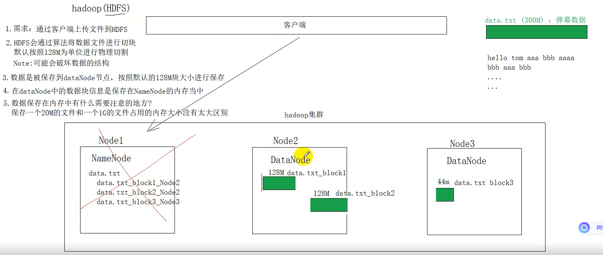
