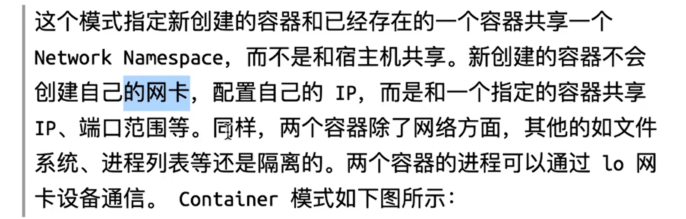

### 查看你当前的内核版本

- uname -r

### 安装 Docker

```yum -y install docker```
yum -y install docker

```
```ag-0ag-0-1h93qqphg-1h93qag-1-1h93qqphgqphgag-1-1h93qqphg
### 启动 Docker 后台服务

```service docker start```
```

### 测试运行 hello-world,由于本地没有hello-world这个镜像，所以会下载一个hello-world的镜像，并在容器内运行。

```
docker run hello-world```
docker run hello-world
docker load < /tmp/....tar.gz
docker rmi -f name
docker save busybox > /tmp
docker tag

docker logs image_id
docker start uuid
docker stop
docker ps -a
docker run --name webserv -d nginx
docker run -it --rm ubuntu:18.04 /bin/bash
docker rm -f uuid

docker run ubuntu:18.04 /bin/bash -c "while true; do echo Hello world;sleep 1; done"

 安装 nginx： ```docker run -d -p 91:80 nginx```
- 列出容器: ```docker ps```
- 查看容器日志： docker container logs bace029a464c
- 进入容器：```docker exec -it f0b1c8ab3633 /bin/bash```
- 删除容器： ```docker rm f0b1c8ab3633```


docker inspect uud -- 查看详细元数据
docker exec -it imag_name /bin/bash

```


### bridge模式

- 查看dnat规则： iptables -t nat -vnl
- 查看容器与主机中网卡映射关系： ip link show
- 如果想和特定的容器相连接，--link
- 使用自定义网络 --network 
- docket network create -d bridge my-net
- docker run -it --rm --name busybox1 **--network** my-net busybox sh


### host模式

- --net =host

### container模式



- 先启动一个容器，其他容器在加入到创建的容器
- --net=container:目标容器名

### none模式


