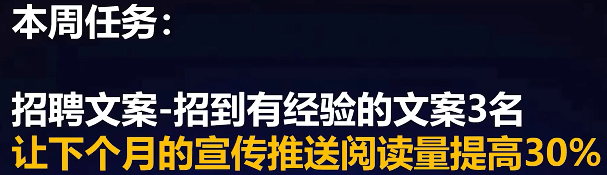
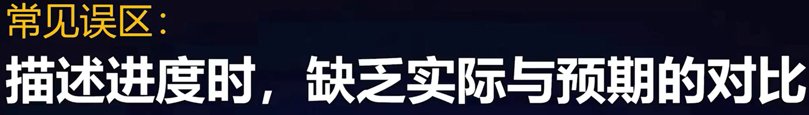

--- 梁秋阳「超级沟通力」 24节 998元

- 把批评改为询问
  
  - 指责变成询问
    
    

- 开未来而不是过去
  
  
  
  

- 这件事情是结果，什么事情是原因？

- 责任，态度，意识的问题

- 帮忙对方把情绪合理化

- 承诺动作，过程，承诺代价

- 让对方成为参与者，扩大战果，扩大框架

### 汇报

- 管理八个人
- 给领导提供一个判断的依据

- 用结果和目标替代动作

- 说出背后的挑战，艰辛

- 我们怎么想，我们怎么做，产生了什么影响

