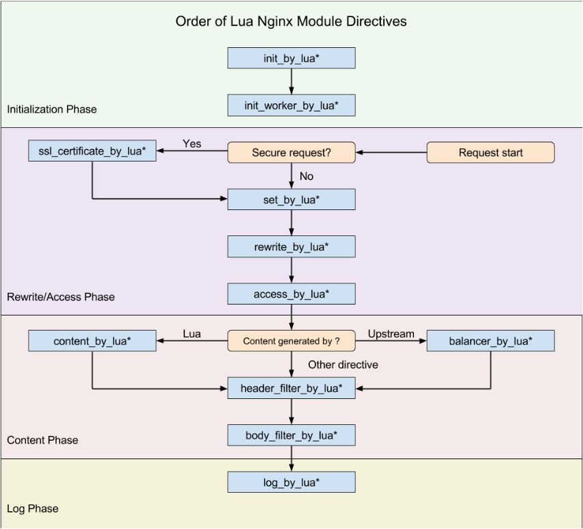

### 基础回顾

- https://openresty.org/download/agentzh-nginx-tutorials-zhcn.html

### nginx执行11阶段

```c
typedef enum {   
    NGX_HTTP_POST_READ_PHASE = 0,    
    NGX_HTTP_SERVER_REWRITE_PHASE,    
    NGX_HTTP_FIND_CONFIG_PHASE,    
    NGX_HTTP_REWRITE_PHASE,    
    NGX_HTTP_POST_REWRITE_PHASE,    
    NGX_HTTP_PREACCESS_PHASE,    
    NGX_HTTP_ACCESS_PHASE,    
    NGX_HTTP_POST_ACCESS_PHASE,    
    NGX_HTTP_PRECONTENT_PHASE,    
    NGX_HTTP_CONTENT_PHASE,    
    NGX_HTTP_LOG_PHASE
} ngx_http_phases
```

### openresty 各个执行阶段



-  **init_by_lua** 只会在 Master 进程被创建时执行，
-  **init_worker_by_lua** 只会在每个 Worker 进程被创建时执行。其他的 *_by_lua 指令则是由终端请求触发，会被反复执行

- **set_by_lua**：设置变量；rewrite_by_lua：转发、重定向等；
- **rewrite_by_lua**：转发、重定向等；
- **access_by_lua**：准入、权限等；
- **content_by_lua**：生成返回内容；
- **header_filter_by_lua**：应答头过滤处理；
- **body_filter_by_lua**：应答体过滤处理；
- **log_by_lua**：日志记录。
