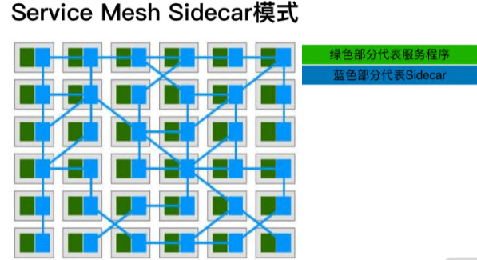
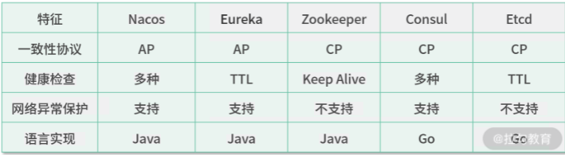

#### Service Mesh 的基础组件及常见名词

**数据面(Data Plane)**

一般我们把负责数据转发的数据面称为 **sidecar**（边车）。

**控制面(Control Plane)**

#### **Service Mesh 的基础组件。**

**服务注册中心**：服务间通信的基础组件。服务通过注册自身节点，让调用方服务发现被调方服务节点，以达到服务间点对点通信的目的。

**配置中心**：用于服务的基础配置更新，以达到代码和配置分离的目的。减少服务的发布次数，配置发布可以更快更及时地变更服务。

**API 网关**：通过统一的网关层，收敛服务的统一鉴权层、链路 ID 生成等基础服务，并聚合后端服务为客户端提供 RESTful 接口。另外 API 网关也负责南北向流量(外网入口流量)的流量治理。

**服务治理**：通过限流、熔断等基础组件，杜绝微服务架构出现雪崩的隐患。

**链路追踪**：通过 trace 将整个微服务链路清晰地绘制出来，并进行精准的故障排查，极大地降低了故障排查的难度。

**监控告警**：通过 Prometheus 和 Grafana 这样的基础组件，绘制服务状态监控大盘，针对资源、服务、业务各项指标，做精准的监控报警。

说完了基础组件，再说一下一些常见的名词解释，便于你理解 Service Mesh。

**Upstream:** 上游服务，如果 A 服务调用 B 服务，在 A 服务的视角来看，B 服务就是上游服务，但是在中文的语境中，经常被叫作“下游服务”。所以在整个课程中，为了避免语言上的歧义，我会直接使用upstream，而不是中文翻译。在中文的语境中，我更喜欢称它为服务端或者被调用方。

**Downstream**: 下游服务，如果 A 服务调用 B 服务，在 B 服务的视角中，A 服务就是下游服务。在中文的语境中，我更喜欢叫客户端或者调用方。

**Endpoint**：指的是服务节点，比如 A 服务有 192.168.2.11 和 192.168.2.12 两个服务节点。

**Cluster**：指的是服务集群，比如 A 服务有 192.168.2.11 和 92.168.2.12 两个服务节点，那么A服务就是 Cluster，也可以直接理解为 Service。

**Node：**在 Kubernetes 语境中，指的是承载 pod 的服务器，但在微服务的语境中，更多的等同于Endpoint。

**Route**：指的是 Service Mesh 中的路由配置，比如 A 服务访问 B 服务，要匹配到一定的规则，比如 header 中要带有服务名(-H servicename:B)，才能够拿到 B 服务的访问方式，通过服务发现或者静态列表访问到 B 服务的节点。

**Listener**：指的是 Service Mesh 的监听端口，通常我们访问 Service Mesh 的数据面，需要知道数据面的监听端口。

### 服务注册与发现

服务注册中心

在分布式架构中，注册中心承接了服务的地址录入和查找功能。

**注册中心的健康检查设计**

1. 服务主动探活

- 主动探活的最大问题，是造成注册中心的写操作变多。

2.  注册中心主动发起健康检查。
3.  注册中心不进行任何健康检查，由调用方负载均衡器进行健康检查
   - 在做健康检查的同时，注册中心下发包含**健康节点**和**非健康节点**的数据到服务节点，并针对健**康检查未通过的删除节点设置一个较长的过期时间**，这样就可以解决 IP 重用产生脏数据的问题了。

2. 

1. 想问问老师如何做到servicemesh 的平滑升级、服务的平滑重启过程？
   **讲师回复**： 对于 HTTP 协议这种连接阻塞协议，多数人不能回答出正确的流程，比如先关闭KeepAlive，处理完此连接上的请求直接关闭连接，再关闭监听器； 对于 HTTP/2 这种多路复用协议，无法回答出 goaway 帧的作用: HTTP/2 依赖 goaway 帧让客户端关闭连接，以达到重建连接的目的； 而上述问题，是实现 Service Mesh 中 sidecar 平滑重启的关键。

