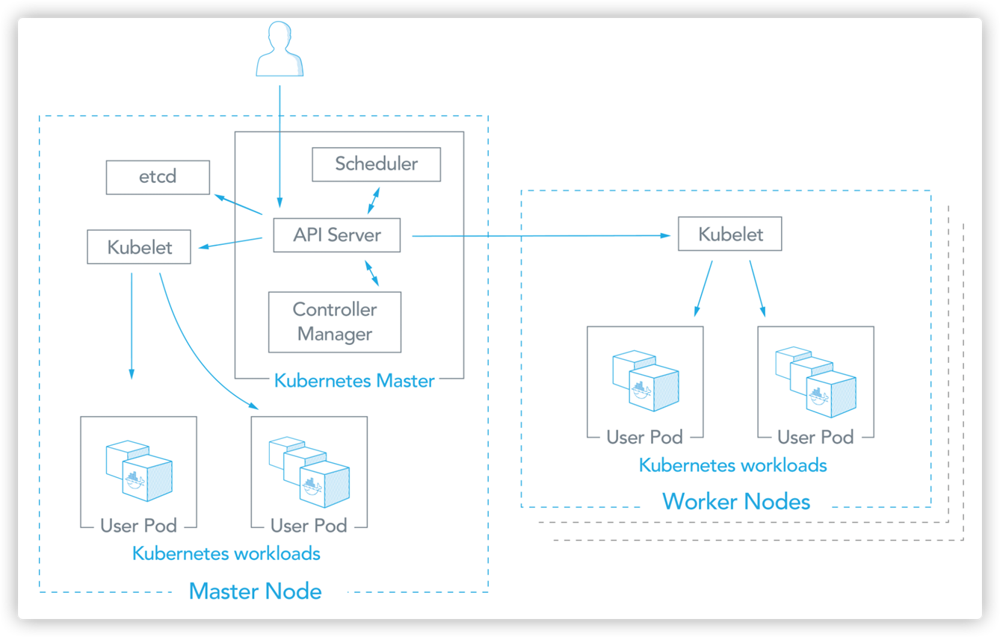
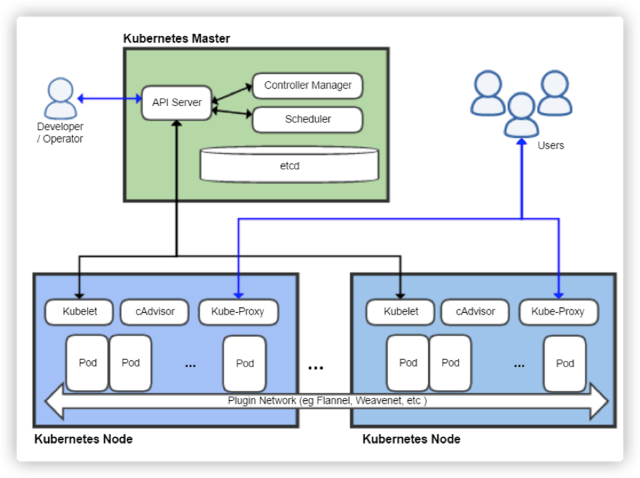
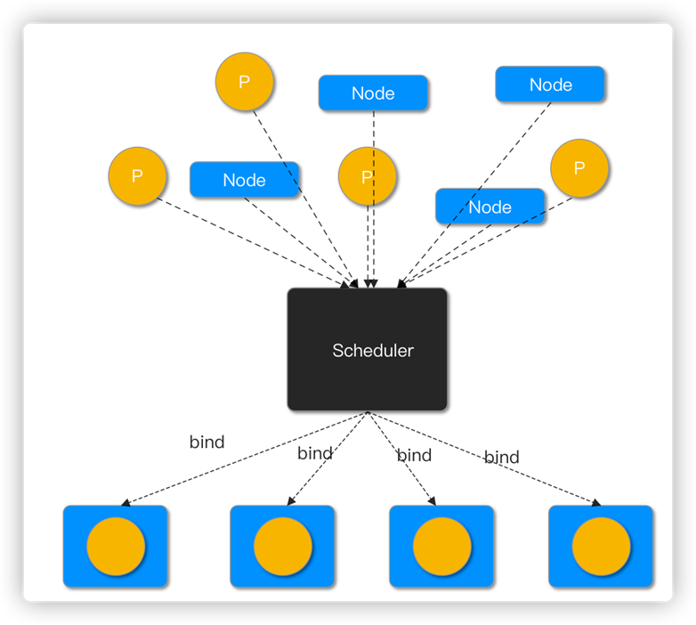
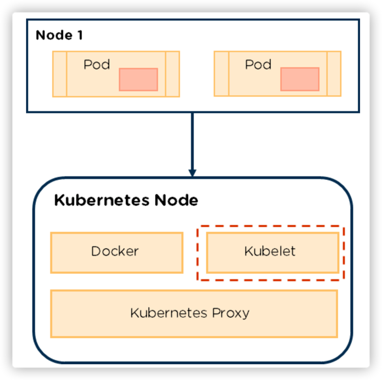
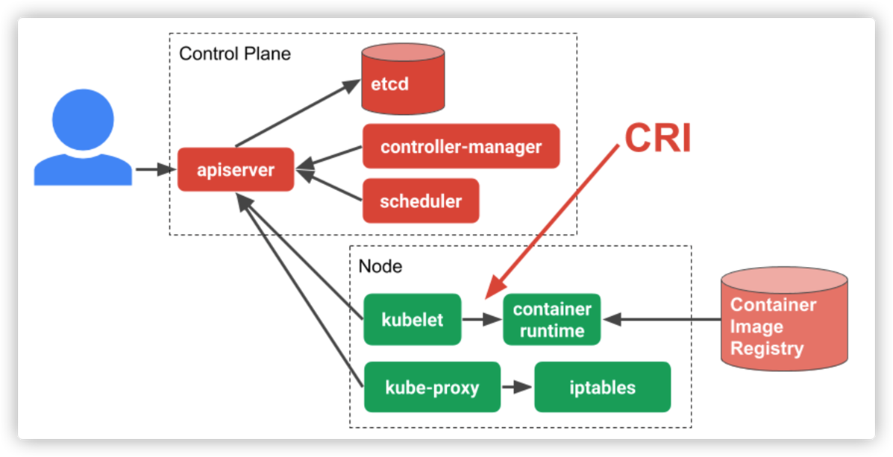
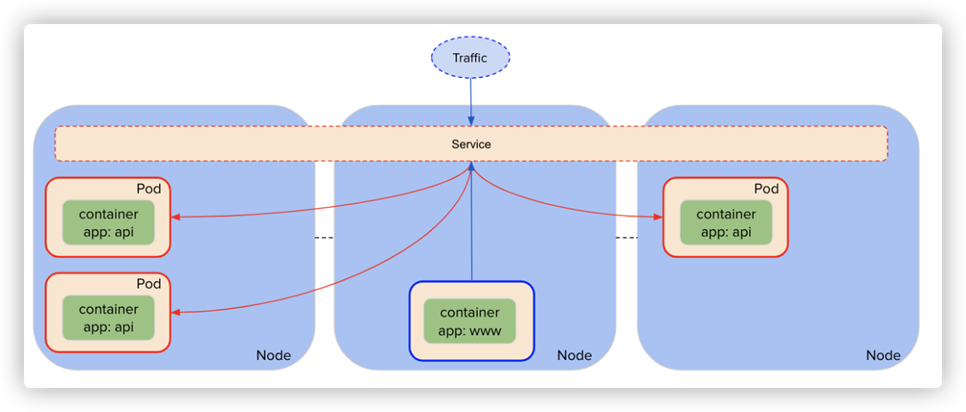
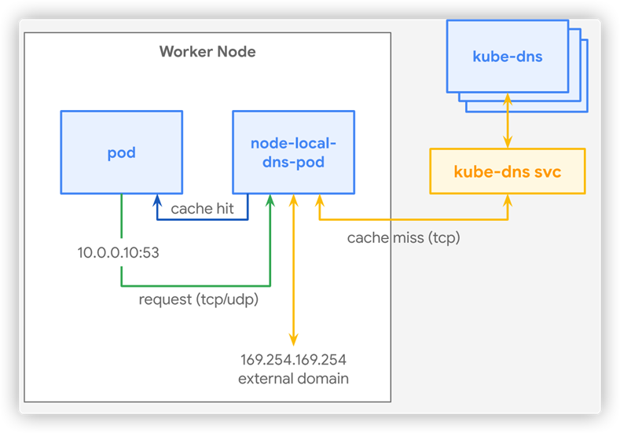
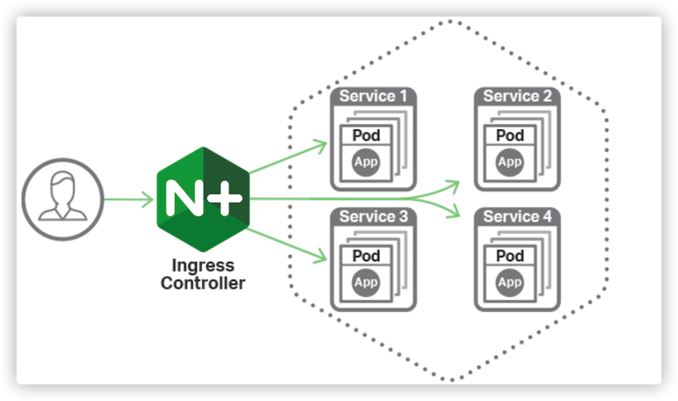
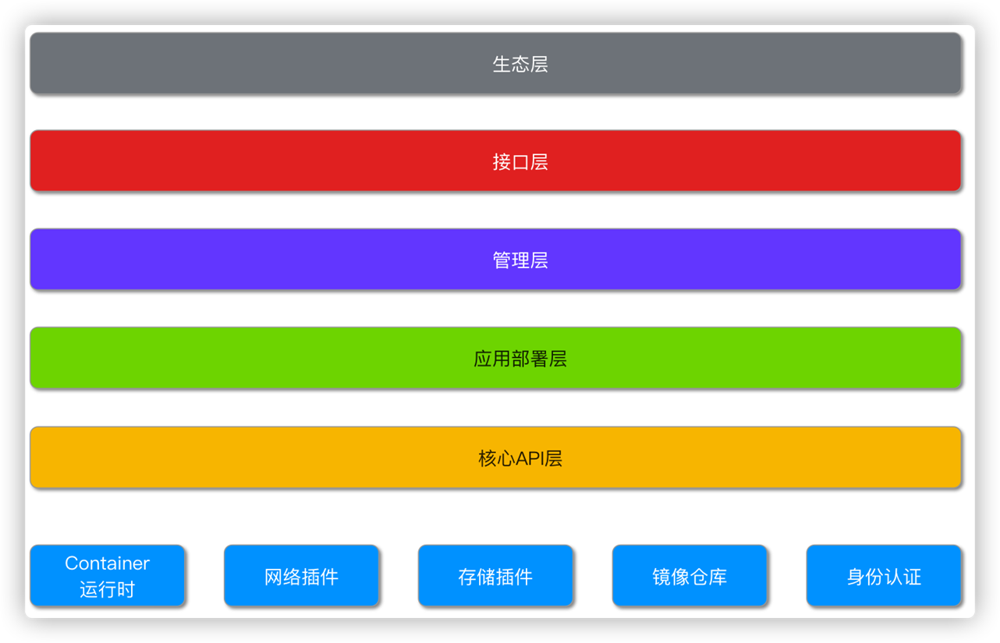

### 思路 -

swarm

fleet

kubernates

### kube-scheduler

- 负责资源的调度，按照预定的调度策略将 Pod 调度到相应的机器上

### kubelet

•控制Pod生命周期

•控制CSI生命周期:container storage interface

•负责CNI创建和访问规则: container network interface

### Container runtime

- CRI: container runtime interface

- Docker
  
  Rkt
  
  ContainerD
  
  CRI-O

### kube-proxy

- 节点运行的负责创建Pod网络访问规则的工具

•用户态处理

•Iptables

•IPVS(eBPF-ipvs)

### kube-dns

- my-svc.namespace.svc.cluster.local

- Service 解析为Cluster IP 

- Headless Service 解析为Pod IP列表

### Ingress Controller

- 负责南北向流量，东西流量靠service转发

- 自动将域名+接口与Service ClusterIP进行绑定

- egress 出流量的服务

### 思路 -

### 声明式API设计原则

1.声明式API

2.资源组合可复用

3.高阶API以调度编排为设计基础

4.低层API根据高阶API需求而设计

5.封装适度

6.不依赖网络状态的状态

7.慎用全局变量
