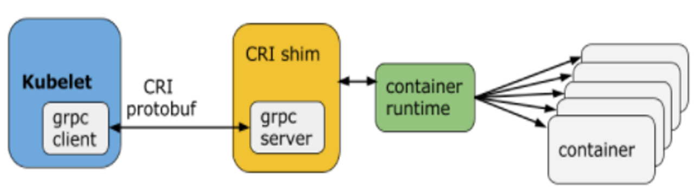

best fit ；集群中刚好满足的节点，集群出现碎片的可能性更小

worst fit： 哪个资源多久调度到哪里，碎片可能较多

性能隔离

- 采用cgroup技术

Borg将资源分为两类

- **可压榨的**（compressible），资源耗尽不会终止进程

- **不可压榨的**（non-compressible），资源耗尽进程会被终止

Kubernetes 是谷歌开源的容器集群管理系统，是 Google 多年大规模容器管理技术 Borg 的开源版本，主要功能包括：  

- 基于容器的应用部署、维护和滚动升级；  
- 负载均衡和服务发现；  
- 跨机器和跨地区的集群调度；  
- 自动伸缩；  
- 无状态服务和有状态服务；  
- 插件机制保证扩展性

operator维护有状态应用。
