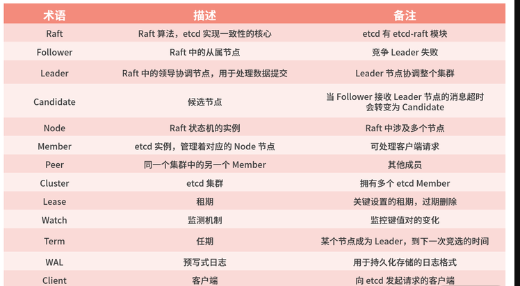

### ETCD

**A distributed, reliable key-value store for the most critical data of a distributed system**

### 学习目标

- 知道什么是 etcd，了解它的基本读写原理、核心特性和能解决什么问题
- 在使用 etcd 解决各类业务场景需求时，能独立判断 etcd 是否适合你的业务场景， 并能设计出良好的存储结构，避免 expensive request
- 在使用 Kubernetes 的过程中，你能清晰地知道你的每个操作背后的 etcd 是如何工 作的，并遵循 Kubernetes/etcd 最佳实践，让你的 Kubernetes 集群跑得更快更稳
- 在运维 etcd 集群的时候，你能知道 etcd 集群核心监控指标，了解常见的坑，制定 良好的巡检、监控策略，及时发现、规避问题，避免事故的产生。
- 遇到 etcd 问题时，能自己分析为什么会出现这样的错误，并知道如何解决，甚 至给社区提 PR 优化，做到知其然知其所以然
- 