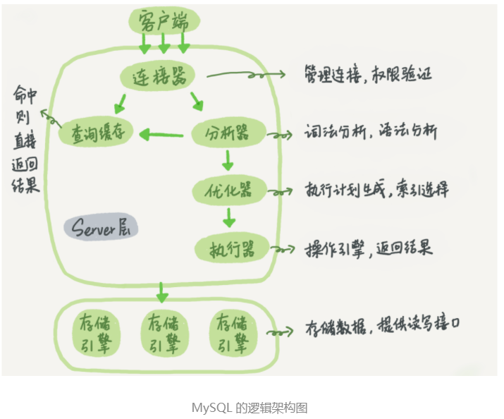
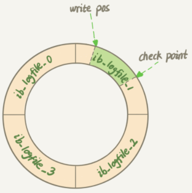

### MySQL逻辑架构图

- 在一个表上有更新的时候，跟这个表有关的查询缓存会失效，所以这条语句就会把表 T 上所有缓存结果都清空。这也就是我们一般不建议使用查询缓存的原因

##### redo log

- 
- redo log属于存储引擎部分
- 可以实现crash safe功能，及时MySQL crash，数据也可以恢复。
- 记录的是物理日志(?不是太理解)，记录的是在某个数据页山做了什么修改
- 空间固定，循环写入，空间会用完。

##### binlog

- 属于MySQL server层，所有存储引擎都可以使用
- 逻辑日志，记录的是这个语句的原始逻辑
- 可以实现追加写，

##### WAL(Write Ahead Logging)

- 先写日志，再写磁盘
- 当有一条记录需要更新的时候，InnoDB 引擎就会先把记录写到 redo log（粉板）里面，并更新内存，这个时候更新就算完成了。同时，InnoDB 引擎会在适当的时候，将这个操作记录更新到磁盘里面，而这个更新往往是在系统比较空闲的时候做，这就像打烊以后掌柜做的事。

### 分布式事务

##### 二阶段提交

###### XA协议

- MySQL是使用此协议实现分布式事务。

> 不管是二阶段提交还是XA协议，都存在如下问题
>
> 1. 在提交阶段，需要预留资源，在资源预留期间，其他人不能操作（比如XA在第一阶段会将有关资源锁定）
> 2. 数据库是独立的系统
>
> 在一个参与者投票要求提交事务之前，它必须保证能够执行提交协议中它自己的那部分，即使参与者出现故障或者中途被替换掉。

##### TCC(Try-Confirm-Cancel)

