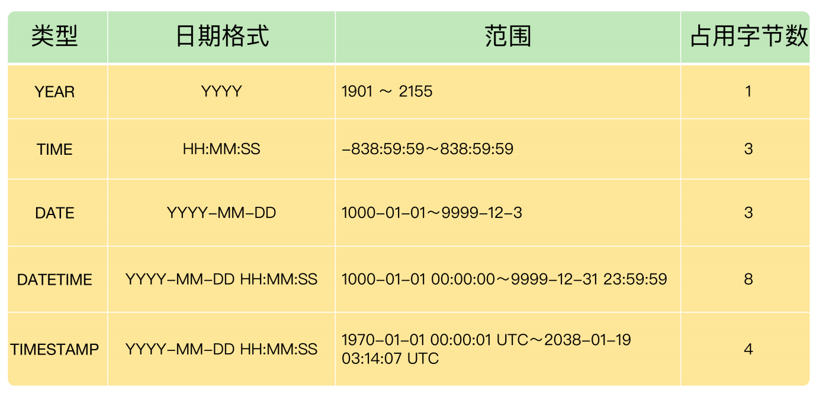

**《MySQL必知必会》**

sync_relay_log： https://blog.csdn.net/n88Lpo/article/details/80863185

sync_master_info：https://www.huaweicloud.com/articles/575484b0e0ed0b9dccfc65ed3ef0c1a3.html

sync _relay_log_info

1. 创建数据库

2. 确认字段

3. 创建数据表
   
   ```mysql
   CREATE TABLE demo.test
   (
       barcode text,
       goodsname text,
       price int
   );
   ```
   
   - 查看表结构
     
     ```mysql
     DESCRIBE test; 
     ```
   
   - 查看数据表
     
     ```mysql
     SHOW TABLES;
     ```

4. 插入数据

->**老师，面试遇到的一个问题，select count(*) from t; t中有id(主键)，name，age,sex4个字段。假设数据10条，对sex添加索引。用explain 查 看执行计划发现用了sex索引，为什么不是主键索引呢?主键索引应该更快的 ***

*作者回复: 问题很好，下面是我的理解，供你参考： 1. MySQL Innodb的主键索引是一个B+树，数据存储在叶子节点上，10条数据，就有10个叶子 节点。 2. sex索引是辅助索引，也是一个B+树，不同之处在于，叶子节点存储的是主键值，由于sex只有 2个可能的值：男和女，因此，这个B+树只有2个叶子节点，比主键索引的B+树小的多 3. 这个表有主键，因此不存在所有字段都为空的记录，所以COUNT(*)只要统计所有主键的值就 可以了，不需要回表读取数据 4. SELECT COUNT(*) FROM t，使用sex索引，只需要访问辅助索引的小B+树，而使用主键索 引，要访问主键索引的那个大B+树，明细工作量大，这就是为什么，优化器使用辅助索引的原因

```mysql
CREATE TABLE goodsmaster
(
    barcode TEXT,
    goodsname TEXT,
    price DOUBLE,
    itemnumber INT PRIMARY KEY AUTO_INCREMENT
);
INSERT INTO goodsmaster(barcode,goodsname,price) VALUES('0001','书',0.47);
INSERT INTO goodsmaster(barcode,goodsname,price) VALUES('0002','笔',0.44);
-- 第三条
INSERT INTO goodsmaster(barcode,goodsname,price) VALUES ('0002','胶水',0.19);

ALTER TABLE goodsmasterMODIFY COLUMN price DECIMAL(5,2);
```

- **Decimal**

类型更加精准，使用场景为金融等要求较高，float与double适用于取值范围大，但是可以容忍误差

- **Text**

由于实际存储的长度不确定，MySQL 不允许 TEXT 类型的字段做主键。遇到这种情况，你只能采用 CHAR(M)，或者 VARCHAR(M)。

- **日期与时间类型**

用得最多的日期时间类型，就是 DATETIME。虽然 MySQL 也支持 YEAR（年）、 TIME（时间）、DATE（日期），以及 TIMESTAMP 类型，但是我建议你，在实际项目 中，尽量用 DATETIME 类型

**距离 TIMESTAMP 的最大值‘2038-01-19 03:14:07’已经很近**



为了优化 TIMESTAMP 的使用，强烈建议你使用显式的时区，而不是操作系统时区。比如在配置文件中显示地设置时区，而不要使用系统时区：

```
[mysqld]
time_zone = "+08:00"
```

日期字段推荐使用 DATETIME，没有时区转化。**即便使用 TIMESTAMP，也需要在数据库中显式地配置时区，而不是用系统时区**。

- **json**

最常见的就是函数 **JSON_EXTRACT**，它用来从 JSON 数据中提取所需要的字段内容

```mysql
CREATE TABLE UserLogin (
    userId BIGINT NOT NULL,
    loginInfo JSON,
    PRIMARY KEY(userId)
);

SET @a = '
{
    "cellphone" : "13918888888",
    "wxchat" : "破产码农",
    "QQ" : "82946772"
}
';

INSERT INTO UserLogin VALUES (1,@a);

SET @b = '
{
    "cellphone" : "15026888888"
}
';

INSERT INTO UserLogin VALUES (2,@b);

SELECT
    userId,
    JSON_UNQUOTE(JSON_EXTRACT(loginInfo,"$.cellphone")) cellphone,
    JSON_UNQUOTE(JSON_EXTRACT(loginInfo,"$.wxchat")) wxchat
FROM UserLogin;

SELECT
    userId,
    loginInfo->>"$.cellphone" cellphone,
    loginInfo->>"$.wxchat" wxchat
FROM UserLogin;
```

当 JSON 数据量非常大，用户希望对 JSON 数据进行有效检索时，可以利用 MySQL 的**函数索引**功能对 JSON 中的某个字段进行索引。

```mysql
ALTER TABLE UserLogin ADD COLUMN cellphone VARCHAR(255) AS (loginInfo->>"$.cellphone");
ALTER TABLE UserLogin ADD UNIQUE INDEX idx_cellphone(cellphone);
```
