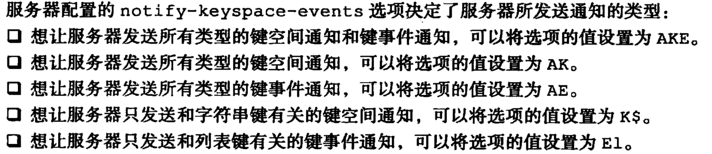

### 键空间通知

- 关注“某个键执行了什么命令”的通知称为```键空间通知``` （Key-space notification）

  - 函数实现： ```void notifyKeyspaceEvent(int type, char *event, robj *key, int dbid) ```

- 关注某个命令被什么键执行了，称为```键事件通知```(key-event notification)

  - 客户端如果获取0号数据库中所有执行了del命令的键： ```SUBSCRIBE __keyevent@0__:del```

    

- 

