### redis全景图

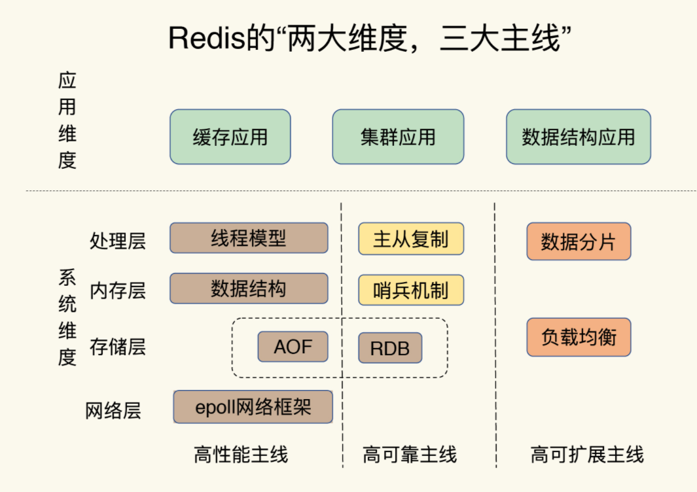

- 应用维度

  - 应用场景驱动
  - 典型案例驱动

- 问题画像图

  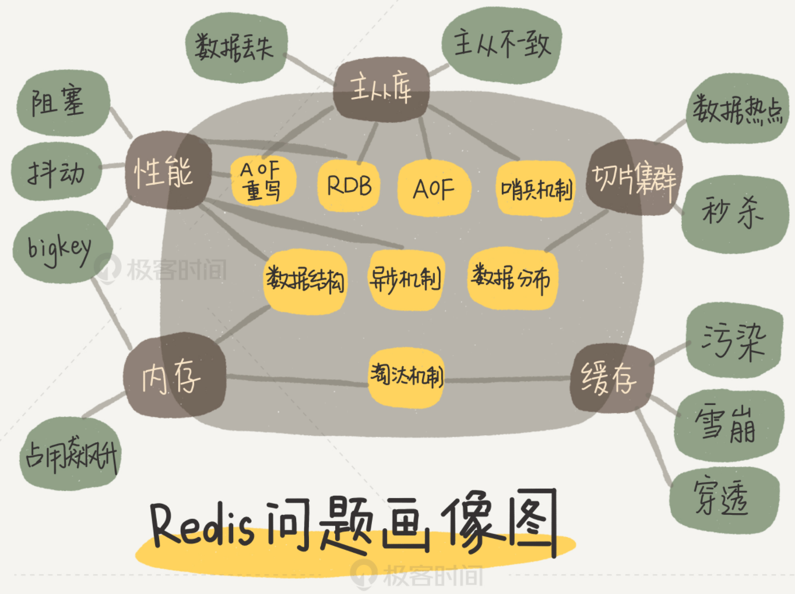

- simple kv设计

  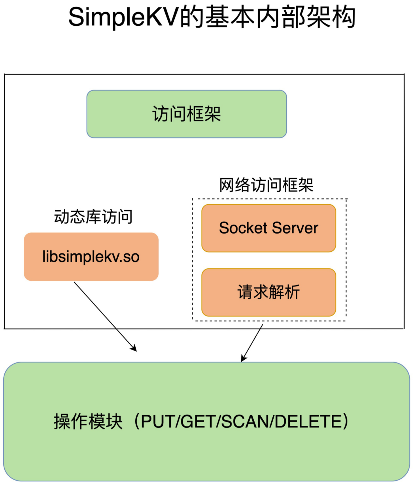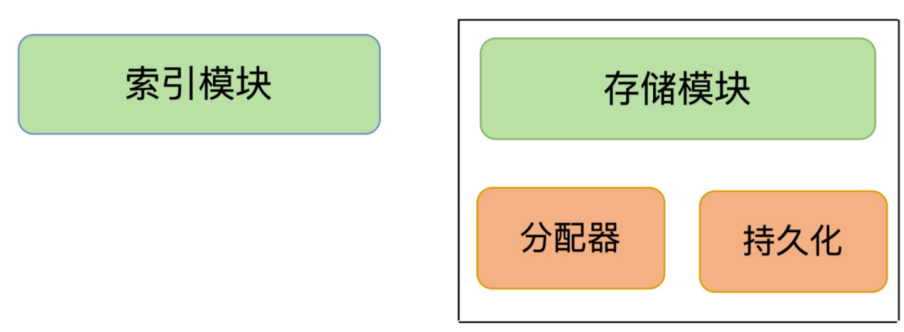

  

### redis 类型与数据结构对应关系

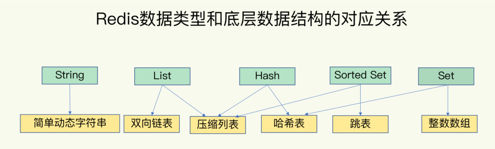

### Redis 基本IO模型

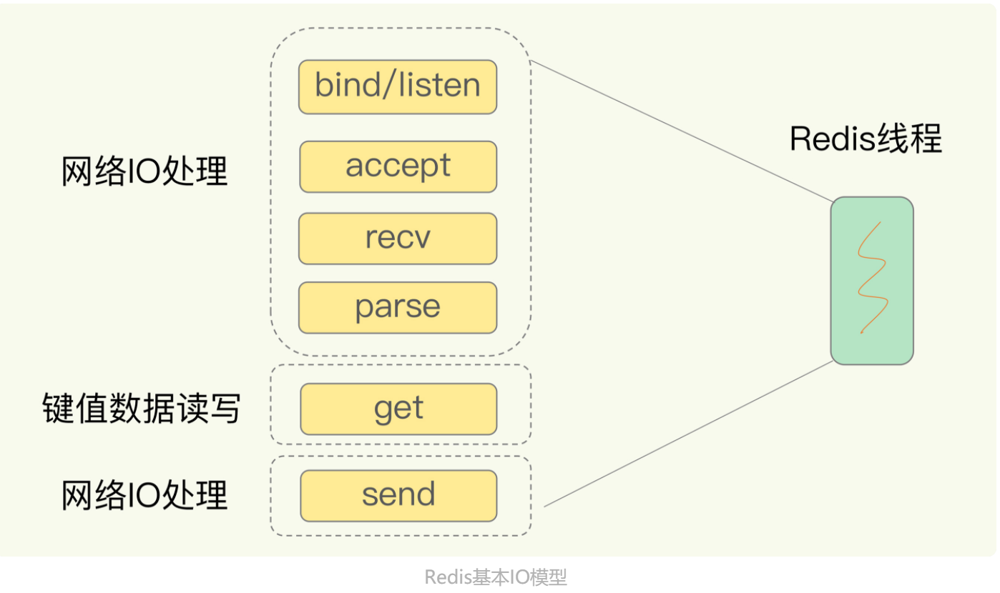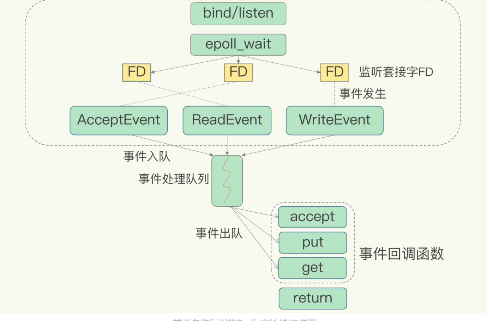

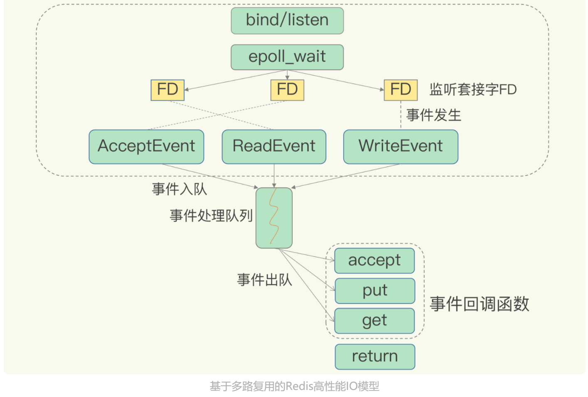

- **selectepoll提供了基于事件的回调机制，对于不同事件的发生，调用相应的处理函数**

### 数据持久化

**AOF**

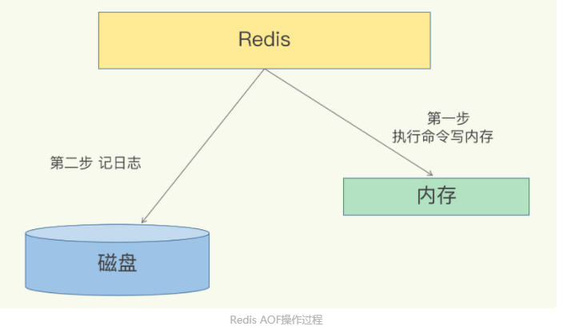

后写日志两大优点

1. 先让系统执行以下命令，如果成功则写入文件，如果失败，直接抛出异常。
2. 在命令执行后才记录日志，不会阻塞当前的写操作。

> 因为这个机制，在使用的时候可能时候系统的性能瓶颈，如果写入磁盘较慢，可能给下一个操作带来阻塞风险，AOF日志也是在主线程中执行的，如果把日志文件写入磁盘时，磁盘写压力大，就会导致写盘很慢，进而导致后续的操作也无法执行。
>
> 注意AOF文件过大带来的性能影响。

针对上述的问题，AOF增加配置项appendfsync配置项解决。

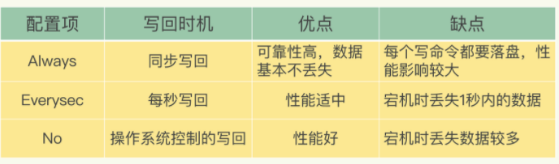

**文件过大带来的性能问题**

1. 重写AOF日志文件
2. 

**RDB**

- short name for:  Redis DataBase
- 提供两个命令生成RDB文件，分别是save和bgsave命令
  - save，在主线程中执行，会导致阻塞
  - bgsave，创建一个子线程，专门用于写入RDB文件，避免了主线程的阻塞，这也是Redis  RDB文件生成的默认配置。
- 

### 可靠性问题

##### 哨兵机制(sentinel)

- 分析： http://www.web-lovers.com/redis-source-sentinel.html

- 架构图

  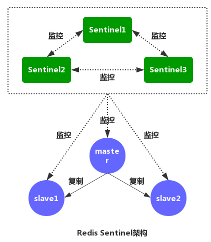

- 主要负责三个任务： 监控，选主和通知

  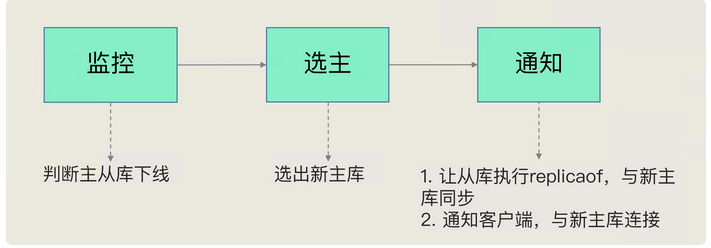

- 在监控任务中，哨兵需要判断主库是否处于下线状态

  哨兵进程会通过使用ping命令检测它自己和主从库的网络连接情况，来判断实例的状态。多个实例都认为主观下线之后才真正的做客观下线，然后开始选主流程。

  - 主观下线
  - 客观下线

- 在选主任务中，哨兵也需要决定选择哪个从库实例作为主库

  - 从多个从库总，先按照一定的筛选条件，把不符合条件的从库去掉，然后按照一定的规则给剩余的从库逐个打分，将得分最高的从库选为主库

  - 在选主时，除了要检查从库的当前在线状态，还要判断它之前的网络连接状态，如果从库总是和主库断连，如果超过一定的次数，可以判断从库的网络状况不是很好。如果在**down-after-milliseconds**毫秒内，主从节点都没有通过网络联系上，我们就认为主从节点断链了。

  - 筛选节点，主要是从库优先级，从库复制进度以及从库ID号。

    1. 优先级最高的从库得分高。 从节点可以根据环境信息设置优先级：slave-priority

    2. 和旧主库同步程度最接近的从库得分高，比较不通slave节点slave_repl_offset值，得分高的节点为主节点
    3. 如果上面两个值还相同，则根据次规则，ID号小的从库得分高。

- 基于redis的pub/sub机制的哨兵集群组成

  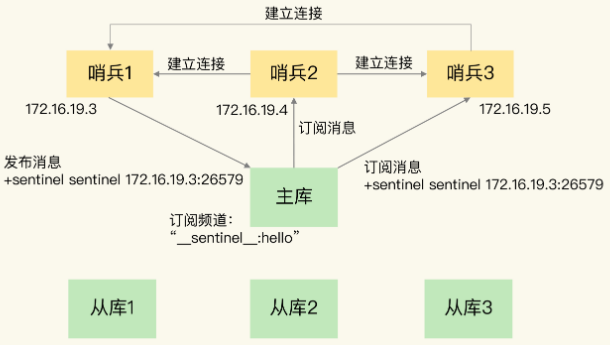

- 如果其中一个实例自身判断主库“主官下线”后，就会给其他实例发送**is-master-down-by-addr**命令，其他实例根据自己和主库的连接，会出Y或N的响应，如果是Y则赞成，如果是N表示反对。达到一定赞成票之后，就可以标记“客观下线”，设置的赞成票数根据配置文件的**quorum**配置设定的。

  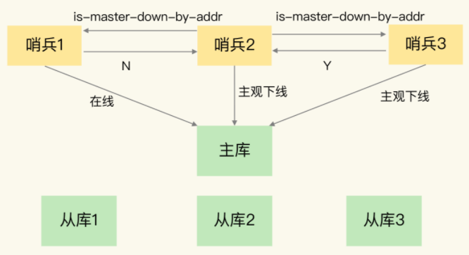

- 在投票的过程中，任何一个想成为leader的哨兵，都需要满足如下两个条件

  1. 拿到半数以上的赞成票
  2. 拿到的票数同时还需要大于等于哨兵配置文件中的**quorum**的值。

- 如果一轮没有选举出具体的leader，则哨兵集群会等待一段时间(也就是哨兵故障转移超时时间的2倍)，再重新选举。

- **要保证所有哨兵实例的配置是一致的，尤其是主观下线的判断值down-after-milliseconds**

### 切片集群

- 就是指启动多个Redis实例组成一个集群，然后按照一定的规则，把收到的数据划分为多分，每一份用一个实例来保存。

  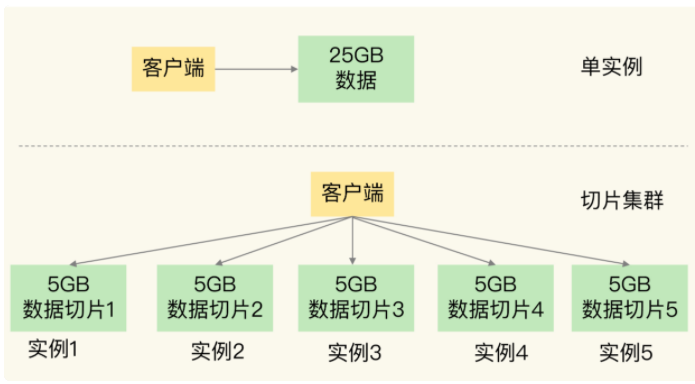

- 横向与纵向扩展

  - 横向： 指增加cpu，内存与磁盘
  - 纵向：增加Redis的实例数。

  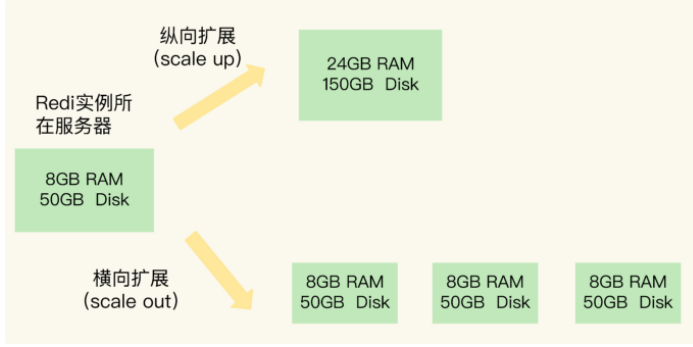

- 分片之后两大问题

  - 数据切片后，在多个实例之间如何分布？

  - 客户端怎么确定想要访问的数据在哪个实例上？

    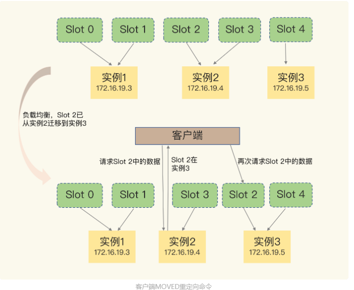

  ---

  实例与哈希槽对应关系可能涉及的变化

  1. 在集群中，实例有新增或者删除，Redis需要重新分配哈希槽
  2. 为了负载均衡，Redis需要把哈希槽在所有实例上重新分布一遍。

  

### repl_backlog_buffer和replication buffer理解

1. repl_backlog_buffer：就是上面我解释到的，它是为了从库断开之后，如何找到主从差异数据而设计的环形缓冲区，从而避免全量同步带来的性能开销。如果从库断开时间太久，repl_backlog_buffer环形缓冲区被主库的写命令覆盖了，那么从库连上主库后只能乖乖地进行一次全量同步，所以repl_backlog_buffer配置尽量大一些，可以降低主从断开后全量同步的概率。而在repl_backlog_buffer中找主从差异的数据后，如何发给从库呢？这就用到了replication buffer。
2. replication buffer：Redis和客户端通信也好，和从库通信也好，Redis都需要给分配一个 内存buffer进行数据交互，客户端是一个client，从库也是一个client，我们每个client连上Redis后，Redis都会分配一个client buffer，所有数据交互都是通过这个buffer进行的：Redis先把数据写到这个buffer中，然后再把buffer中的数据发到client socket中再通过网络发送出去，这样就完成了数据交互。所以主从在增量同步时，从库作为一个client，也会分配一个buffer，只不过这个buffer专门用来传播用户的写命令到从库，保证主从数据一致，我们通常把它叫做replication buffer。
3. 既然有这个内存buffer存在，那么这个buffer有没有限制呢？如果主从在传播命令时，因为某些原因从库处理得非常慢，那么主库上的这个buffer就会持续增长，消耗大量的内存资源，甚至OOM。所以Redis提供了client-output-buffer-limit参数限制这个buffer的大小，如果超过限制，主库会强制断开这个client的连接，也就是说从库处理慢导致主库内存buffer的积压达到限制后，主库会强制断开从库的连接，此时主从复制会中断，中断后如果从库再次发起复制请求，那么此时可能会导致恶性循环，引发复制风暴，这种情况需要格外注意。

