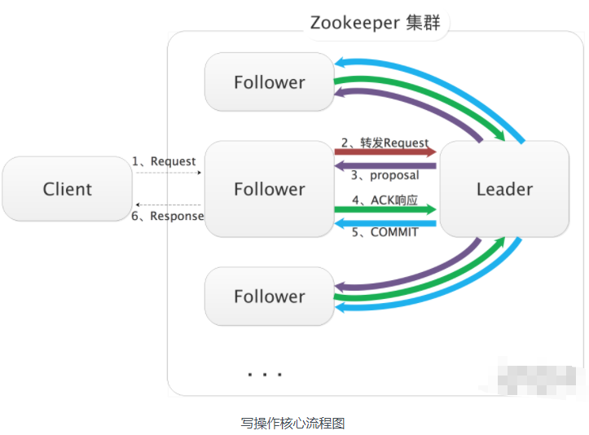

- Dubbo 中任意的一个实现都可以抽象为一个 URL，Dubbo 使用 URL 来统一描述了所有对象和配置信息，并贯穿在整个 Dubbo 框架之中。
- 

### zookeeper 核心写入流程

1. Leader 节点接收写请求后，会为写请求赋予一个全局唯一的 zxid（64 位自增 id），通过 zxid 的大小比较就可以实现写操作的顺序一致性。

2. Leader 通过先进先出队列（会给每个 Follower 节点都创建一个队列，保证发送的顺序性），将带有 zxid 的消息作为一个 proposal（提案）分发给所有 Follower 节点。

3. 当 Follower 节点接收到 proposal 之后，会先将 proposal 写到本地事务日志，写事务成功后再向 Leader 节点回一个 ACK 响应。

4. 当 Leader 节点接收到过半 Follower 的 ACK 响应之后，Leader 节点就向所有 Follower 节点发送 COMMIT 命令，并在本地执行提交。

5. 当 Follower 收到消息的 COMMIT 命令之后也会提交操作，写操作到此完成。

6. 最后，Follower 节点会返回 Client 写请求相应的响应。

#### 崩溃恢复

上面写请求处理流程中，如果发生 Leader 节点宕机，整个 ZooKeeper 集群可能处于如下两种状态：

当 Leader 节点收到半数以上 Follower 节点的 ACK 响应之后，会向各个 Follower 节点广播 COMMIT 命令，同时也会在本地执行 COMMIT 并向连接的客户端进行响应。如果在各个 Follower 收到 COMMIT 命令前 Leader 就宕机了，就会导致剩下的服务器没法执行这条消息。

当 Leader 节点生成 proposal 之后就宕机了，而其他 Follower 并没有收到此 proposal（或者只有一小部分 Follower 节点收到了这条 proposal），那么此次写操作就是执行失败的。

在 Leader 宕机后，ZooKeeper 会进入崩溃恢复模式，重新进行 Leader 节点的选举。

ZooKeeper 对新 Leader 有如下两个要求：

对于原 Leader 已经提交了的 proposal，新 Leader 必须能够广播并提交，这样就需要选择拥有最大 zxid 值的节点作为 Leader。

对于原 Leader 还未广播或只部分广播成功的 proposal，新 Leader 能够通知原 Leader 和已经同步了的 Follower 删除，从而保证集群数据的一致性。