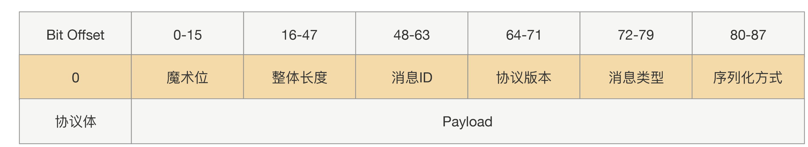
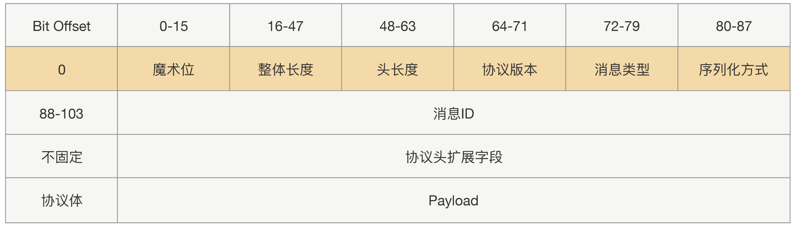
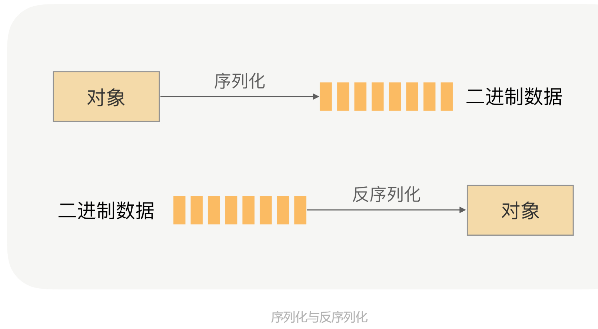
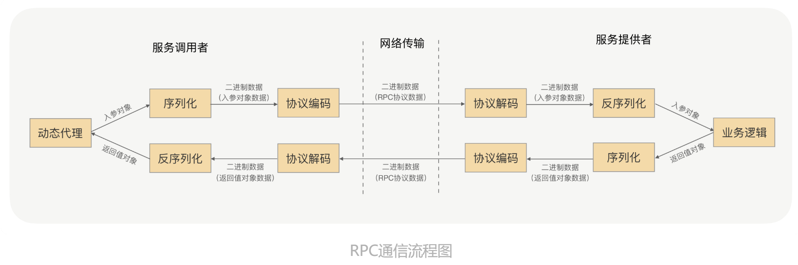
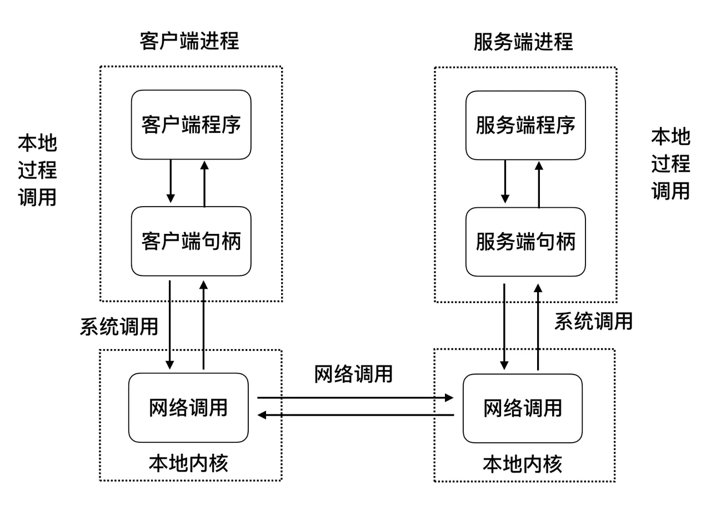
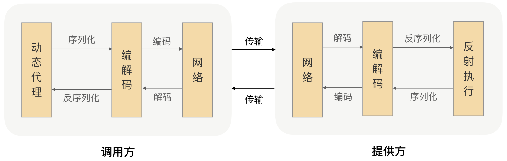

### 什么是RPC

- RPC帮助我们屏蔽网络编程细节，实现调用远程方法就跟调用本地方法一样二体验

- 作用体现再如下两个方面

  - 屏蔽远程调用与本地调用的区别，让我们感觉就是调用项目内的方法
  - 隐藏底层网络通信的复杂性，让我们更专注与业务逻辑

- RPC框架能够帮助我们解决系统拆分后的*通信系统*，并且能让我们像调用本地一样去调用远程方法。

- RPC协议属于应用层协议

- RPC自定义协议包含内容

  

- 上述协议如果有新的协议体增加，则不能很好的扩容，如果将新的请求头参数加再协议体，则对一些超时请求可能导致cpu使用浪费，如下为可扩展协议设计

  

- RPC不适用http协议原因

  - 无法实现请求跟响应关联，每次请求都需要重新建立连接，响应完成后再关闭连接。
  - http会添加一大堆的请求头内容，可能对应用没有实际作用，浪费资源。

- 网络传输的数据必须是二进制数据，但是调用放请求的输入参数都是对象。

  

- RPC通信流程图

  

- 

### 服务治理包含如下内容

- 服务发现、
- 负载均衡、
- 超时、重试、
- 限流、熔断、
- 分布式链路追踪

### RPC框架解决问题

- 开发效率问题
- 通信效率
- 数据传输
  - 序列话
  - 传输效率
- 通用化
- 服务治理

### RPC调用过程

- RPC框架执行流程

