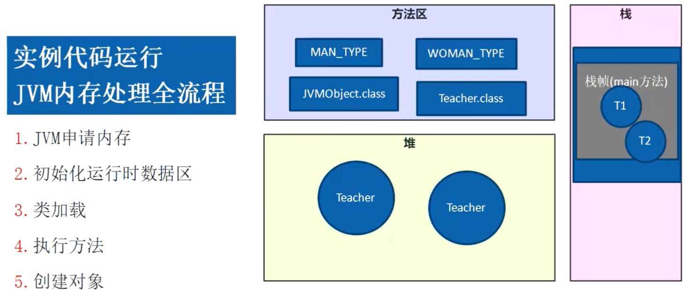
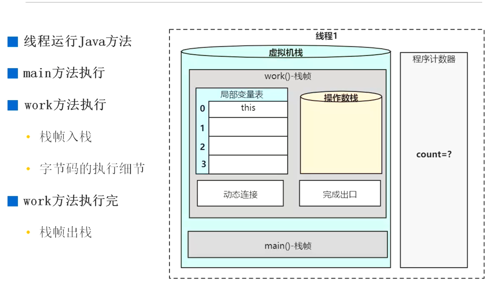
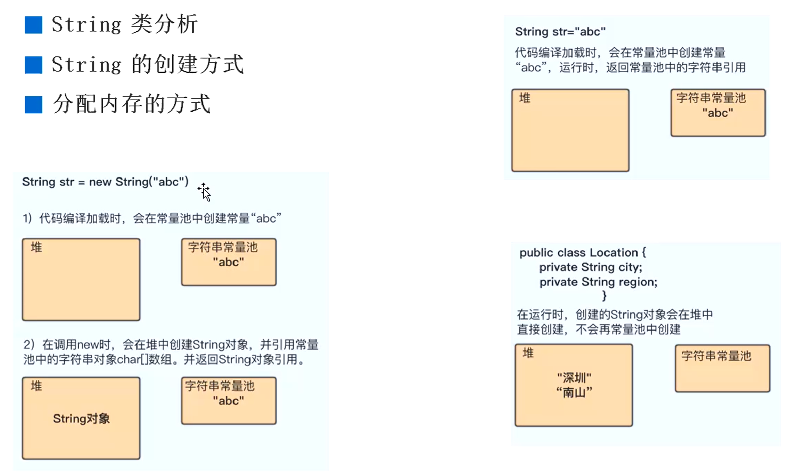
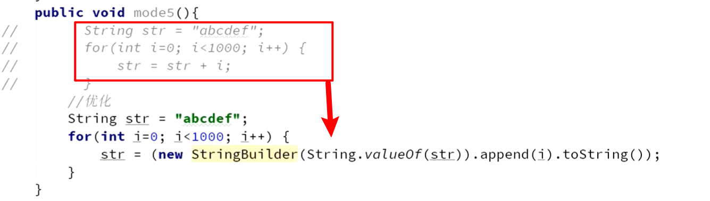

虚拟机栈

- 操作数栈
  - 局部变量表
  - 
- 

### 栈/堆





### OOM

- 栈 -Xss 1M 超过默认大小，就会爆出OOM

- 堆 -Xmx 30M -Xms 30M

  - 代码问题，可能内存泄漏：GC占据98%的资源问题,回收不足2%，报错：GC overhead limit exceede

- 方法区异常

  - -XX:MetaspaceSize=10M -XX:MaxMetaspaceSize=10M

  - -XX:MaxDirectMemorySize=100M 直接内存大小限制

    ```java
    ByteBuffer.allocateDirect(128*1024*1024)
    ```

### 常量池与字符串

- 运行时常量池：直接引用---jdk1.7以后在堆中实现
- 静态（class）常量池(Constant pool),编译时存在的字面量，符号引用
- 字符串常量池：



- 为什么string设计为不可变
  - 安全性
  - hash值唯一
  - 可以实现字符串常量池

