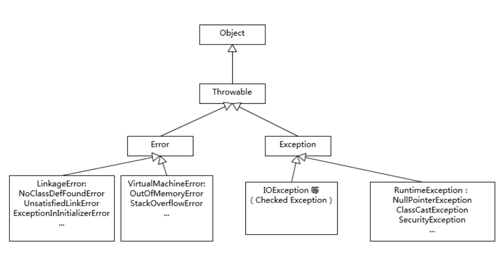

- NoClassDefFoundError 和 ClassNotFoundException 有什么区别，这也是个经典的入门题目

### 异常处理

第一，**尽量不要捕获类似 Exception 这样的通用异常，而是应该捕获特定异常**

第二，**不要生吞（swallow）异常**。这是异常处理中要特别注意的事情，因为很可能会导致非常难以诊断的诡异情况。

**第三， Throw early, catch late 原则**---https://v.qq.com/x/page/d0635rf5x0o.html

- 是否需要定义成 Checked Exception，因为这种类型设计的初衷更是为了从异常情况恢复，作为异常设计者，我们往往有充足信息进行分类。
- 在保证诊断信息足够的同时，也要考虑避免包含敏感信息，因为那样可能导致潜在的安全问题。如果我们看 Java 的标准类库，你可能注意到类似 java.net.ConnectException，出错信息是类似“ Connection refused (Connection refused)”，而不包含具体的机器名、IP、端口等，一个重要考量就是信息安全。类似的情况在日志中也有，比如，用户数据一般是不可以输出到日志里面的。