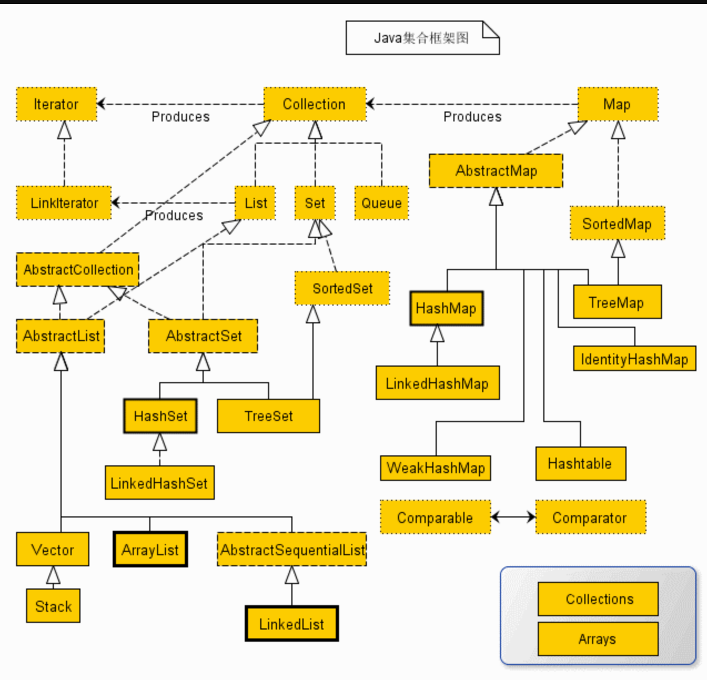

### 强引用

- 只要还有对象引用指向一个对象，就能表明对象还活着，垃圾收集器不会碰这种对象

### 软引用

- 只有当jvm认为内存不足时，才会取试图回收软引用所指向的对象，jvm会确保在抛出OutOfMemory之前，清理软引用指向的对象。

### 弱引用

### 虚幻引用

### java集合框架

- https://www.starfish.ink/interview/Collections-FAQ.html#jdk1-8-%E5%AE%9E%E7%8E%B0

