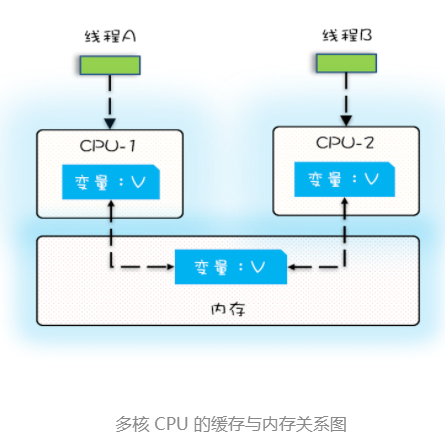
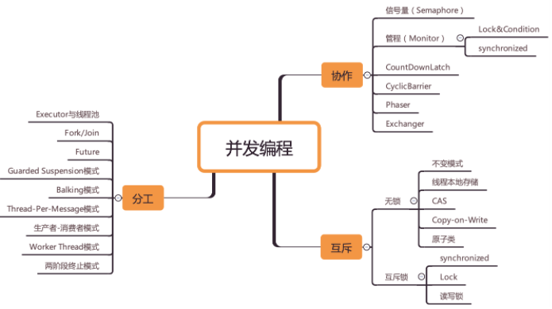

### 并发三个核心学习点

- 同步  synchronized
- 互斥    lock
- 分工： fork/join

---

两个学习方法

- 跳出来，看全景
- 钻进去，看本质

并发的核心： 操作系统，多看操作系统知识。

---

### 工程上的解决方案，一定有理论做基础

### 可见性

- 一个线程对共享变量的修改，另外一个线程能够立刻看到，我们称为可见性

- 缓存导致的可见性问题

  

### 有序性

- 编译优化带来的有序性问题

- 有序性指的是程序按照代码的先后顺序执行

  ```java
  public class Singleton {
    static Singleton instance;
    static Singleton getInstance(){
      if (instance == null) {
        synchronized(Singleton.class) {
          if (instance == null)
            instance = new Singleton();
          }
      }
      return instance;
    }
  }
  ```

  new对象步骤

  1. 分配一块内存 M；
  2. 在内存 M 上初始化 Singleton 对象；
  3. 然后 M 的地址赋值给 instance 变量。

- 

### 原子性

- 我们把一个或者多个操作在 CPU 执行的过程中不被中断的特性称为**原子性**
- 很多时候我们需要在高级语言层面保证操作的原子性



### 为了合理利用 CPU 的高性能，平衡这三者的速度差异，计算机体系机构、操作系统、编译程序都做出了贡献，主要体现为：

1. CPU 增加了缓存，以均衡与内存的速度差异；
2. 操作系统增加了进程、线程，以分时复用 CPU，进而均衡 CPU 与 I/O 设备的速度差异；
3. 编译程序优化指令执行次序，使得缓存能够得到更加合理地利用。