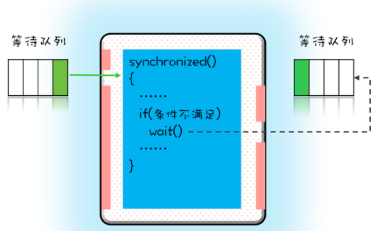

### 为了合理利用CPU的高性能，平衡IO/CPU/内存的速度差异，计算机体系机构、操作系统、编译程序都做出了贡献，主要体现为：
  - CPU增加了缓存，以均衡与内存的速度差异；
  - 操作系统增加了进程、线程，以分时复用CPU，进而均衡CPU与I/O设备的速度差异；
  - 编译程序优化指令执行次序，使得缓存能够得到更加合理地利用。

- 一个线程对共享变量的修改，另外一个线程能够立刻看到，我们称为```可见性```
  - 解决原子性问题，是要保证中间状态对外不见
- 我们把一个或者多个操作在CPU执行的过程中不被中断的特性称为```原子性```
- 缓存导致的可见性问题，线程切换带来的原子性问题，编译优化带来的有序性问题，其实缓存、线程、编译优化的目的和我们写并发程序的目的是相同的，都是提高程序性能。

### 同时上诉优化也带来如下问题
- 缓存导致的可见性问题
- 线程切换带来的原子性问题
  - 出现IO阻塞时会出现线程切换
  - 在一个时间片内，如果一个进程进行一个IO操作，例如读个文件，这个时候该进程可以把自己标记为“休眠状态”并出让CPU的使用权，待文件读进内存，操作系统会把这个休眠的进程唤醒，唤醒后的进程就有机会重新获得CPU的使用权了。
- 编译优化带来的有序性问题

### new对象操作步骤
``` java
Singleton instance =new Singleton()
```
- 分配一块内存M；
- 将M的地址赋值给instance变量；
- 最后在内存M上初始化Singleton对象。

对于CPU来说的三个指令，这一行分对于CPU来讲，有3个指令：
1. 分配内存空间
2. 初始化对象
3. instance引用指向内存空间

### Hapens-Before
- 真正的含义：前面一个操作的结果对后续操作是可见的，程序前面对某个变量的修改一定是对后续操作可见的。
- Happens-Before 约束了编译器的优化行为，虽允许编译器优化，但是要求编译器优化后一定遵守 Happens-Before 规则

1. 程序的顺序性规则
2. volatile变量规则
3. 传递性
   
   - 这条规则是指如果A Happens-Before B，且B Happens-Before C，那么A Happens-Before C
4. 管程中锁的规则
   - 指对一个锁的解锁 Happens-Before 于后续对这个锁的加锁
   - 管程是一种通用的同步原语，在Java中指的就是synchronized，synchronized是Java里对管程的实现。
5. 线程 start() 规则
   
   - 主线程A启动子线程B后，子线程B能够看到主线程在启动子线程B前的操作。，如果线程A调用线程B的 start() 方法（即在线程A中启动线程B），那么该start()操作 Happens-Before 于线程B中的任意操作
6. 线程 join() 规则
   - 主线程A等待子线程B完成（主线程A通过调用子线程B的join()方法实现），当子线程B完成后（主线程A中join()方法返回），主线程能够看到子线程的操作。当然所谓的“看到”，指的是对共享变量的操作。
   - 如果在线程A中，调用线程B的 join() 并成功返回，那么线程B中的任意操作Happens-Before 于该 join() 操作的返回。
   ```java
   Thread B = new Thread(()->{
    // 此处对共享变量var修改
    var = 66;
    });
    // 例如此处对共享变量修改，
    // 则这个修改结果对线程B可见
    // 主线程启动子线程
    B.start();
    B.join()
    // 子线程所有对共享变量的修改
    // 在主线程调用B.join()之后皆可见
    // 此例中，var==66
   ```
>如果A事件是导致B事件的起因，那么A事件一定是先于（Happens-Before）B事件发生的，这个就是Happens-Before语义的现实理解
### 问题思考
- long类型64位，所以在32位的机器上，对long类型的数据操作通常需要多条指令组合出来，无法保证原子性，所以并发的时候会出问题

### 死锁
- 死锁的一个比较专业的定义是：一组互相竞争资源的线程因互相等待，导致“永久”阻塞的现象。
- 发生死锁条件
  - 互斥，共享资源X和Y只能被一个线程占用；
  - 占有且等待，线程T1已经取得共享资源X，在等待共享资源Y的时候，不释放共享资源X；
  - 不可抢占，其他线程不能强行抢占线程T1占有的资源；
  - 循环等待，线程T1等待线程T2占有的资源，线程T2等待线程T1占有的资源，就是循环等待。

- 管程中锁的规则：对一个锁的解锁 Happens-Before 于后续对这个锁的加锁。

**等待 - 通知机制：线程首先获取互斥锁，当线程要求的条件不满足时，释放互斥锁，进入等待状态；当要求的条件满足时，通知等待的线程，重新获取互斥锁**。

### wait操作工作原理

