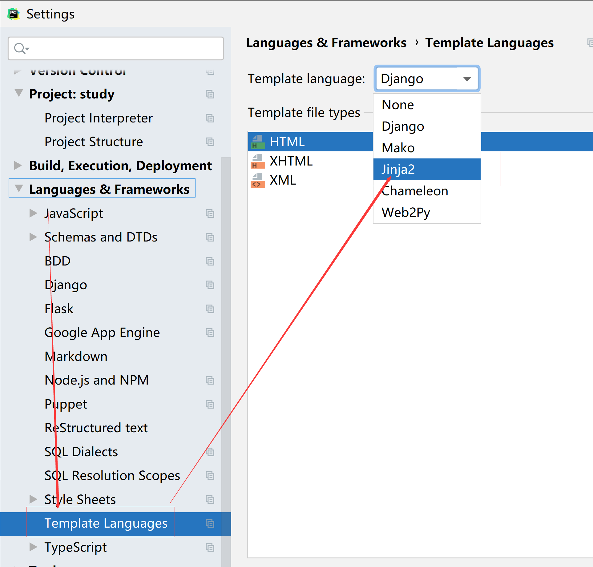

### 创建admin用户名与密码
- pycharm中Tools-》Run manage task
- makemigrations
- migrate
- createsuperuser

### c创建项目
- django-admin startproject mysite
- 运行程序 python manage.py runserver
### 创建app
- python manage.py startapp blog

### 安装
- pip install django

- pip install MySQL

  ````
  #__init__.py文件中必须添加如下的内容 要使用mysql，此次一定不能少，否则会导致makemigrations失败
  import pymysql
  pymysql.install_as_MySQLdb()
  ````

  

### 常用操作命令
- python manage.py makemigrations
- python manage.py migrate
- python manage.py shell

### 创建管理员账户
- python manage.py createsuperuser

### 数据操作
1. SystemInfo.objects().all()
2. SystemInfo.objects.filter() # 筛选返回n个结果
3. exclude() === not in
- F对象语法格式

  ```django
  from django.db.models import F
  filter(id__gte==F('count'))
  ```

- Q对象

  ```django
  from django.db.models import Q
  # 或者语法
  filter(Q(id__gt==2) || Q(name__in='xx'))
  # 并且语法
  filter(Q(id__gt==2) && Q(name__in='xx'))
  # not == ~Q()
  ```

4. 聚合函数

   ```
   from django.db.models import sum
   SystemInfo.objects.aggregate(sum('id'))
   ```


### 分页数据查询

```
from django.core.paginator import Paginator
```

### 页面视图

- 跳转： 

  ```python
  path('admin/', admin.site.urls,name="index"),
  
  from django.shortcuts import render, redirect
  redirect("/index/")
  ```

- 通过名字获取路径

  ```python
  from django.urls import reverse
  path = reverse("index") // 动态路由信息获取
  redirect(path)
  ```

- namespace

  ```python
  path(r'back/', include("backend.urls",namespace="backend")),
  namepsace:name # 获取动态路由
  reverse('backend:index') # 这种方式才能获取动态路由，如果没有设置namespace，则根据name获取
  ```

- HttpRequest对象

  - 位置参数 /year/id

  - 关键字参数  ?P<id>\d+

  - get请求参数  

    -  获取字符串值：request.GET.get("username")

    - 获取列表参数：request.GET.getList("username")

  - POST数据

    - POST参数： request.POST

  - 获取body数据： request.body.decode()  # 数据格式为bytes，转换之后为字符串数据，

  - ```python
    json.dumps(request.body.decode()) # 将字典转换为json字符串
    json.loads() # 将json字符串转换为dict
    ```

- HttpResponse对象

  - data参数不要为对象和字典类型，传递字符串类型
  - 如果返回为json字符串，则直接使用JsonResponse

- 跳转到指定页面： redirect

### 类视图

- 继承自View


### 模板

-  获取变量值： {{}}

-  ... 

- 列表循环有关数据：forloop.counter 获取index数据

- 过滤器(其实就是一个函数)

  - 变量 | 过滤器：参数  ```value | date: "Y:m:d"```
  - safe 
  - default
  - length

- 继承视图： 

  ```
  
  
  
  
  
  
  
  ```

  

- jinjia2 模板

  - pip install jinjia2

- 设置模板引擎

  ```
  # 与模板有关的配置
  TEMPLATES = [
      {
          # 默认使用django template
          'BACKEND': 'django.template.backends.django.DjangoTemplates',
          #'BACKEND': 'django.template.backends.jinja2.Jinja2',
          'OPTIONS': {
              # 'environment': 'jinja2.Enviroment.environment',
          }
  ]
  ```

  - jinja2 没有多行注释

  - jiaja扩展函数配置

    ```python
    from django.templatetags.static import static
    from django.urls import reverse
    
    from jinja2 import Environment
    
    
    def environment(**options):
        env = Environment(**options)
        env.globals.update({
            'static': static,
            'url': reverse,
            'date': date
        })
        return env
    ```

  - pycharm设置jinja模板

    

  - jinja 自定义过滤器


### CSRF

- Cross Site Request Forgery 跨站请求伪造

- 使用短信验证码或者邮件验证码解决此问题

  ```python
  from django.middleware.csrf import get_token
  csrf_token = get_token(request)
  ```

- 

### restfull风格

- 参考文档：http://soong.site/drf/C01-IntroduceToDRF/DevelopRESTAPIWithDjango.html
- 

### 序列化

- 对于模型类中的字段验证放在序列化中

- 嵌套序列化

  - 

- ser= SystemInfoSerializer(data=data_dict)

  - 验证数据：serializer.is_valid() 

  - 获取验证后的结果： serializer.validated_data

  - 自定义验证

    ```python
        # 单一字符按验证
        def validate_name(self, value):
            if value == 'python':
                raise serializers.ValidationError("不能为python")
            return value
    
        # 多个字段验证
        def validate(self, attrs):
            if attrs['readcount'] < 0:
                raise serializers.ValidationError("xxx")
            return attrs
    ```

  - 

  

### 反序列化

- ```python
  # 如果多个数据对象，则必须对于many=True
  ret = SystemInfoSerializer(objects_all,many=True)
  ret.data # 获取返回为json的数据
  ```

- 


### DRF

#### APIView

```python
from rest_framework.response import Response
from rest_framework.views import APIView
class SystemInfoView(APIView):
    def get(self, request):
       request.query_params # 获取参数
       request.data # 获取body数据，类型为dict
       return Response(data=ret.data)
```

##### GenericAPIView

```python
from rest_framework.generics import GenericAPIView

class SystemInfoView(GenericAPIView):
    # 指定当前类视图使用的查询集数据
    queryset = SystemInfo.objects.all()
    # 指定序列化器
    serializer_class = SystemInfoSerializer

    def get(self, request):
        # 获取查询的所有数据
        objects_all = self.get_queryset()

        ret = self.get_serializer(objects_all, many=True)
        # ret.is_valid()
        return Response(data=ret.data)

    def post(self, request):
        data_dict = {}
        serializer = self.get_serializer(data_dict, many=True)
        serializer.is_valid()
        # serializer.e
        serializer.save()  # 调用序列化中的create方法
        serializer.data()  ## 返回序列化值
        pass

    def put(self, request, pk):
        data = request.data
        # data = request.body.decode()
        # data_dict = json.loads(data)
        # 从查询中获取指定的单数据对象，pk与queryset 对比获取结果
        get = self.get_object()
        get.name = ""
        get.save()
        return Response({})

```

##### 拓展类（配合GenericAPIView使用）

- ListModelMixin

- CreateModelMixin

- UpdateModelMixin

- RetrieveModelMixin  获取单一数据对象

- DestroyModelMixin 删除数据

```python
from rest_framework.generics import GenericAPIView
from rest_framework.mixins import CreateModelMixin, ListModelMixin, RetrieveModelMixin, UpdateModelMixin, \
    DestroyModelMixin
    
class SystemInfoView(GenericAPIView,CreateModelMixin,ListModelMixin):
    # 指定当前类视图使用的查询集数据
    queryset = SystemInfo.objects.all()
    # 指定序列化器
    serializer_class = SystemInfoSerializer

    def get(self, request):
        # 获取查询的所有数据
        return self.list(request)

    def post(self, request):
        return self.create(request)

```

##### 拓展类子类

- 