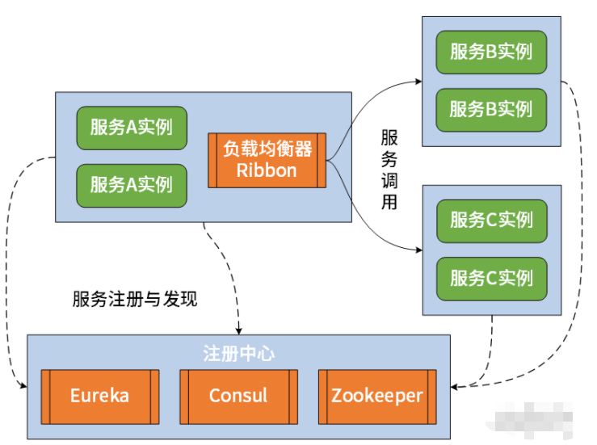
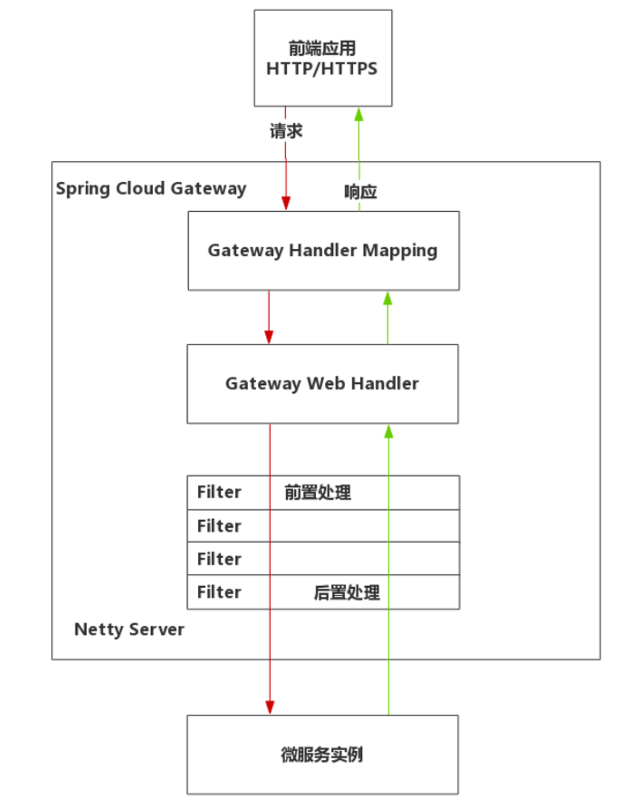

### 微服务服务治理

- 在微服务架构中，对于任何一个服务而言，既可以是服务提供者，也可以是服务消费者。围绕服务消费者如何调用服务提供者这个问题，需要进行服务的治理。
- Spring Cloud中整体服务治理方案

### Spring Cloud Gateway

- 执行流程

**路由（Route）**是指一个完整的网关地址映射与处理过程。一个完整的路由包含两部分配置：**谓词（Predicate）**与**过滤器（Filter）**。前端应用发来的请求要被转发到哪个微服务上，是由**谓词**决定的；而转发过程中请求、响应数据被网关如何加工处理是由**过滤器**决定的。

在整个处理过程中谓词（Predicate）与过滤器（Filter）起到了重要作用，谓词决定了路径的匹配规则，让 Gateway 确定应用哪个微服务，而 Filter 则是对请求或响应作出实质的前置、后置处理。

**计时过滤器**是指任何从网关访问的请求，都要在日志中记录下从请求进入到响应退出的执行时间，通过这个时间运维人员便可以收集并分析哪些功能进行了慢处理，以此为依据进行进一步优化。