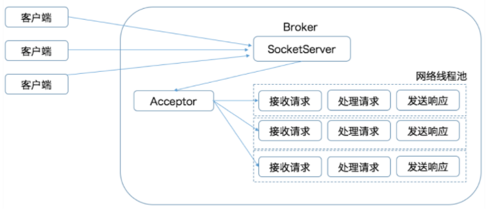
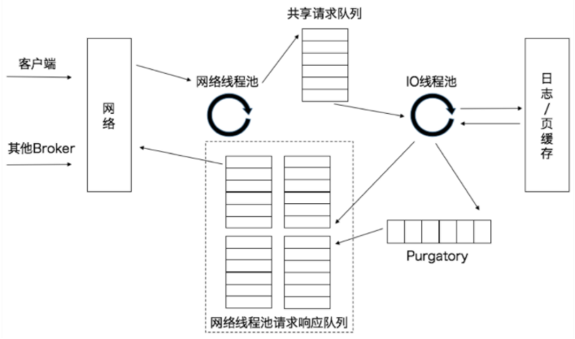

### kafka broken处理请求模型





- IO 线程池处中的线程才是执行请求逻辑的线程。Broker 端参数**num.io.threads**控制了这个线程池中的线程数。**目前该参数默认值是 8，表示每台 Broker 启动后自动创建 8 个 IO 线程处理请求**。你可以根据实际硬件条件设置此线程池的个数。

---

- Selector
  
  ```java
  @Override
    public void connect(String id, InetSocketAddress address, int sendBufferSize, int receiveBufferSize) throws IOException {
        ensureNotRegistered(id);
        SocketChannel socketChannel = SocketChannel.open();
        SelectionKey key = null;
        try {
            configureSocketChannel(socketChannel, sendBufferSize, receiveBufferSize);
            boolean connected = doConnect(socketChannel, address);
            key = registerChannel(id, socketChannel, SelectionKey.OP_CONNECT);
  
            if (connected) {
                // OP_CONNECT won't trigger for immediately connected channels
                log.debug("Immediately connected to node {}", id);
                immediatelyConnectedKeys.add(key);
                key.interestOps(0);
            }
        } catch (IOException | RuntimeException e) {
            if (key != null)
                immediatelyConnectedKeys.remove(key);
            channels.remove(id);
            socketChannel.close();
            throw e;
        }
    }
  ```

- 对于socketchanel配置
  
  ```java
    private void configureSocketChannel(SocketChannel socketChannel, int sendBufferSize, int receiveBufferSize)
            throws IOException {
        socketChannel.configureBlocking(false); // 非阻塞
        Socket socket = socketChannel.socket();
        socket.setKeepAlive(true); //keepalived
        if (sendBufferSize != Selectable.USE_DEFAULT_BUFFER_SIZE)
            socket.setSendBufferSize(sendBufferSize);
        if (receiveBufferSize != Selectable.USE_DEFAULT_BUFFER_SIZE)
            socket.setReceiveBufferSize(receiveBufferSize);
        socket.setTcpNoDelay(true); // NoDelay
    }
  ```

- Deque 双端队列数据结构使用