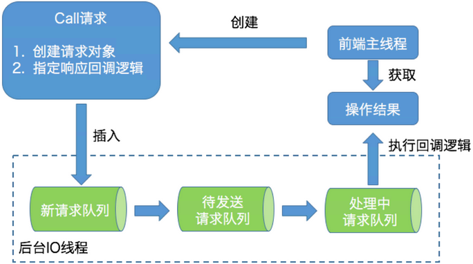

### AdminClient

1. 主题管理：包括主题的创建、删除和查询。
2. 权限管理：包括具体权限的配置与删除。
3. 配置参数管理：包括 Kafka 各种资源的参数设置、详情查询。所谓的 Kafka 资源，主要有 Broker、主题、用户、Client-id 等。
4. 副本日志管理：包括副本底层日志路径的变更和详情查询。
5. 分区管理：即创建额外的主题分区。
6. 消息删除：即删除指定位移之前的分区消息。
7. Delegation Token 管理：包括 Delegation Token 的创建、更新、过期和详情查询。
8. 消费者组管理：包括消费者组的查询、位移查询和删除。
9. Preferred 领导者选举：推选指定主题分区的 Preferred Broker 为领导者。

**工作原理**

- **从设计上来看，AdminClient 是一个双线程的设计：前端主线程和后端 I/O 线程**。前端线程负责将用户要执行的操作转换成对应的请求，然后再将请求发送到后端 I/O 线程的队列中；而后端 I/O 线程从队列中读取相应的请求，然后发送到对应的 Broker 节点上，之后把执行结果保存起来，以便等待前端线程的获取。



> Note: 后端 I/O 线程其实是有名字的，名字的前缀是  kafka-admin-client-thread。有时候我们会发现，AdminClient 程序貌似在正常工作，但执行的操作没有返回结果，或者 hang 住了，现在你应该知道这可能是因为 I/O 线程出现问题导致的。如果你碰到了类似的问题，不妨使用**jstack 命令**去查看一下你的 AdminClient 程序，确认下 I/O 线程是否在正常工作。
>
> 这可不是我杜撰出来的好处，实际上，这是实实在在的社区 bug。出现这个问题的根本原因，就是 I/O 线程未捕获某些异常导致意外“挂”掉。由于 AdminClient  是双线程的设计，前端主线程不受任何影响，依然可以正常接收用户发送的命令请求，但此时程序已经不能正常工作了。

- 创建主题

  ```java
  String newTopicName = "test-topic";
  
  try (AdminClient client = AdminClient.create(props)) {
           NewTopic newTopic = new NewTopic(newTopicName, 10, (short) 3);
           CreateTopicsResult result = client.createTopics(Arrays.asList(newTopic));
           result.all().get(10, TimeUnit.SECONDS);
  }
  ```

- 查询消费者组位移

  ```java
  String groupID = "test-group";
  try (AdminClient client = AdminClient.create(props)) {
           ListConsumerGroupOffsetsResult result = client.listConsumerGroupOffsets(groupID);
           Map<TopicPartition, OffsetAndMetadata> offsets = 
                    result.partitionsToOffsetAndMetadata().get(10, TimeUnit.SECONDS);
           System.out.println(offsets);
  }
  ```

- 查看磁盘占用

  ```java
  try (AdminClient client = AdminClient.create(props)) {
  
           DescribeLogDirsResult ret = client.describeLogDirs(Collections.singletonList(targetBrokerId)); // 指定 Broker id
           long size = 0L;
           for (Map<String, DescribeLogDirsResponse.LogDirInfo> logDirInfoMap : ret.all().get().values()) {
                    size += logDirInfoMap.values().stream().map(logDirInfo -> logDirInfo.replicaInfos).flatMap(
                             topicPartitionReplicaInfoMap ->
                             topicPartitionReplicaInfoMap.values().stream().map(replicaInfo -> replicaInfo.size)).mapToLong(Long::longValue).sum();
           }
           System.out.println(size);
  
  }
  ```

### 认证

- 英文是 authentication，是指通过一定的手段，完成对用户身份的确认。认证的主要目的是确认当前声称为某种身份的用户确实是所声称的用户。

### 授权

- 英文是 authorization。授权一般是指对信息安全或计算机安全相关的资源定义与授予相应的访问权限。

### Kafka 认证机制

**Kafka 支持的 SASL 机制有 5 种**

1. GSSAPI：也就是 Kerberos 使用的安全接口，是在 0.9 版本中被引入的。
   - GSSAPI 适用于本身已经做了 Kerberos 认证的场景，这样的话，SASL/GSSAPI 可以实现无缝集成。
2. PLAIN：是使用简单的用户名 / 密码认证的机制，在 0.10 版本中被引入。
   - SASL/PLAIN 的配置和运维成本相对较小，适合于小型公司中的 Kafka 集群
3. SCRAM：主要用于解决 PLAIN 机制安全问题的新机制，是在 0.10.2 版本中被引入的。
4. OAUTHBEARER：是基于 OAuth 2 认证框架的新机制，在 2.0 版本中被引进。
5. Delegation Token：补充现有 SASL 机制的轻量级认证机制，是在 1.1.0 版本被引入的。

