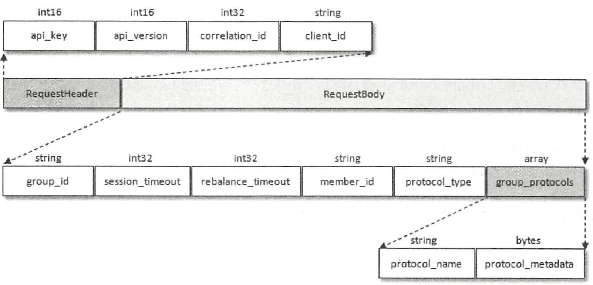
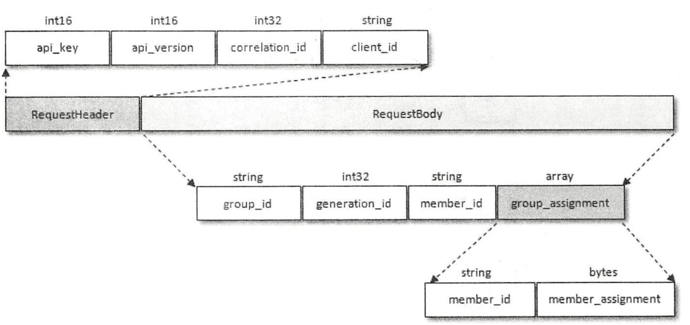
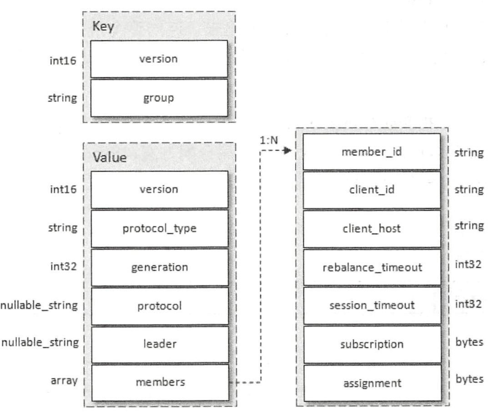
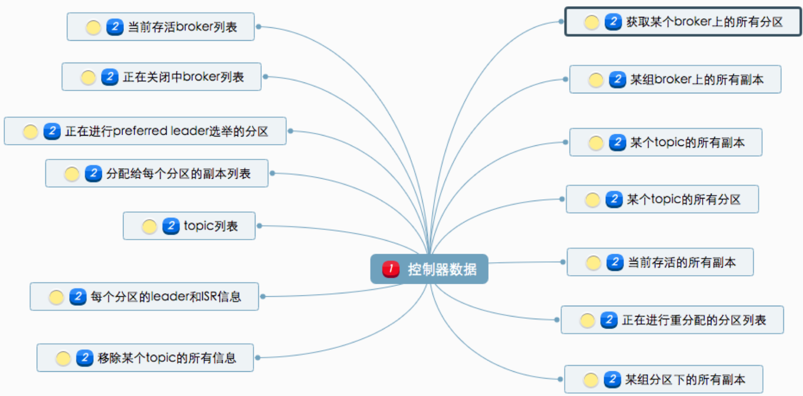
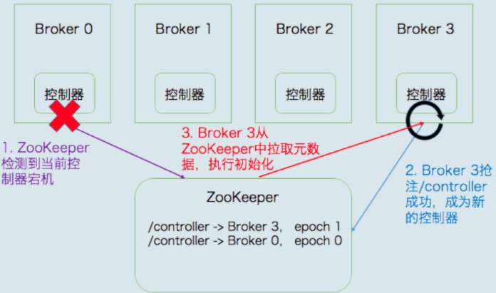
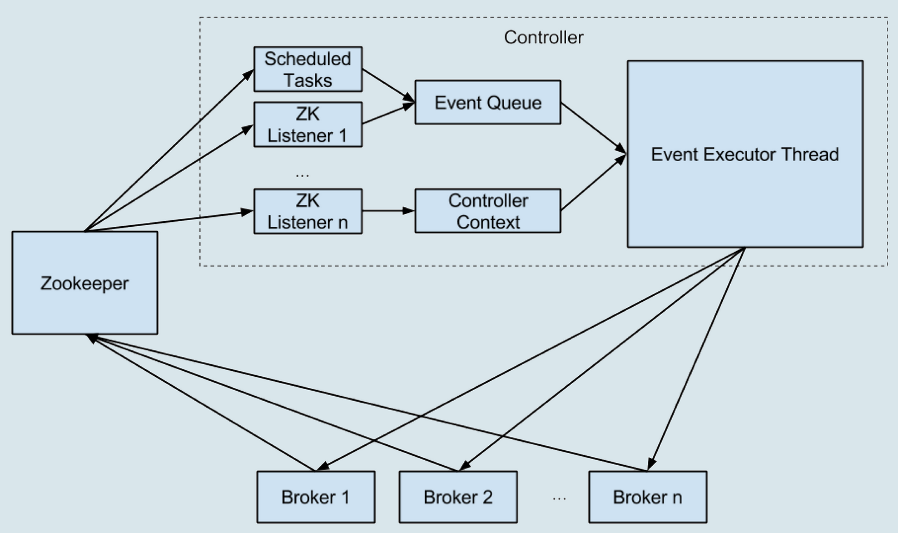

### 再均衡原理

### 当有消费者加入消费组时

- Find_coordinator 阶段

  - 消费组需要确认它所属的消费组对应的GroupCoordinator所在的broker，并创建与该broker相互通信的网络连接。
  - 找到对应的分区之后，继续寻找此分区leader副本所在的broker节点，该broker节点就是这个groupId所对应的GroupCoordinator节点。

- Join Group阶段

  - 消费者 GroupCoordinator->JoinGroupRequest请求，JoinGroupRequest数据结构如下

    

  - Request与Response过程如下

    

  - JoinGroupResponse返回内容具体结构

    

- Sync_group阶段

  - 各个消费者通过GroupCoordinator发送SyncGroupRequest请求来同步分配方案，通过Coordinator这个中间人来同步数据

    

  - SyncGroupRequest 结构体如下，其中只有leader节点的group_assignment由分区分配数据

    

  - 消费组元数据信息结构图

    

    - protocal_type 消费组实现的协议，这里的值为“consumer”。
    - generation： 标识当前消费组的年代信息，避免受到过期请求的影响。
    - protocal 消费组选取的分区分配策略
    - leader 消费组的leader消费者名称
    - members 数据类型，包含消费组各个消费者成员信息。subscription和assignment者两个字段，分别代表消费者的订阅信息和分配信息。

- heartbeat阶段

  - 消费者的心跳间隔时间由参数heartbeat.interval.ms 指定，默认值为3000，即3s，这个参数比session.timeout.ms参数设定的值要小。一般heartbeat.interval.ms的值不能超过session.timeout.ms值的1/3,这个参数可以调整更低，以控制正常重新平衡的预期时间。

- **重平衡过程是如何通知到其他消费者实例的？答案就是，靠消费者端的心跳线程（Heartbeat Thread）**。

### 消费者组状态机

- Broker 端的协调者组件就要开始忙了，主要涉及到控制消费者组的状态流转，Kafka 为消费者组定义了 5 种状态，它们分别是：Empty、Dead、PreparingRebalance、CompletingRebalance 和 Stable

  

- 状态机流转图

  

#### 消费者端重平衡流程

- 在消费者端，重平衡分为两个步骤：分别是加入组和等待领导者消费者（Leader Consumer）分配方案。这两个步骤分别对应两类特定的请求：**JoinGroup 请求和 SyncGroup 请求**。

- **领导者消费者的任务是收集所有成员的订阅信息，然后根据这些信息，制定具体的分区消费分配方案。**

- JoinGroup 请求的主要作用是将组成员订阅信息发送给领导者消费者，待领导者制定好分配方案后，重平衡流程进入到 SyncGroup 请求阶段。

  

- SyncGroup 请求的主要目的，就是让协调者把领导者制定的分配方案下发给各个组内成员。当所有成员都成功接收到分配方案后，消费者组进入到 Stable 状态，即开始正常的消费工作。

  

- 新成员入组流程

  

- 成员主动离组

  

- 崩溃离组

  

- 

#### kafka中zookeeper

- 在zookeeper中创建节点如图

#####  控制器作用

1. **主题管理（创建、删除、增加分区）**
2. **分区重分配**
3. **Preferred 领导者选举**
4. **集群成员管理（新增 Broker、Broker 主动关闭、Broker 宕机）**
5. **数据服务**

##### 控制器保存数据

##### 比较重要的数据如下

- 所有主题信息。包括具体的分区信息，比如领导者副本是谁，ISR 集合中有哪些副本等。
- 所有 Broker 信息。包括当前都有哪些运行中的 Broker，哪些正在关闭中的 Broker 等。
- 所有涉及运维任务的分区。包括当前正在进行 Preferred 领导者选举以及分区重分配的分区列表。

### 控制器故障转移（Failover）

- **故障转移指的是，当运行中的控制器突然宕机或意外终止时，Kafka 能够快速地感知到，并立即启用备用控制器来代替之前失败的控制器**

  

- 控制器内部设计原理

  统一处理各种控制器事件，然后控制器将原来执行的操作全部建模成一个个独立的事件，发送到专属的事件队列中，供此线程消费。这就是所谓的单线程 + 队列的实现方式。

