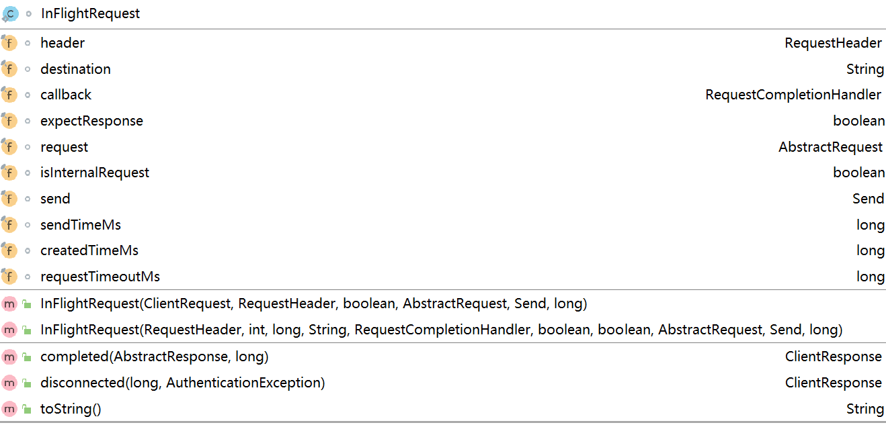

### buffer.memory

RecurdAccumulator主要用来缓存信息以便Sender线程可以批量发送，进而减少网络传输的资源消耗以及性能提升。RecurdAccumulator的大小可以通过此参数来设置，默认为32KB

### max.block.ms

如果生产者生产消息的速度大于发送到服务器段的速度，则会导致生产者空间不足，send方法要么被阻塞，要么抛出异常。取决于此参数，默认配置为60秒

### session.timeout.ms

如果一个消费发生崩溃，并停止读取消息，那么GroupCoordinator会等待一段时间，确认这个消费者死亡之后才会触发再均衡。在这一小段时间内，死掉的消费者并不会读取分区里的消息。这段时间由此参数控制，此参数必须在group.min.session.timout.ms（默认值6000）与group.max.session.timeout.ms（默认值5分钟）允许的范围内

### batch.size

ByteBuffer只针对特定大小的ByteBuffer进行管理，其他大小的ByteBuffer不会缓存进BufferPool中，这个特定的大小由batch.size决定，默认值为16KB

### max.in.flight.requests.per.connection

InflightRequest缓存已经发送出去但是还没有收到响应的请求，此类中还提供许多管理类的方法，并且通过配置参数还可以限制每个链接最多可以缓存的请求数据，

