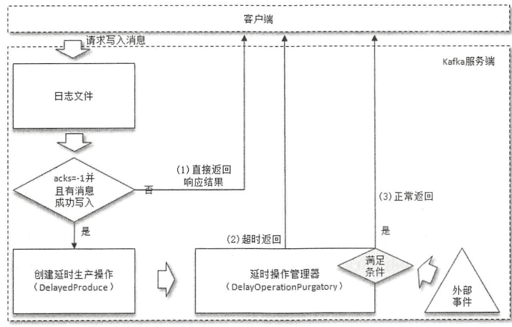
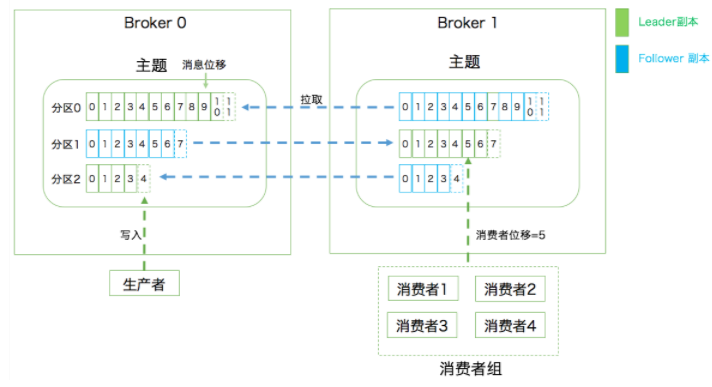
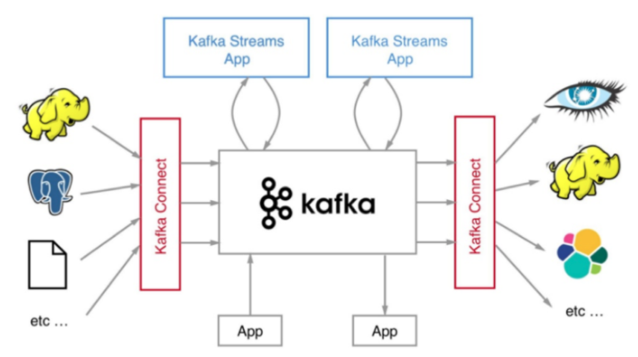

- 延时操作使用时间轮方式
- Timer， DelayQueue延迟实现使用方式与区别 时间复杂度o(nlogn) 不能满足高性能要求。
- scala实现：```TimingWheel```

- 延时操作管理器：```DelayedOperationPurgatory```

- ```ExpiredOperationReaper``` 时间轮得轮转由此实现

- 客户端在请求写入消息到收到响应结果得过程中与延时生产操作相关得细节

  


### kafka监控

- https://www.metricfire.com/blog/kafka-monitoring-using-prometheus/

### 基本概念



**主题分区与副本的关系**

- 第一层是主题层，每个主题可以配置 M 个分区，而每个分区又可以配置 N 个副本。
- 第二层是分区层，每个分区的 N 个副本中只能有一个充当领导者角色，对外提供服务；其他 N-1 个副本是追随者副本，只是提供数据冗余之用。
- 第三层是消息层，分区中包含若干条消息，每条消息的位移从 0 开始，依次递增。
- 最后，客户端程序只能与分区的领导者副本进行交互。

### 分区

- **分区的作用，就是提供负载均衡的能力，或者说对数据进行分区的主要原因就是为了实现系统的发哦伸缩性**

- 分区策略：决定生产者讲消息发送到哪个分区的算法。

  - 轮询策略，**轮询策略有非常优秀的负载均衡表现，它总是能保证消息最大限度地被平均分配到所有分区上，故默认情况下它是最合理的分区策略，也是我们最常用的分区策略之一。**

  - 随机策略。

    ```java
    List<PartitionInfo> partitions = cluster.partitionsForTopic(topic);
    return ThreadLocalRandom.current().nextInt(partitions.size());
    ```

  - **按消息键保序策略**

    ```java
    List<PartitionInfo> partitions = cluster.partitionsForTopic(topic);
    return Math.abs(key.hashCode()) % partitions.size();
    ```

  - 根据地理位置策略

    ```java
    List<PartitionInfo> partitions = cluster.partitionsForTopic(topic);
    return partitions.stream().filter(p -> isSouth(p.leader().host())).map(PartitionInfo::partition).findAny().get();
    ```

  - 

- 

### topic多队列作用

- 关于为什么分多个队列，和kafka分区一样，主要是为了能并行消费，提升消费性能。另外还有一个作用是，多个队列（分区）可以分布到多个节点上，提升主题整体的可用性。
- 

### kafka设计初衷

- 提供一套 API 实现生产者和消费者；
- 降低网络传输和磁盘存储开销；
- 实现高伸缩性架构。

### kafka connect生态圈



### kafka性能高的因素

1. 批量消息处理能力

   - 当调用send方法后，先缓存在本地，然后找到合适的时机讲缓存中的数据批量发送给服务器。
   - broker端处理批量消息时，不会对批量消息解开，一直作为一条批消息来进行处理。
   - 构建批量消息在producer端和consumer端处理，broker不参数数据处理。

2. 使用顺序读写提升磁盘IO性能

3. 使用pagecache加速消息读写

   pagecache就是操作系统在内存中给磁盘上的文件建立的缓存。无论什么程序语言，在调用系统api读写文件的时候，并不会直接去读写磁盘上的文件，都是在操作pagecache，也就是文件在内存中缓存的副本。

4. 使用zero copy技术

   1. 从文件复制数据到 PageCache 中，如果命中 PageCache，这一步可以省掉；
   2. 从 PageCache 复制到应用程序的内存空间中，也就是我们可以操作的对象所在的内存；
   3. 从应用程序的内存空间复制到 Socket 的缓冲区，这个过程就是我们调用网络应用框架的 API 发送数据的过程。
   4. Kafka 使用零拷贝技术可以把这个复制次数减少一次，上面的 2、3 步骤两次复制合并成一次复制。直接从 PageCache 中把数据复制到 Socket 缓冲区中，这样不仅减少一次数据复制，更重要的是，由于不用把数据复制到用户内存空间，DMA 控制器可以直接完成数据复制，不需要 CPU 参与，速度更快。

### 重点参数

- auto.create.topics.enable：是否允许自动创建 Topic。---**建议生产环境为false**
- unclean.leader.election.enable：是否允许 Unclean Leader 选举。   ---**建议生产环境为false**
- auto.leader.rebalance.enable：是否允许定期进行 Leader 选举(换leader)。  -- **比如 Leader A 一直表现得很好，但若`auto.leader.rebalance.enable=true`，那么有可能一段时间后 Leader A 就要被强行卸任换成 Leader B。建议生产环境为false**

- ```
  bin/kafka-topics.sh --bootstrap-server localhost:9092--create--topic transaction --partitions 1 --replication-factor 1 --config retention.ms=15552000000 --config max.message.bytes=5242880
  ```

- ```
   bin/kafka-configs.sh --zookeeper localhost:2181 --entity-type topics- -entity-name transaction --alter--add-config max.message.bytes=10485760
  ```

- 如果 Broker 所在机器的 CPU 资源非常充裕，建议使用 CMS 收集器。启用方法是指定`-XX:+UseCurrentMarkSweepGC`。

  否则，使用吞吐量收集器。开启方法是指定`-XX:+UseParallelGC`。

- 将你的 JVM 堆大小设置成 **6GB** 吧，这是目前业界比较公认的一个合理值。我见过很多人就是使用默认的 Heap Size 来跑 Kafka，说实话默认的 1GB 有点小，毕竟 Kafka Broker 在与客户端进行交互时会在 JVM 堆上创建大量的 ByteBuffer 实例，Heap Size 不能太小。实时监控堆上的live data大小，根据这个值调整heap size.

- ```
  $> export KAFKA_HEAP_OPTS=--Xms6g  --Xmx6g
  $> export  KAFKA_JVM_PERFORMANCE_OPTS= -server -XX:+UseG1GC -XX:MaxGCPauseMillis=20 -XX:InitiatingHeapOccupancyPercent=35 -XX:+ExplicitGCInvokesConcurrent -Djava.awt.headless=true
  $> bin/kafka-server-start.sh config/server.properties
  ```

- 操作系统层面

  - 文件描述符限制 ，ulimit -n 1000000
  -  ext3、ext4 或 ZFS，建议使用ZFS日志型文件系统
  - swap优化，swappniess 配置成一个接近 0 但不为 0 的值，比如 1

- 

### 消息压缩

- 消息生产者

  ```java
   Properties props = new Properties();
   props.put("bootstrap.servers", "localhost:9092");
   props.put("acks", "all");
   props.put("key.serializer", "org.apache.kafka.common.serialization.StringSerializer");
   props.put("value.serializer", "org.apache.kafka.common.serialization.StringSerializer");
   // 开启 GZIP 压缩
   props.put("compression.type", "gzip");
  ```

  

- 有两种例外情况就可能让 Broker 重新压缩消息。

  1. Broker 端指定了和 Producer 端不同的压缩算法
  2. Broker 端发生了消息格式转换

- 