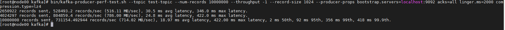
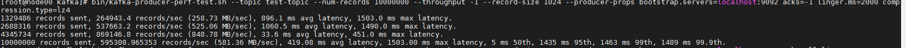

### topic

- 查看topic信息 

  ```shell
  kafka-topics.sh --bootstrap-server localhost:9092 --describe --topic topic
  ```

- 修改分区数

  ```shell
  bin/kafka-topics.sh --bootstrap-server localhost:9092 --alter --topic topic --partitions 2
  ```

-  修改主题级别参数

  ```shell
  bin/kafka-configs.sh --zookeeper zookeeper_host:port --entity-type topics --entity-name <topic_name> --alter --add-config max.message.bytes=10485760
  ```

- 查看主题消息总数

  ```shell
  bin/kafka-run-class.sh kafka.tools.GetOffsetShell --broker-list localhost:9092 --time -2 --topic test-topic
  ```

  

- 查看topic内容

```shell
bin/kafka-console-consumer.sh --bootstrap-server localhost:9092 --topic __consumer_offsets --formatter "kafka.coordinator.group.GroupMetadataManager\$GroupMetadataMessageFormatter" --from-beginning
```

### Producer

- 生产消息

  ```shell
  /bin/kafka-console-producer.sh --broker-list localhost:9092 --topic test-topic --request-required-acks -1 --producer-property compression.type=lz4
  ```

- 性能测试

  ```shell
  bin/kafka-producer-perf-test.sh --topic test-topic --num-records 10000000 --throughput -1 --record-size 1024 --producer-props bootstrap.servers=localhost:9092 acks=-1 linger.ms=2000 compression.type=lz4
  ```

  

  

- 

### Consumer

- 查看消费者组列表

  ```shell
  bin/kafka-consumer-groups.sh --bootstrap-server localhost:9092 --list
  ```

- 消费消息

  ```shell
  bin/kafka-console-consumer.sh --bootstrap-server localhost:9092 --topic test-topic --group test-group --from-beginning --consumer-property enable.auto.commit=false 
  ```

- 消费者性能参数

  ```shell
  bin/kafka-consumer-perf-test.sh --broker-list localhost:9092 --messages 10000000 --topic test-topic
  ```

### 消息数据

- 查看消息文件数据

  ```
  bin/kafka-dump-log.sh --files /opt/kafka/log/kafka-logs/topic-0/00000000000000000000.log 
  ```

### 授权认证

- 

```shell
bin/kafka-configs.sh --zookeeper localhost:2181 --alter --add-config 'SCRAM-SHA-256=[password=admin],SCRAM-SHA-512=[password=admin]' --entity-type users --entity-name admin
bin/kafka-configs.sh --zookeeper localhost:2181 --alter --add-config 'SCRAM-SHA-256=[password=writer],SCRAM-SHA-512=[password=writer]' --entity-type users --entity-name writer
bin/kafka-configs.sh --zookeeper localhost:2181 --alter --add-config 'SCRAM-SHA-256=[password=reader],SCRAM-SHA-512=[password=reader]' --entity-type users --entity-name reader
bin/kafka-configs.sh --zookeeper localhost:2181 --describe --entity-type users  --entity-name writer

```

- 动态新增用户

  ```shell
  bin/kafka-configs.sh --zookeeper localhost:2181 --alter --delete-config 'SCRAM-SHA-256' --entity-type users --entity-name writer
  
  bin/kafka-configs.sh --zookeeper localhost:2181 --alter --delete-config 'SCRAM-SHA-512' --entity-type users --entity-name writer
  
  bin/kafka-configs.sh --zookeeper localhost:2181 --alter --add-config 'SCRAM-SHA-256=[iterations=8192,password=new_writer]' --entity-type users --entity-name new_writer
  ```

### 异常处理

##### 主题删除失败

1. 手动删除 ZooKeeper 节点 /admin/delete_topics 下以待删除主题为名的 znode。

2. 手动删除该主题在磁盘上的分区目录。

3. 在 ZooKeeper 中执行 rmr  /controller，触发 Controller 重选举，刷新 Controller 缓存。

##### **__consumer_offsets 占用太多的磁盘**

- 你一定要显式地用**jstack 命令**查看一下 kafka-log-cleaner-thread 前缀的线程状态。通常情况下，这都是因为该线程挂掉了，无法及时清理此内部主题。倘若真是这个原因导致的，那我们就只能重启相应的 Broker 了

