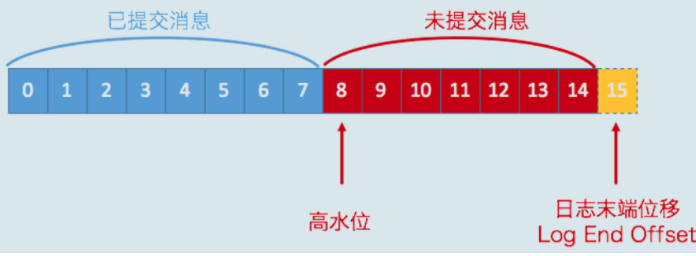
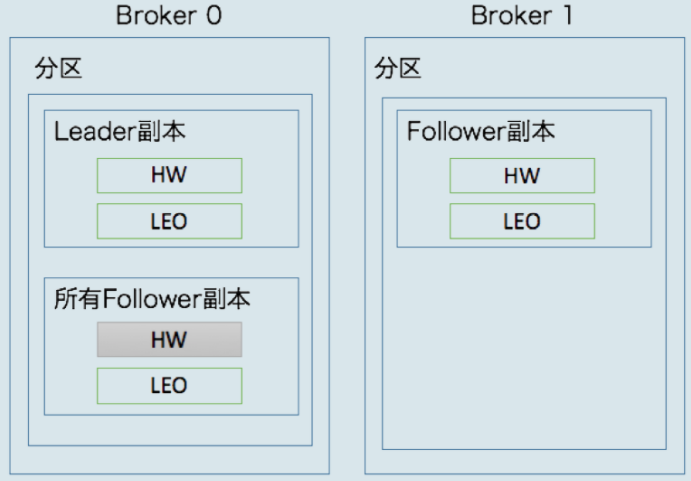
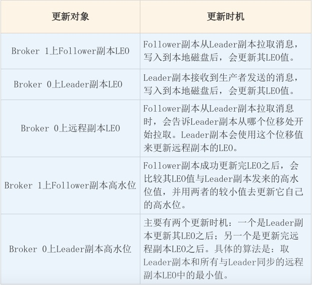
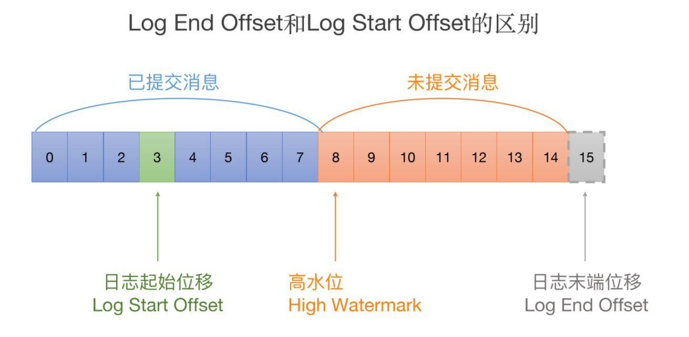
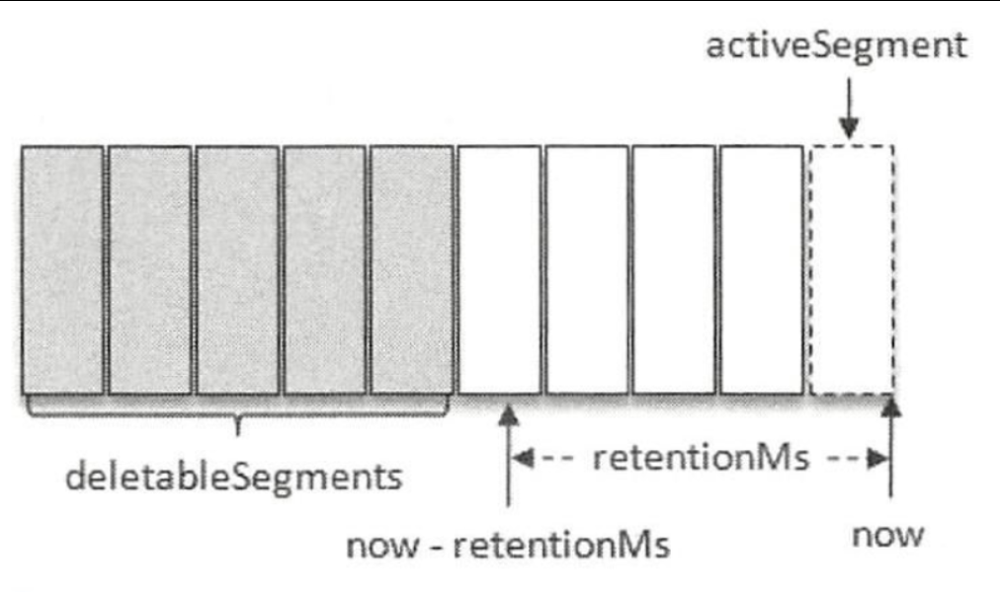
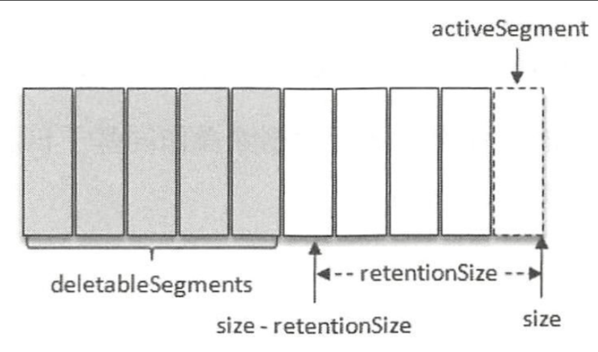
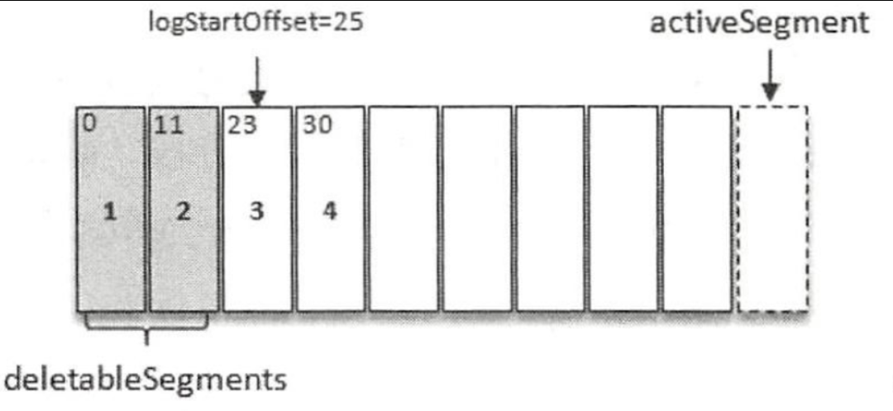

### HW 是 High Watermark 的缩写，
俗称高水位，它标识 了一个特定的消息偏移量(offset)，消费者只能拉取到这个 offset 之前的消息。

- https://mp.weixin.qq.com/s/WUg9sSXq5JZVY13tF8QmwA



- **位移值等于高水位的消息也属于未提交消息。也就是说，高水位上的消息是不能被消费者消费的**。

- Log End Offset，简写是 LEO。它表示副本写入下一条消息的位移值。注意，数字 15 所在的方框是虚线，这就说明，这个副本当前只有 15 条消息，位移值是从 0 到 14，下一条新消息的位移是 15。显然，介于高水位和 LEO 之间的消息就属于未提交消息。这也从侧面告诉了我们一个重要的事实，那就是：**同一个副本对象，其高水位值不会大于 LEO 值**。

-  Leader 副本所在的 Broker 上，还保存了其他 Follower 副本的 LEO 值

  

- 为什么要在 Broker 0 上保存这些远程副本呢？其实，它们的主要作用是，**帮助 Leader 副本确定其高水位，也就是分区高水位**。

  

- Leader 副本保持同步。判断的条件有两个。

  1. 该远程 Follower 副本在 ISR 中。
  2. 该远程 Follower 副本 LEO 值落后于 Leader 副本 LEO 值的时间，不超过 Broker 端参数 replica.lag.time.max.ms 的值。如果使用默认值的话，就是不超过 10 秒。

**Leader 副本**

处理生产者请求的逻辑如下：

1. 写入消息到本地磁盘。
2. 更新分区高水位值。
    i. 获取 Leader 副本所在 Broker 端保存的所有远程副本 LEO 值{LEO-1，LEO-2，……，LEO-n}。
    ii. 获取 Leader 副本高水位值：currentHW。
    iii. 更新 currentHW = min(currentHW, LEO-1，LEO-2，……，LEO-n)。

处理 Follower 副本拉取消息的逻辑如下：

1. 读取磁盘（或页缓存）中的消息数据。
2. 使用 Follower 副本发送请求中的位移值更新远程副本 LEO 值。
3. 更新分区高水位值（具体步骤与处理生产者请求的步骤相同）。

**Follower 副本**

从 Leader 拉取消息的处理逻辑如下：

1. 写入消息到本地磁盘。
2. 更新 LEO 值。
3. 更新高水位值。
    i. 获取 Leader 发送的高水位值：currentHW。
    ii. 获取步骤 2 中更新过的 LEO 值：currentLEO。
    iii. 更新高水位为 min(currentHW, currentLEO)。

### LW 是 Low Watermark 的缩写，
俗称“低水位”，代表 AR 集合中最小的 logStartOffset 值。副本的拉取请求(FetchRequest，它有可能触发新建日志分段而旧的被清理，进而导致 logStartOffset 的增加)和删除消息请求(DeleteRecordRequest)都有可能促使 LW 的增长。



### kafka中日志保留策略
 Kafka 的日志管理器中会有一个专门的日志删除任务来周期性地检测和删除不符合保留条件的日志分段文件，这个周期可以通过 broker 端参数 ```log.retention.check.interval.ms```来配置，默认值为 300000，即 5 分钟。当前日志分段的保留策略有 3 种：
 - 基于时间的保留策略、
   
 - 
 - 基于日志大小的保留策略
   
 - 基于日志起始偏移量的保留策略。
 而“基于日志起始偏移量的保留策略”正是基于 logStartOffset来实现的
   

 ### 日志清理
 > 日志删除时指清楚整个日志分段，日志压缩时值对相同key的消息的合并清理。
 - 日志压缩
   - log compaction 对于有相同key的不同value值，只保留最后一个版本，如果应用只关心key对应的最新的value值，则可以开启kafka的日志清理功能，kafka灰定期将相同key的消息进行合并，只保留最新的value值。
   > NOTE:log compacation是针对key，所以在使用时，每个消息的key值部位null
   - log.dir目录下面的文件```cleaner-offset-checkpoint```文件，就是清理检查点文件，用来记录每个主题的每个分区中已清理的偏移量。通过检查点将Log文件两个部分：已经清理clean部分和未清理dirty部分
   - 日志在被清理前最小保留时间: ```log.cleaner.min.compaction.lag.ms``` 默认值为0，配置消息在被清理前最小保留时间。
   - 脏页率 ```dirtyRatio = dirtyBytes / (cleanByte + dirtyBytes)``` 为了保证日志不必要的频繁清理操作，可以使用```log.cleaner.min.cleanable.ration```来限定可进行清理操作的最小脏页。默认值为0.5
   - 


 - 日志删除
