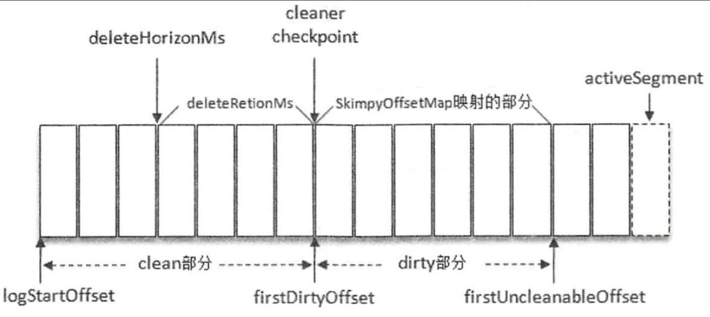

### HW 是 High Watermark 的缩写，
俗称高水位，它标识 了一个特定的消息偏移量(offset)，消费者只能拉取到这个 offset 之前的消息。

- https://mp.weixin.qq.com/s/WUg9sSXq5JZVY13tF8QmwA

### LW 是 Low Watermark 的缩写，
俗称“低水位”，代表 AR 集合中最小的 logStartOffset 值。副本的拉取请求(FetchRequest，它有可能触发新建日志分段而旧的被清理，进而导致 logStartOffset 的增加)和删除消息请求(DeleteRecordRequest)都有可能促使 LW 的增长。

### kafka中日志保留策略
 Kafka 的日志管理器中会有一个专门的日志删除任务来周期性地检测和删除不符合保留条件的日志分段文件，这个周期可以通过 broker 端参数 ```log.retention.check.interval.ms```来配置，默认值为 300000，即 5 分钟。当前日志分段的保留策略有 3 种：
 - 基于时间的保留策略、
   
 - 基于日志大小的保留策略
   
 - 基于日志起始偏移量的保留策略。
 而“基于日志起始偏移量的保留策略”正是基于 logStartOffset来实现的
   

 ### 日志清理
 > 日志删除时指清楚整个日志分段，日志压缩时值对相同key的消息的合并清理。
 - 日志压缩
   - log compaction 对于有相同key的不同value值，只保留最后一个版本，如果应用只关心key对应的最新的value值，则可以开启kafka的日志清理功能，kafka灰定期将相同key的消息进行合并，只保留最新的value值。
   > NOTE:log compacation是针对key，所以在使用时，每个消息的key值部位null
   - log.dir目录下面的文件```cleaner-offset-checkpoint```文件，就是清理检查点文件，用来记录每个主题的每个分区中已清理的偏移量。通过检查点将Log文件两个部分：已经清理clean部分和未清理dirty部分
   - 日志在被清理前最小保留时间: ```log.cleaner.min.compaction.lag.ms``` 默认值为0，配置消息在被清理前最小保留时间。
   - 脏页率 ```dirtyRatio = dirtyBytes / (cleanByte + dirtyBytes)``` 为了保证日志不必要的频繁清理操作，可以使用```log.cleaner.min.cleanable.ration```来限定可进行清理操作的最小脏页。默认值为0.5
   - 
 

 - 日志删除
