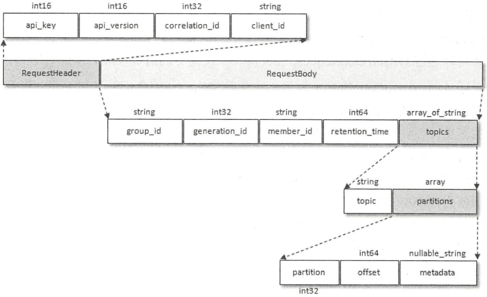
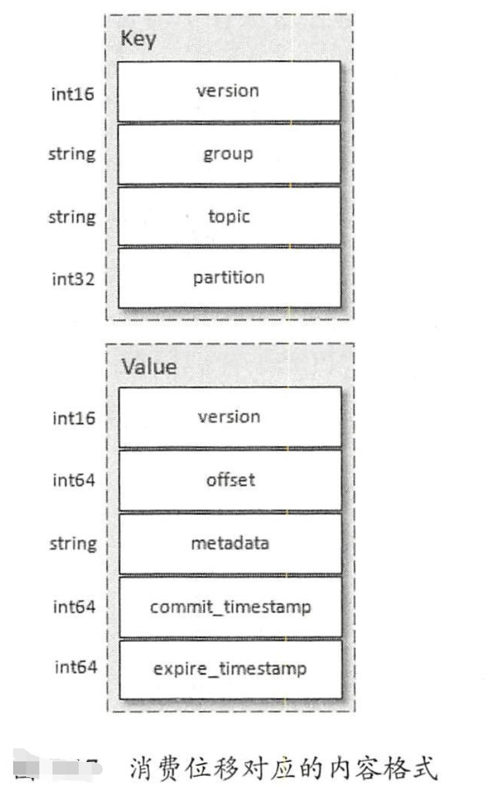

- 时间轮

- TimingWheel 使用DelayQueue来协助推进时间轮

- controlller节点会在zookeeper中写入key为```/controller```, 查看其值使用```get /controller```


### __consumer_offsets

- 位移提交的内容最终会保存到kafka的内部主题中。副本一次由参数```offsets.topic.replication.factor```(默认值为3)控制，分区数```offsets.topic.num.partitions``` 默认值为50

- 客户端提交位移使用OffsetCommitRequest请求实现，结构如图所示

  

- 消费位移对应的内容格式，```expire_timestamp```的值为commit_timestamp值与offset/retention.minutes参数值之和相等。

  

### 事务

- 消息中间件的消息传输保障有三个层级
  - at most once 最多一次。消息可能会丢失，但是绝对不会重复。
  - at least once 最少一次。消息绝对不会丢失，但是可能会重复传输。
  - exactly once 恰好一次。每条消息肯定会被传输一次且仅传输一次。
- 0.11.0.0版本引入幂等和事务两个特性，实现EOS（exactly once semantics 精确一次处理语义）
  - 幂等： 对接口多次调用产生的结果和一次调用产生的结果是一致的。
  - enable.idempotence设置为true，ProducerConfig.ENABLE_IDEMPOTENCE_CONFIG 参数即打开幂等功能。
  - 只能保证单个生产者会话中单分区的幂等。 不保证消息内容的幂等。
  - retries >0 acks =-1  ```max.in.flight.requests.per.connection值不能大于5```
- 