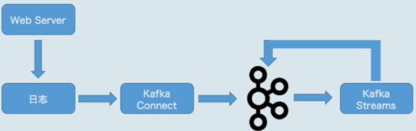
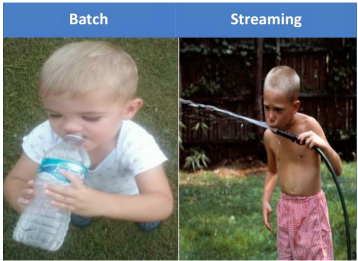
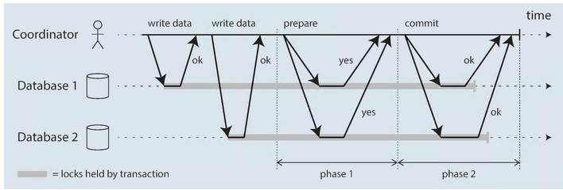
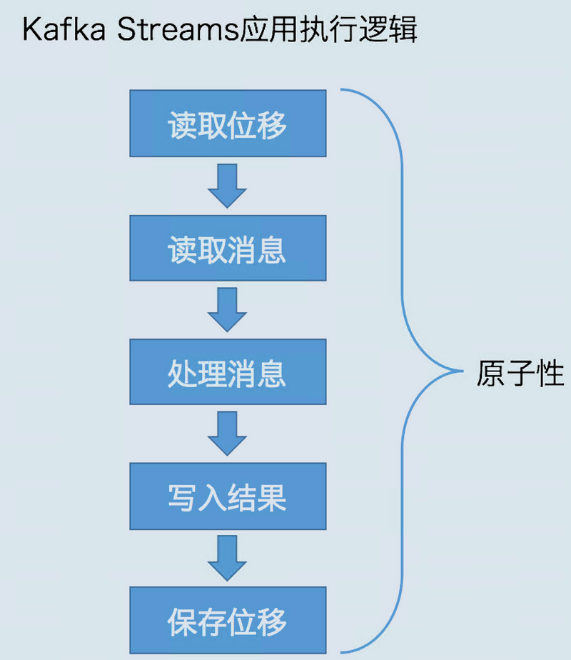

## kafka流计算

- [基本概念](https://juejin.im/entry/59bf56ebf265da065d2b63fa)

### 基于kafka实时日志流成立平台流程



```
1 partitions have leader brokers without a matching listener
```

- 配置
  
  ```
  config/connect-distributed.properties
  
  bootstrap.servers=localhost:9092
  rest.host.name=localhost
  rest.port=8083
  ```

- 启动connector
  
  ```shell
  bin/connect-distributed.sh config/connect-distributed.properties
  ```

- 创建connector
  
  ```
  curl -H "Content-Type:application/json" -H "Accept:application/json" http://localhost:8083/connectors -X POST --data '{"name":"file-connector-nginx","config":{"connector.class":"org.apache.kafka.connect.file.FileStreamSourceConnector","file":"/usr/local/openresty/nginx/logs","tasks.max":"1","topic":"access_log"}}'
  ```

- 查看创建connector
  
  ```
  curl http://localhost:8083/connectors
  ```

- 查看对应的主题中是否有数据
  
  ```
  bin/kafka-console-consumer.sh --bootstrap-server localhost:9092 --topic os-check --from-beginning --property value.deserializer=org.apache.kafka.common.serialization.LongDeserializer --property print.key=true --property key.deserializer=org.apache.kafka.streams.kstream.TimeWindowedDeserializer --property key.deserializer.default.windowed.key.serde.inner=org.apache.kafka.common.serialization.Serdes\$StringSerde
  ```

### 基本概念

**流处理平台（Streaming System）是处理无限数据集（Unbounded Dataset）的数据处理引擎，而流处理是与批处理（Batch Processing）相对应的**

利用流处理快速地给出不那么精确的结果；另一方面，依托于批处理，最终实现数据一致性。这就是所谓的**Lambda 架构**



- 所谓的**微批化**，其实就是重复地执行批处理引擎来实现对无限数据集的处理。典型的微批化实现平台就是Spark Streaming。

### kafka Stream 与其他框架对比

- 应用部署
  
  - Kafka Streams 更倾向于将部署交给开发人员来做，而不是依赖于框架自己实现。

- 目前 Kafka Streams 只支持与 Kafka 集群进行交互，它没有提供开箱即用的外部数据源连接器。

- 分布式系统中的 2PC 常见于数据库内部实现或以 XA 事务的方式供各种异质系统使用。Kafka 也借鉴了 2PC 的思想，在 Kafka 内部实现了基于 2PC 的事务机制。
  
  

- kafka streams执行步骤
  
  1. 读取最新处理的消息位移；
  2. 读取消息数据；
  3. 执行处理逻辑；
  4. 将处理结果写回到 Kafka；
  5. 保存位置信息。
  
  

- 在设计上，Kafka Streams 在底层大量使用 Kafka 事务机制和幂等性 Producer 来实现多分区的原子性写入，又因为它只能读写 Kafka，因此 Kafka Streams 很容易地就实现了端到端的 EOS。

**所有流处理应用本质上都可以分为两类：有状态的（Stateful）应用和无状态的（Stateless）应用**。

- 有状态的应用指的是应用中使用了类似于连接、聚合或时间窗口（Window）的 API。一旦调用了这些 API，你的应用就变为有状态的了，也就是说你需要让 Kafka Streams 帮你保存应用的状态。

- 无状态的应用是指在这类应用中，某条消息的处理结果不会影响或依赖其他消息的处理。常见的无状态操作包括事件转换以及刚刚那个例子中的过滤等。
