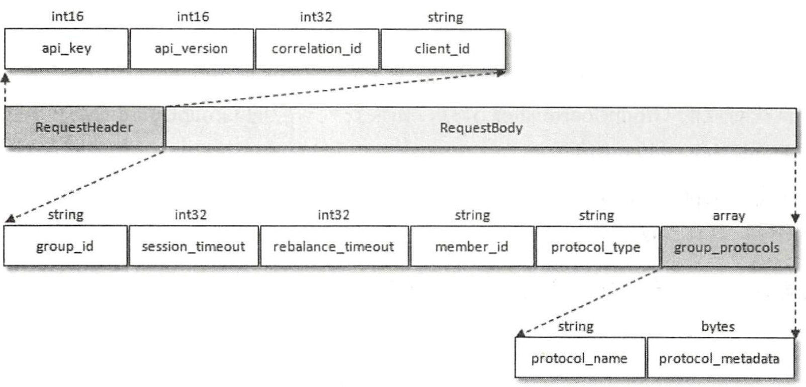
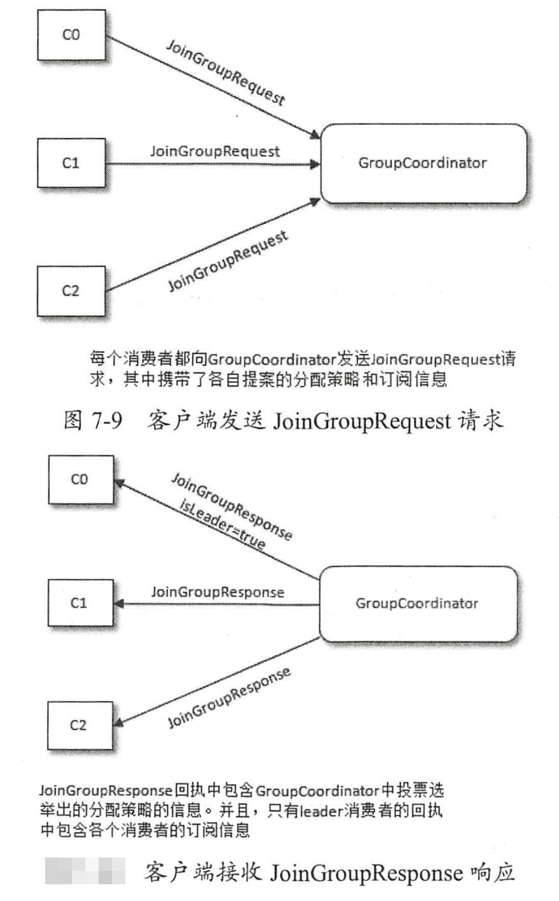
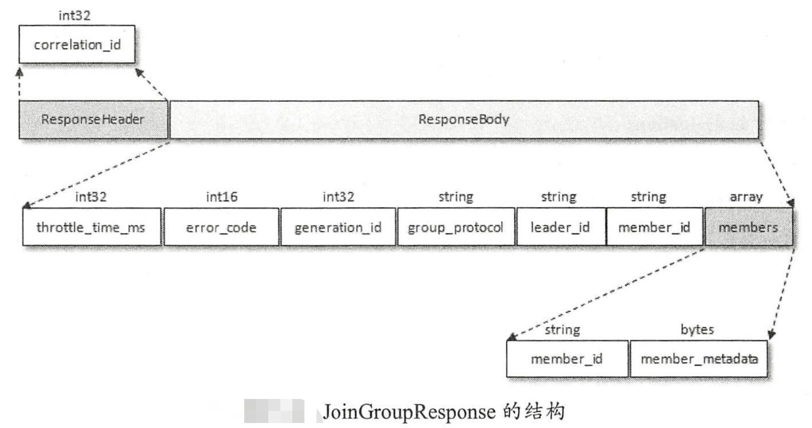
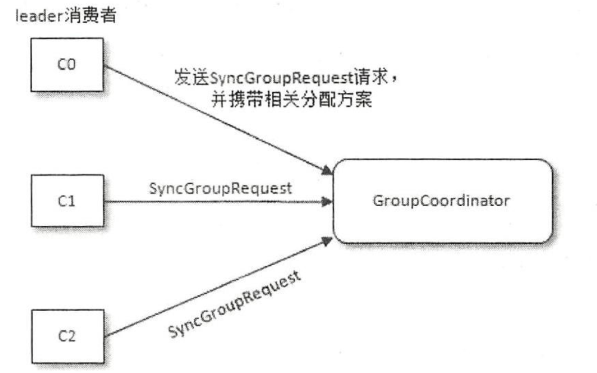
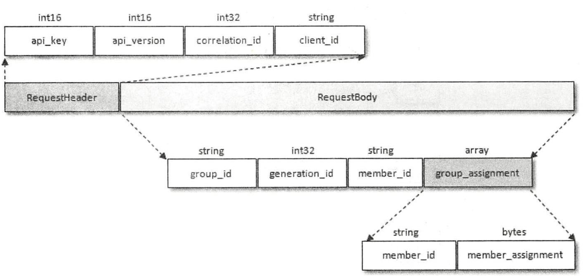
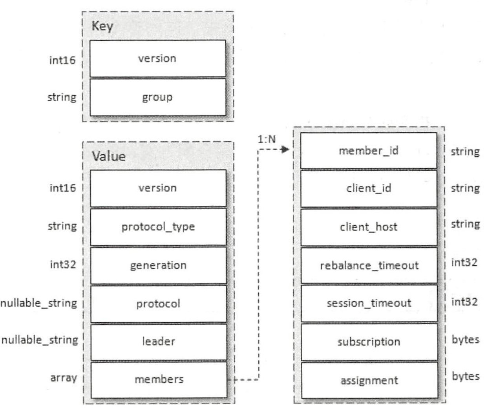

### 再均衡原理

### 当有消费者加入消费组时

- Find_coordinator 阶段

  - 消费组需要确认它所属的消费组对应的GroupCoordinator所在的broker，并创建与该broker相互通信的网络连接。
  - 找到对应的分区之后，继续寻找此分区leader副本所在的broker节点，该broker节点就是这个groupId所对应的GroupCoordinator节点。

- Join Group阶段

  - 消费者 GroupCoordinator->JoinGroupRequest请求，JoinGroupRequest数据结构如下

    

  - Request与Response过程如下

    

  - JoinGroupResponse返回内容具体结构

    

- Sync_group阶段

  - 各个消费者通过GroupCoordinator发送SyncGroupRequest请求来同步分配方案，通过Coordinator这个中间人来同步数据

    

  - SyncGroupRequest 结构体如下，其中只有leader节点的group_assignment由分区分配数据

    

  - 消费组元数据信息结构图

    

    - protocal_type 消费组实现的协议，这里的值为“consumer”。
    - generation： 标识当前消费组的年代信息，避免受到过期请求的影响。
    - protocal 消费组选取的分区分配策略
    - leader 消费组的leader消费者名称
    - members 数据类型，包含消费组各个消费者成员信息。subscription和assignment者两个字段，分别代表消费者的订阅信息和分配信息。

- heartbeat阶段

  - 消费者的心跳间隔时间由参数heartbeat.interval.ms 指定，默认值为3000，即3s，这个参数比session.timeout.ms参数设定的值要小。一般heartbeat.interval.ms的值不能超过session.timeout.ms值的1/3,这个参数可以调整更低，以控制正常重新平衡的预期时间。

  

- 