### 消息队列涉及知识

- 必读文章：https://engineering.linkedin.com/distributed-systems/log-what-every-software-engineer-should-know-about-real-time-datas-unifying

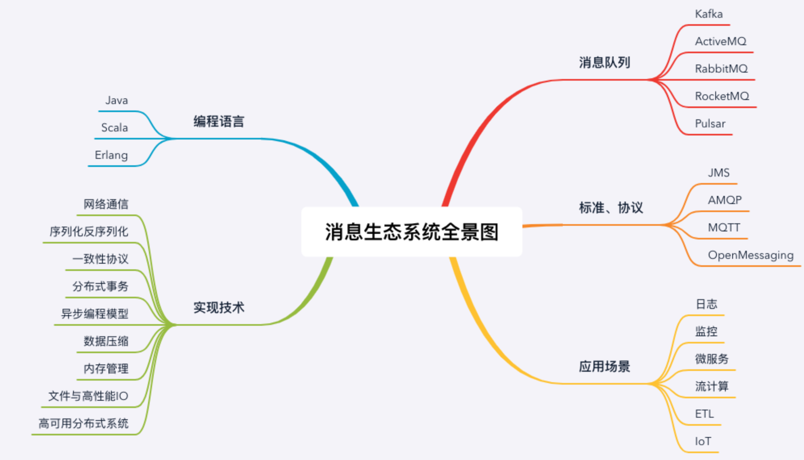

### 消息队列问题

- 引入消息队列带来的延迟问题；
- 增加了系统的复杂度；
- 可能产生数据不一致的问题。

### 秒杀系统

**使用消息队列隔离网关和后端服务，以达到流量控制和保护后端服务的目的**

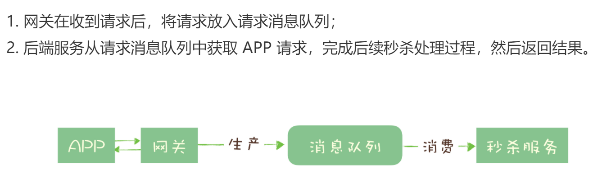

- 异步处理
- 流量限制
- 服务解耦
- 

**令牌桶控制流量的原理是： 单位时间内只发放固定数量的令牌到令牌桶中，规定服务在处理请求之前必须先从令牌桶中拿出一个令牌，如果令牌桶中没有令牌，则拒绝请求。这样就保证单位时间内，能处理的请求不超过发放令牌的数量，起到了流量控制的作用。**（参考实现：https://blog.csdn.net/king0406/article/details/103129063）

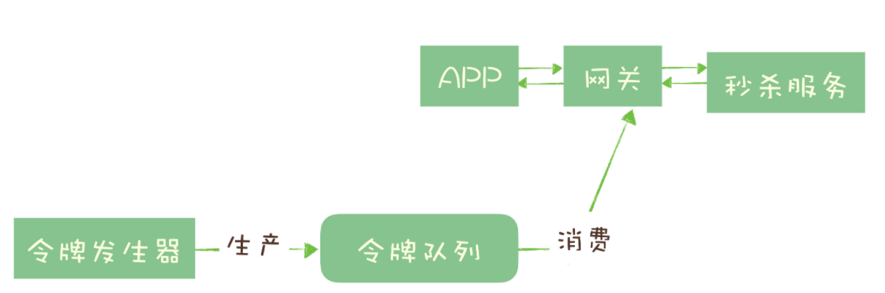

### 延迟任务

Note: silvan bullet, 万金油

### 消息队列选型

- 消息的可靠传递：确保不丢消息；
- Cluster：支持集群，确保不会因为某个节点宕机导致服务不可用，当然也不能丢消息；
- 性能：具备足够好的性能，能满足绝大多数场景的性能要求。
- **选择中间件的考量维度：可靠性，性能，功能，可运维行，可拓展性，是否开源及社区活跃度***

#### rabbitmq

- 对消息堆积支持不友好
- 性能相对来说不是最好
- 内核的语言相对小众erlang

#### rocketmq

- 不错的性能，稳定性和可靠性
- RocketMQ 对在线业务的响应时延做了很多的优化，大多数情况下可以做到毫秒级的响应，如果你的应用场景很在意响应时延，那应该选择使用 RocketMQ
- 每个主题在任意时刻，至多只能有一个消费者实例在进行消费，那就没法通过水平扩展消费者的数量来提升消费端总体的消费性能。为了解决这个问题，RocketMQ 在主题下面增加了队列的概念。
- **每个主题包含多个队列，通过多个队列来实现多实例并行生产和消费。**需要注意的是，RocketMQ 只在队列上保证消息的有序性，主题层面是无法保证消息的严格顺序的。
- 

#### kafka

- 可靠性、稳定性和功能特性等方面都可以满足绝大多数场景的需求
- Kafka 与周边生态系统的兼容性是最好的没有之一，尤其在大数据和流计算领域，几乎所有的相关开源软件系统都会优先支持 Kafka
- Kafka 不太适合在线业务场景

### topic与queue区别

- publish-subscribe pattern

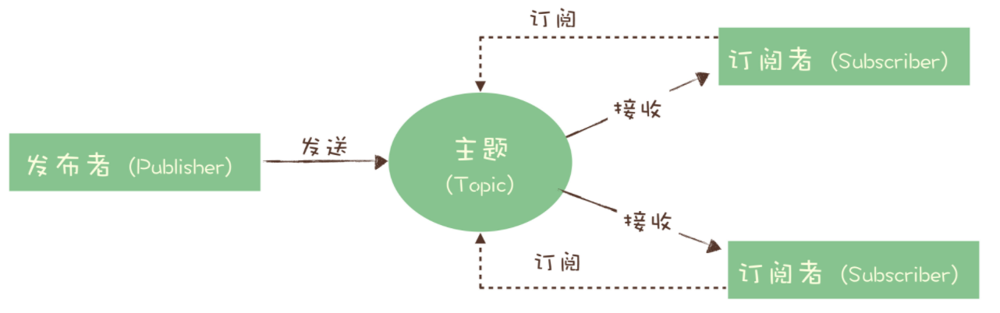

- 它们最大的区别其实就是，一份消息数据能不能被消费多次的问题。

- rabbitmq没有topic模型，而是使用队列模型，至于多个消费者需要消费消息，通过exchange配置路由目的队列实现。同一份消息如果需要被多个消费者来消费，需要配置 Exchange 将消息发送到多个队列，每个队列中都存放一份完整的消息数据，可以为一个消费者提供消费服务。这也可以变相地实现新发布 - 订阅模型中，“一份消息数据可以被多个订阅者来多次消费”这样的功能。

  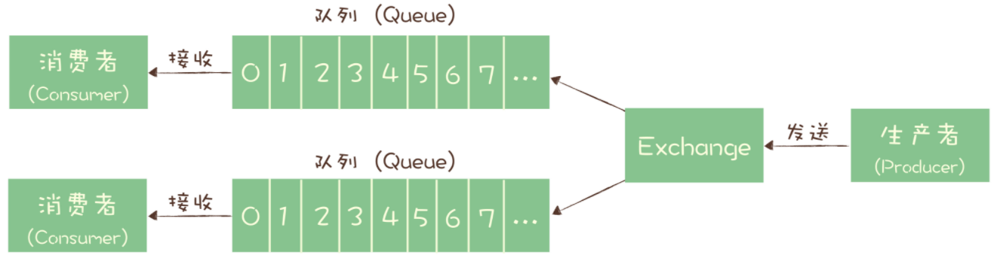

- rocketmq 消息模型

  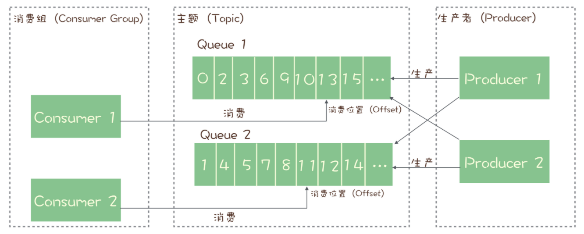

### 消息队列中的事务（分布式事务）

- **消息队列中的“事务”，主要解决的是消息生产者和消息消费者的数据一致性问题。**

  ### 分布式事务基本特征

  一个严格意义的事务实现，应该具有 4 个属性：原子性、一致性、隔离性、持久性。这四个属性通常称为 ACID 特性。

  - **原子性**，是指一个事务操作不可分割，要么成功，要么失败，不能有一半成功一半失败的情况。

  - **一致性**，是指这些数据在事务执行完成这个时间点之前，读到的一定是更新前的数据，之后读到的一定是更新后的数据，不应该存在一个时刻，让用户读到更新过程中的数据。

  - **隔离性**，是指一个事务的执行不能被其他事务干扰。即一个事务内部的操作及使用的数据对正在进行的其他事务是隔离的，并发执行的各个事务之间不能互相干扰，这个有点儿像我们打网游中的副本，我们在副本中打的怪和掉的装备，与其他副本没有任何关联也不会互相影响。

  - **持久性**，是指一个事务一旦完成提交，后续的其他操作和故障都不会对事务的结果产生任何影响。

####  kafka事务执行流程图

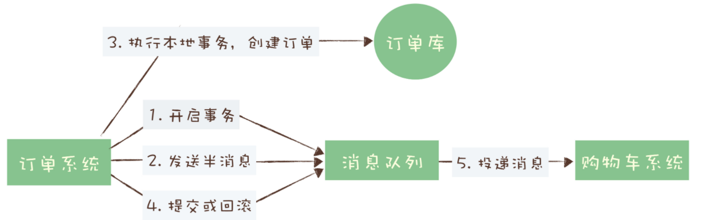

- **半消息***：消息发送之后消费者看不到，订单系统处理之后执行commit之后，购物车系统才可以看到对应的消息
- 如果第4步执行提交失败之后，kafka直接抛出异常，客户端需要处理

##### rocketmq执行事务流程

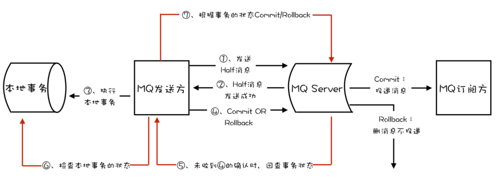

### rabbitmq实现事务

- https://www.rabbitmq.com/semantics.html


### 消息丢失

- 识别消息丢失

  - 使用拦截器在每个消息加上编号，在消费者端通过检测编号连续来检查是否丢失数据

- 生产到消费阶段

  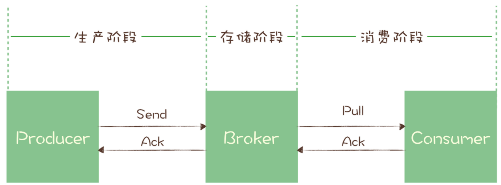

- 发送阶段

  - 发送消息代码时，需要注意，正确处理返回值或者捕获异常，就可以保证这个阶段的消息不会丢失
  - 同步发送时，只要注意捕获异常即可
  - 异步发送时，则需要在回调方法里进行检查。这个地方是需要特别注意的，很多丢消息的原因就是，我们使用了异步发送，却没有在回调中检查发送结果。

- 存储阶段

  - 消息落盘，保证broker 宕机消息也不丢失。


### 重复消费

- **At most once**: 至多一次。消息在传递时，最多会被送达一次。换一个说法就是，没什么消息可靠性保证，允许丢消息。一般都是一些对消息可靠性要求不太高的监控场景使用，比如每分钟上报一次机房温度数据，可以接受数据少量丢失。
- **At least once**: 至少一次。消息在传递时，至少会被送达一次。也就是说，不允许丢消息，但是允许有少量重复消息出现。
- **Exactly once**：恰好一次。消息在传递时，只会被送达一次，不允许丢失也不允许重复，这个是最高的等级。

**设计幂等操作**

- 利用数据库的唯一约束实现幂等

- 为更新的数据设置前置条件

- 记录并检查操作

  记录并检查操作，也称为“Token 机制或者 GUID（全局唯一 ID）机制”，实现的思路特别简单：在执行数据更新操作之前，先检查一下是否执行过这个更新操作。在发送消息时，给每条消息指定一个全局唯一的 ID，消费时，先根据这个 ID 检查这条消息是否有被消费过，如果没有消费过，才更新数据，然后将消费状态置为已消费。


### 消息堆积额

- 发送端
  - 对于发送消息的业务逻辑，只需要注意设置合适的并发和批量大小，就可以达到很好的发送性能
  - 消息发送流程
    - 发送端准备数据、序列化消息、构造请求等逻辑的时间，也就是发送端在发送网络请求之前的耗时；
    - 发送消息和返回响应在网络传输中的耗时；
    - Broker 处理消息的时延。
  - 
- 消费端
  - 我们在设计系统的时候，一定要保证消费端的消费性能要高于生产端的发送性能，这样的系统才能健康的持续运行。
  - **在扩容 Consumer 的实例数量的同时，必须同步扩容主题中的分区（也叫队列）数量，确保 Consumer 的实例数和分区数量是相等的。**如果 Consumer 的实例数量超过分区数量，这样的扩容实际上是没有效果的。
- 能导致积压突然增加，最粗粒度的原因，只有两种：要么是发送变快了，要么是消费变慢了


### 异步提高吞吐率

- java： CompletableFuture 
- 

###  异步编程

- IO密集型： 磁盘操作

  - 磁盘IO

  - 网络IO

    - 同步网络IO模型

    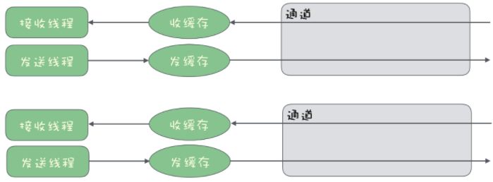

    - 异步网络IO模型

      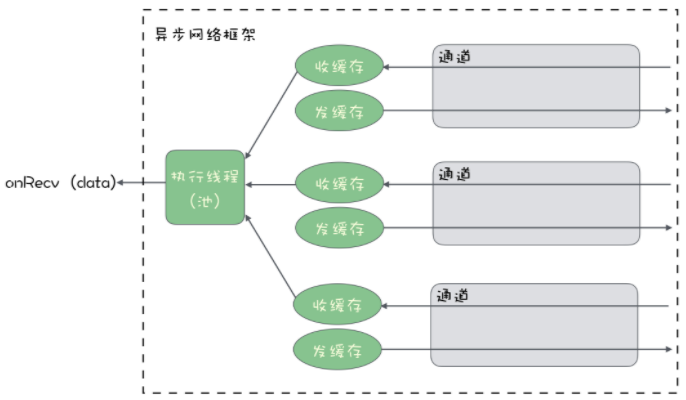

  - 需要更加关注高性能的异步网络传输。

- 计算密集型：使用CPU


### 内存管理

申请内存的逻辑非常简单

1. 计算要创建对象所需要占用的内存大小；
2. 在内存中找一块儿连续并且是空闲的内存空间，标记为已占用；
3. 把申请的内存地址绑定到对象的引用上，这时候对象就可以使用了。

如何找出可以回收的对象呢？现代的 GC 算法大多采用的是“标记 - 清除”算法或是它的变种算法，这种算法分为标记和清除两个阶段：

- 标记阶段：从 GC Root 开始，你可以简单地把 GC Root 理解为程序入口的那个对象，标记所有可达的对象，因为程序中所有在用的对象一定都会被这个 GC Root 对象直接或者间接引用。
- 清除阶段：遍历所有对象，找出所有没有标记的对象。这些没有标记的对象都是可以被回收的，清除这些对象，释放对应的内存即可。

**垃圾回收完成后，还需要进行内存碎片整理，将不连续的空闲内存移动到一起，以便空出足够的连续内存空间供后续使用**

- 在高并发的场景下，会产生大量的待回收的对象，需要频繁地执行垃圾回收，导致程序长时间暂停，我们的程序看起来就像卡死了一样。为了缓解这个问题，我们需要尽量少地使用一次性对象，对于需要频繁使用，占用内存较大的一次性对象，我们可以考虑自行回收并重用这些对象，来减轻垃圾回收的压力。

### 使用缓存减少磁盘IO

- **使用内存作为缓存来加速应用程序的访问速度，是几乎所有高性能系统都会采用的方法。**
- 应用程序可以调用 sync 等系统调用，强制操作系统立即把缓存数据同步到磁盘文件中去，但是这个同步的过程是很慢的，也就失去了缓存的意义。
- 保持缓存数据新鲜


### kafka可靠性--不丢失消息

- kafka只对“已提交”的消息(committed message)做有限度的持久化保证
  - 已提交消息
  - 有限度的持久化保证

##### 消费者端可靠性


##### 生产者端可靠性

- **如果是多线程异步处理消费消息，Consumer 程序不要开启自动提交位移，而是要应用程序手动提交位移**

### kafka consumer

- 查看消费者消费进度lag

  ```shell
  ./kafka-consumer-groups.sh --bootstrap-server 80.158.32.147:9092 --describe --group very-simple-consumer
  ```

- KafkaConsumer 就变为了双线程的设计，即**用户主线程和心跳线程**

  - **所谓用户主线程，就是你启动 Consumer 应用程序 main 方法的那个线程，而新引入的心跳线程（Heartbeat Thread）只负责定期给对应的 Broker 机器发送心跳请求，以标识消费者应用的存活性（liveness）**

- 新版本consumer设计了单线程+轮询机制，能够较好地实现非阻塞式的消息获取。

- KafkaConsumer类不是线程安全的，不能在多线程中共享KafkaConsumer实例

- 多线程方案

  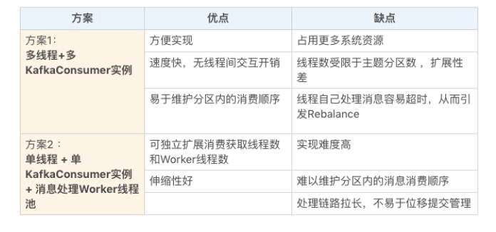

  1. **消费者程序启动多个线程，每个线程维护专属的 KafkaConsumer 实例，负责完整的消息获取、消息处理流程**

     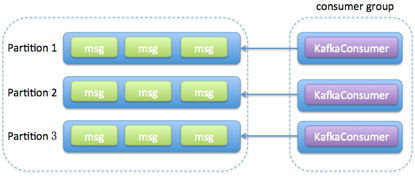

  2. **消费者程序使用单或多线程获取消息，同时创建多个消费线程执行消息处理逻辑**。获取消息的线程可以是一个，也可以是多个，每个线程维护专属的 KafkaConsumer 实例，处理消息则交由**特定的线程池**来做，从而实现消息获取与消息处理的真正解耦.

     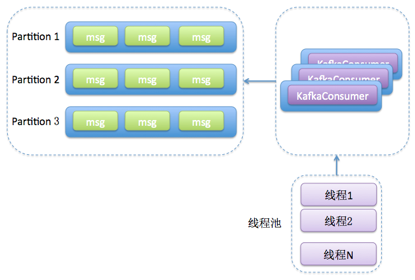

     ```java
     private final KafkaConsumer<String, String> consumer;
     private ExecutorService executors;
     ...
     private int workerNum = ...;
     executors = new ThreadPoolExecutor(
     	workerNum, workerNum, 0L, TimeUnit.MILLISECONDS,
     	new ArrayBlockingQueue<>(1000), 
     	new ThreadPoolExecutor.CallerRunsPolicy());
     
     ...
     while (true)  {
     	ConsumerRecords<String, String> records = consumer.poll(Duration.ofSeconds(1));
     	for (final ConsumerRecord record : records) {
     		executors.submit(new Worker(record));
     	}
     }
     ```

     

  3. 

  

- 

### kafka拦截器

- 生产者实现类继承**org.apache.kafka.clients.producer.ProducerInterceptor**
  1. onSend：该方法会在消息发送之前被调用。如果你想在发送之前对消息“美美容”，这个方法是你唯一的机会。
  2. onAcknowledgement：该方法会在消息成功提交或发送失败之后被调用。还记得我在上一期中提到的发送回调通知 callback  吗？onAcknowledgement 的调用要早于 callback 的调用。值得注意的是，这个方法和 onSend  不是在同一个线程中被调用的，因此如果你在这两个方法中调用了某个共享可变对象，一定要保证线程安全哦。还有一点很重要，这个方法处在 Producer 发送的主路径中，所以最好别放一些太重的逻辑进去，否则你会发现你的 Producer TPS 直线下降。
- 消费者实现类继承**org.apache.kafka.clients.consumer.ConsumerInterceptor**
  1. onConsume：该方法在消息返回给 Consumer 程序之前调用。也就是说在开始正式处理消息之前，拦截器会先拦一道，搞一些事情，之后再返回给你。
  2. onCommit：Consumer 在提交位移之后调用该方法。通常你可以在该方法中做一些记账类的动作，比如打日志等。

##### 使用场景

- 客户端监控，监控一条消息从产生到消费的时延。
- 消息审计


- 统计消息时延拦截器

  生产者端

  ```java
  public class AvgLatencyProducerInterceptor implements ProducerInterceptor<String, String> {
      private Jedis jedis; // 省略 Jedis 初始化
      @Override
      public ProducerRecord<String, String> onSend(ProducerRecord<String, String> record) {
          jedis.incr("totalSentMessage");
          return record;
      }
      @Override
      public void onAcknowledgement(RecordMetadata metadata, Exception exception) {
      }
      @Override
      public void close() {
      }
      @Override
      public void configure(Map<java.lang.String, ?> configs) {
      }
  ```

  消费者端

  ```java
  public class AvgLatencyConsumerInterceptor implements ConsumerInterceptor<String, String> {
      private Jedis jedis; // 省略 Jedis 初始化
      @Override
      public ConsumerRecords<String, String> onConsume(ConsumerRecords<String, String> records) {
          long lantency = 0L;
          for (ConsumerRecord<String, String> record : records) {
              lantency += (System.currentTimeMillis() - record.timestamp());
          }
          jedis.incrBy("totalLatency", lantency);
          long totalLatency = Long.parseLong(jedis.get("totalLatency"));
          long totalSentMsgs = Long.parseLong(jedis.get("totalSentMessage"));
          jedis.set("avgLatency", String.valueOf(totalLatency / totalSentMsgs));
          return records;
      }
      @Override
      public void onCommit(Map<TopicPartition, OffsetAndMetadata> offsets) {
  
      }
      @Override
      public void close() {
  
      }
      @Override
  
      public void configure(Map<String, ?> configs) {
  ```

  #### 实验

  Producer 拦截器 onSend 方法的签名如下

  ```java
  public ProducerRecord<K, V> onSend(ProducerRecord<K, V> record)
  ```

  如果我实现的逻辑仅仅是 return null，你觉得 Kafka 会丢弃该消息，还是原封不动地发送消息？请动手试验一下，看看结果是否符合你的预期。

### 网络

---

##### kafka producer

##### TCP连接

- 在创建KafkaProducer实例时创建
- 1. 更新元数据
  2. 在消息发送时

##### 关闭TCP连接

1. 用户主动关闭
   - 主动关闭实际上是广义的主动关闭，甚至包括用户调用 kill -9 主动“杀掉”Producer 应用。当然最推荐的方式还是调用 producer.close() 方法来关闭。
2. kafka自动关闭
   - Producer 端参数 connections.max.idle.ms 的值有关。默认情况下该参数值是 9 分钟，即如果在 9 分钟内没有任何请求“流过”某个 TCP 连接，那么 Kafka 会主动帮你把该 TCP 连接关闭

---

##### kafka consumer

###### **TCP 连接是在调用 KafkaConsumer.poll 方法时被创建的**。再细粒度地说，在 poll 方法内部有 3 个时机可以创建 TCP 连接

1. **发起 FindCoordinator 请求时**。

2. **连接协调者时。**

​       Broker 处理完上一步发送的 FindCoordinator  请求之后，会返还对应的响应结果（Response），显式地告诉消费者哪个 Broker  是真正的协调者，因此在这一步，消费者知晓了真正的协调者后，会创建连向该 Broker 的 Socket  连接。只有成功连入协调者，协调者才能开启正常的组协调操作，比如加入组、等待组分配方案、心跳请求处理、位移获取、位移提交等。

3. **消费数据时。**

消费者程序会创建 3 类 TCP 连接：

1. 确定协调者和获取集群元数据。
2. 连接协调者，令其执行组成员管理操作。
3. 执行实际的消息获取。

#### 如何关闭TCP连接

- 主动关闭

  - 调用KafkaConsumer.close()

  - kill -9 pid

- 自动关闭

  - **消费者端参数 connection.max.idle.ms**控制的，该参数现在的默认值是 9 分钟，即如果某个 Socket 连接上连续 9 分钟都没有任何请求“过境”的话，那么消费者会强行“杀掉”这个 Socket 连接。

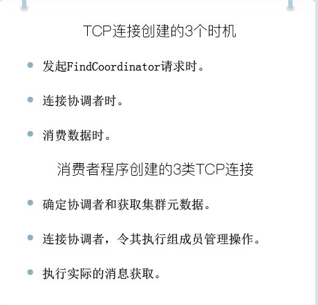

### 可靠性

- 最多一次（at most once）：消息可能会丢失，但绝不会被重复发送。

- 至少一次（at least once）：消息不会丢失，但有可能被重复发送。

- 精确一次（exactly once）：消息不会丢失，也不会被重复发送。

- Kafka 是怎么做到精确一次的呢？简单来说，这是通过两种机制：

  - 幂等性（Idempotence）

    - 其最大的优势在于我们可以安全地重试任何幂等性操作，反正它们也不会破坏我们的系统状态

    - 配置

      ```java
      props.put(“enable.idempotence”, ture) 或者
      props.put(ProducerConfig.ENABLE_IDEMPOTENCE_CONFIG， true)。
      ```

      它只能保证**单分区上的幂等性**，即一个幂等性 Producer  能够保证某个主题的一个分区上不出现重复消息，它无法实现多个分区的幂等性。其次，**它只能实现单会话上的幂等性，不能实现跨会话的幂等性**。这里的会话，你可以理解为 Producer 进程的一次运行。当你重启了 Producer 进程之后，这种幂等性保证就丧失了

  - 事务（Transaction）

    - 目前主要是在 read committed 隔离级别上做事情。它能保证多条消息原子性地写入到目标分区，同时也能保证 Consumer 只能看到事务成功提交的消息

    - 设置事务性producer

      - 和幂等性 Producer 一样，开启 **enable.idempotence = true**。
      - 设置 Producer 端参数 ** transctional. id**。最好为其设置一个有意义的名字。

      ```java
      producer.initTransactions();
      try {
          producer.beginTransaction();
          producer.send(record1);
          producer.send(record2);
          producer.commitTransaction();
      } catch (KafkaException e) {
           producer.abortTransaction();
      }
      ```

    >  如果我想实现多分区以及多会话上的消息无重复，应该怎么做呢？答案就是事务（transaction）或者依赖事务型 Producer
    >
    > 幂等性 Producer 只能保证单分区、单会话上的消息幂等性；而事务能够保证跨分区、跨会话间的幂等性

### consumer group

- 如果所有实例都属于同一个 Group，那么它实现的就是消息队列模型；如果所有实例分别属于不同的 Group，那么它实现的就是发布 / 订阅模型。
- Rebalance 就是让一个 Consumer Group 下所有的 Consumer 实例就如何消费订阅主题的所有分区达成共识的过程,在 Rebalance 过程中，所有 Consumer 实例共同参与，在协调者组件的帮助下，完成订阅主题分区的分配。但是，在整个过程中，所有实例都不能消费任何消息，因此它对 Consumer 的 TPS 影响很大。

##### rebalance 触发条件,

1. 组成员数发生变更。比如有新的 Consumer 实例加入组或者离开组，抑或是有 Consumer 实例崩溃被“踢出”组。
   - 当 Consumer Group 完成 Rebalance 之后，每个 Consumer 实例都会定期地向 Coordinator  发送心跳请求，表明它还存活着。如果某个 Consumer 实例不能及时地发送这些心跳请求，Coordinator 就会认为该 Consumer  已经“死”了，从而将其从 Group 中移除，然后开启新一轮 Rebalance。Consumer 端有个参数，叫  session.timeout.ms，就是被用来表征此事的。该参数的默认值是 10 秒，即如果 Coordinator 在 10 秒之内没有收到 Group 下某 Consumer 实例的心跳，它就会认为这个 Consumer 实例已经挂了。可以这么说，**session.timout.ms **决定了 Consumer 存活性的时间间隔
   - Consumer 还提供了一个允许你控制发送心跳请求频率的参数，就是  **heartbeat.interval.ms**。这个值设置得越小，Consumer  实例发送心跳请求的频率就越高。频繁地发送心跳请求会额外消耗带宽资源，但好处是能够更加快速地知晓当前是否开启 Rebalance
2. 订阅主题数发生变更。Consumer Group 可以使用正则表达式的方式订阅主题，比如  consumer.subscribe(Pattern.compile(“t.*c”)) 就表明该 Group 订阅所有以字母 t 开头、字母 c 结尾的主题。在 Consumer Group 的运行过程中，你新创建了一个满足这样条件的主题，那么该 Group 就会发生  Rebalance。
3. 订阅主题的分区数发生变更。Kafka 当前只能允许增加一个主题的分区数。当分区数增加时，就会触发订阅该主题的所有 Group 开启 Rebalance。


- Rebalance 过程对 Consumer Group 消费过程有极大的影响。如果你了解 JVM  的垃圾回收机制，你一定听过万物静止的收集方式，即著名的 stop the world，简称 STW。在 STW  期间，所有应用线程都会停止工作，表现为整个应用程序僵在那边一动不动。Rebalance 过程也和这个类似，在 Rebalance 过程中，所有  Consumer 实例都会停止消费，等待 Rebalance 完成。这是 Rebalance 为人诟病的一个方面。


##### rebalance问题

1. Rebalance 影响 Consumer 端 TPS。这个之前也反复提到了，这里就不再具体讲了。总之就是，在 Rebalance 期间，Consumer 会停下手头的事情，什么也干不了。
2. Rebalance 很慢。如果你的 Group 下成员很多，就一定会有这样的痛点。还记得我曾经举过的那个国外用户的例子吧？他的 Group 下有几百个 Consumer 实例，Rebalance 一次要几个小时。在那种场景下，Consumer Group 的 Rebalance  已经完全失控了。
3. Rebalance 效率不高。当前 Kafka 的设计机制决定了每次 Rebalance 时，Group 下的所有成员都要参与进来，而且通常不会考虑局部性原理，但局部性原理对提升系统性能是特别重要的。

##### Coordinator

- 它专门为 Consumer Group 服务，负责为 Group 执行 Rebalance 以及提供位移管理和组成员管理等。

- Consumer 端应用程序在提交位移时，其实是向 Coordinator 所在的 Broker 提交位移。同样地，当 Consumer  应用启动时，也是向 Coordinator 所在的 Broker 发送各种请求，然后由 Coordinator  负责执行消费者组的注册、成员管理记录等元数据管理操作。

- 所有 Broker 在启动时，都会创建和开启相应的 Coordinator 组件。也就是说，**所有 Broker 都有各自的 Coordinator 组件**

- Kafka 为某个 Consumer Group 确定 Coordinator 所在的 Broker 的算法有 2 个步骤。

  1. 确定由位移主题的哪个分区来保存该 Group 数据：partitionId=Math.abs(groupId.hashCode() % offsetsTopicPartitionCount)。

  2. 找出该分区 Leader 副本所在的 Broker，该 Broker 即为对应的 Coordinator。

### __consumer_offsets

- **将 Consumer 的位移数据作为一条条普通的 Kafka 消息，提交到 __consumer_offsets 中。可以这么说，__consumer_offsets 的主要作用是保存 Kafka 消费者的位移信息。**它要求这个提交过程不仅要实现高持久性，还要支持高频的写操作

- **位移主题的 Key 中应该保存 3 部分内容：<Group ID，主题名，分区号 >**

- 当 Kafka 集群中的第一个 Consumer 程序启动时，**Kafka 会自动创建位移主题**

- 主题数与分区数

  - 设置分区数： offsets.topic.num.partitions       2.3版本默认值为1
  - 设置副本数：offsets.topic.replication.factor    2.3版本默认值为1

- 提交位移时，会写入到此主题，目前有两种提交方式

  - 手动提交位移
    - 禁止打开：  enable.auto.commit = false
    - 作为 Consumer 应用开发的你就要承担起位移提交的责任，consumer.commitSync
    - 
  - 自动提交位移  
    -  enable.auto.commit 设置为true
    - 提交间隔时间： auto.commit.interval.ms 
    - 优点：系统管理，客户端不用操心；缺点：丧失太多灵活性和可控性，没法把控consumer端的位移。

- **Kafka 是怎么删除位移主题中的过期消息的呢？答案就是 Compaction. Kafka 提供了专门的后台线程定期地巡检待 Compact 的主题，看看是否存在满足条件的可删除数据**。这个后台线程叫 Log Cleaner

  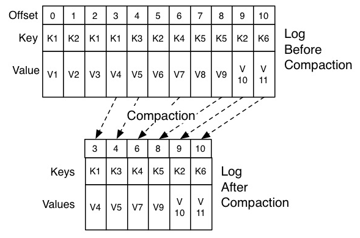


### 规避rebalance

- **第一类非必要 Rebalance 是因为未能及时发送心跳，导致 Consumer 被“踢出”Group 而引发的**。
  - 设置 session.timeout.ms = 6s。
  - 设置 heartbeat.interval.ms = 2s。
  - 要保证 Consumer 实例在被判定为“dead”之前，能够发送至少 3 轮的心跳请求，即 session.timeout.ms >= 3 * heartbeat.interval.ms。
  - 将 session.timeout.ms 设置成 6s 主要是为了让 Coordinator 能够更快地定位已经挂掉的  Consumer。毕竟，我们还是希望能尽快揪出那些“尸位素餐”的 Consumer，早日把它们踢出  Group。希望这份配置能够较好地帮助你规避第一类“不必要”的 Rebalance
- **第二类非必要 Rebalance 是 Consumer 消费时间过长导致的**，**max.poll.interval.ms**参数值的设置显得尤为关键。如果要避免非预期的 Rebalance，你最好将该参数值设置得大一点，比你的下游最大处理时间稍长一点。就拿 MongoDB 这个例子来说，如果写 MongoDB 的最长时间是 7 分钟，那么你可以将该参数设置为 8 分钟左右。
- 如果你按照上面的推荐数值恰当地设置了这几个参数，却发现还是出现了 Rebalance，那么我建议你去排查一下**Consumer 端的 GC 表现**，比如是否出现了频繁的 Full GC 导致的长时间停顿，从而引发了 Rebalance。为什么特意说 GC？那是因为在实际场景中，我见过太多因为 GC 设置不合理导致程序频发 Full GC 而引发的非预期 Rebalance 了

> 判断是否发生rebalance，去找Coordinator所在的broker日志，如果经常发生rebalance，会有类似于"(Re)join group" 之类的日志

- Kafka 为某个 Consumer Group 确定 Coordinator 所在的 Broker 的算法有 2 个步骤。
  1. 确定由位移主题的哪个分区来保存该 Group 数据：partitionId=Math.abs(groupId.hashCode() % offsetsTopicPartitionCount)。
  2. 找出该分区 Leader 副本所在的 Broker，该 Broker 即为对应的 Coordinator。
  3. 简单解释一下上面的算法。首先，Kafka 会计算该 Group 的 group.id 参数的哈希值。比如你有个 Group 的 group.id 设置成了“test-group”，那么它的 hashCode 值就应该是 627841412。其次，Kafka 会计算  __consumer_offsets 的分区数，通常是 50 个分区，之后将刚才那个哈希值对分区数进行取模加求绝对值计算，即  abs(627841412 % 50) = 12。此时，我们就知道了位移主题的分区 12 负责保存这个 Group 的数据。有了分区号，算法的第 2 步就变得很简单了，我们只需要找出位移主题分区 12 的 Leader 副本在哪个 Broker 上就可以了。这个  Broker，就是我们要找的 Coordinator。

### 消息消费进度

- ```
  $ bin/kafka-consumer-groups.sh --bootstrap-server <Kafka broker 连接信息 > --describe --group <group 名称 >
  ```

- API方式获取

  ```java
  package org.frm.kafka;
  
  import org.apache.kafka.clients.CommonClientConfigs;
  import org.apache.kafka.clients.admin.AdminClient;
  import org.apache.kafka.clients.admin.ListConsumerGroupOffsetsResult;
  import org.apache.kafka.clients.consumer.ConsumerConfig;
  import org.apache.kafka.clients.consumer.KafkaConsumer;
  import org.apache.kafka.clients.consumer.OffsetAndMetadata;
  import org.apache.kafka.common.TopicPartition;
  import org.apache.kafka.common.serialization.StringDeserializer;
  
  import java.util.Collections;
  import java.util.Map;
  import java.util.Properties;
  import java.util.concurrent.ExecutionException;
  import java.util.concurrent.TimeUnit;
  import java.util.concurrent.TimeoutException;
  import java.util.stream.Collectors;
  
  /**
   * API 方式获取kafka中lag监控信息
   */
  public class ConsumerUtils {
      public static Map<TopicPartition, Long> lagOf(String groupID,
                                                    String bootstrapServers) throws TimeoutException {
          Properties props = new Properties();
          props.put(CommonClientConfigs.BOOTSTRAP_SERVERS_CONFIG, bootstrapServers);
          try (AdminClient client = AdminClient.create(props)) {
              ListConsumerGroupOffsetsResult result = client.listConsumerGroupOffsets(groupID);
              try {
                  Map<TopicPartition, OffsetAndMetadata> consumedOffsets =
                          result.partitionsToOffsetAndMetadata().get(10, TimeUnit.SECONDS);
                  props.put(ConsumerConfig.ENABLE_AUTO_COMMIT_CONFIG, false); // 禁止自动提交位移
                  props.put(ConsumerConfig.GROUP_ID_CONFIG, groupID);
                  props.put(ConsumerConfig.KEY_DESERIALIZER_CLASS_CONFIG,
                          StringDeserializer.class.getName());
                  props.put(ConsumerConfig.VALUE_DESERIALIZER_CLASS_CONFIG,
                          StringDeserializer.class.getName());
                  try (final KafkaConsumer<String, String> consumer = new KafkaConsumer<>(props)) {
                      Map<TopicPartition, Long> endOffsets = consumer.endOffsets(consumedOffsets.keySet());
                      return endOffsets.entrySet().stream().collect(Collectors.toMap(entry -> entry.getKey(),entry -> entry.getValue() - consumedOffsets.get(entry.getKey()).offset()));
                  }
              } catch (InterruptedException e) {
                  Thread.currentThread().interrupt();
                  // 处理中断异常
                  // ...
                  return Collections.emptyMap();
              } catch (ExecutionException e) {
                  // 处理 ExecutionException
                  // ...
                  return Collections.emptyMap();
              } catch (TimeoutException e) {
                  throw new TimeoutException("Timed out when getting lag for consumer group " + groupID);
              }
          }
      }
  }
  
  ```


### 副本机制

副本机制有什么好处

1. **提供数据冗余**。即使系统部分组件失效，系统依然能够继续运转，因而增加了整体可用性以及数据持久性。
2. **提供高伸缩性**。支持横向扩展，能够通过增加机器的方式来提升读性能，进而提高读操作吞吐量。
3. **改善数据局部性**。允许将数据放入与用户地理位置相近的地方，从而降低系统延时。

**所谓副本（Replica），本质就是一个只能追加写消息的提交日志**。

**追随者副本是不对外提供服务的**,Kafka 为什么要这样设计呢？其实这种副本机制有两个方面的好处

1. **方便实现“Read-your-writes”**
   - 如果允许追随者副本对外提供服务，由于副本同步是异步的，因此有可能出现追随者副本还没有从领导者副本那里拉取到最新的消息，从而使得客户端看不到最新写入的消息。
2. **方便实现单调读（Monotonic Reads）**
   - 如果允许追随者副本提供读服务，那么假设当前有 2 个追随者副本 F1 和 F2，它们异步地拉取领导者副本数据。倘若 F1 拉取了 Leader 的最新消息而 F2 还未及时拉取，那么，此时如果有一个消费者先从 F1 读取消息之后又从 F2 拉取消息，它可能会看到这样的现象：第一次消费时看到的最新消息在第二次消费时不见了，这就不是单调读一致性。但是，如果所有的读请求都是由 Leader 来处理，那么 Kafka 就很容易实现单调读一致性。

## In-sync Replicas（ISR）

**ISR 不只是追随者副本集合，它必然包括 Leader 副本。甚至在某些情况下，ISR 只有 Leader 这一个副本**。

 **replica.lag.time.max.ms 参数值**。这个参数的含义是 Follower 副本能够落后 Leader 副本的最长时间间隔，当前默认值是 10 秒。这就是说，只要一个 Follower 副本落后 Leader 副本的时间不连续超过 10 秒，那么 Kafka 就认为该 Follower 副本与 Leader 是同步的，即使此时 Follower 副本中保存的消息明显少于 Leader 副本中的消息。