1. SEDA （Stage Event Driven Architecture） 一个请求过程分成若干个stage（阶段）

### 功能模块图

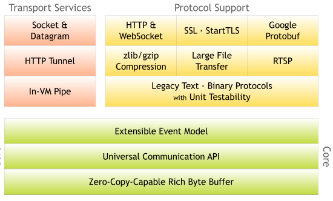

### netty逻辑架构图

- 网络通信层

  - 网络通信层的核心组件包含BootStrap、ServerBootStrap、Channel三个组件。

  >Bootstrap

  - 它主要负责整个 Netty 程序的启动、初始化、服务器连接等过程，它相当于一条主线，串联了 Netty 的其他核心组件。
  - 一个为用于客户端引导的 Bootstrap，另一个为用于服务端引导的 ServerBootStrap，它们都继承自抽象类 AbstractBootstrap。

  > Channel,网络通信的载体,Channel提供了基本的 API 用于网络 I/O 操作，如 register、bind、connect、read、write、flush 等。Netty 自己实现的 Channel 是以 JDK NIO Channel 为基础的，相比较于 JDK NIO，Netty 的 Channel 提供了更高层次的抽象，同时屏蔽了底层 Socket 的复杂性，赋予了 Channel 更加强大的功能，你在使用 Netty 时基本不需要再与 Java Socket 类直接打交道。

  - NioServerSocketChannel 异步 TCP 服务端。

  - NioSocketChannel 异步 TCP 客户端。
  - Channel 最常见的状态所对应的事件回调。

  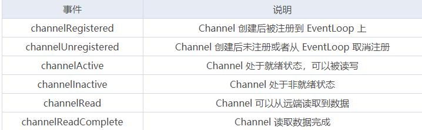

- 事件调度层

  - 事件调度层的职责是通过 Reactor 线程模型对各类事件进行聚合处理，通过 Selector 主循环线程集成多种事件（ I/O 事件、信号事件、定时事件等），实际的业务处理逻辑是交由服务编排层中相关的 Handler 完成。

  - **事件调度层的核心组件包括 EventLoopGroup、EventLoop。**

    - 一个 EventLoopGroup 往往包含一个或者多个 EventLoop。EventLoop 用于处理 Channel 生命周期内的所有 I/O 事件，如 accept、connect、read、write 等 I/O 事件。
    - EventLoop 同一时间会与一个线程绑定，每个 EventLoop 负责处理多个 Channel。
    - 每新建一个 Channel，EventLoopGroup 会选择一个 EventLoop 与其绑定。该 Channel 在生命周期内都可以对 EventLoop 进行多次绑定和解绑。

    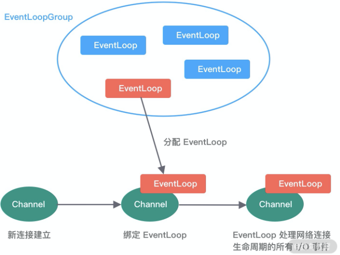

  - EventLoopGroup 本质是一个**线程池，主要负责接收 I/O 请求，并分配线程执行处理请求**，是 Netty Reactor 线程模型的具体实现方式

    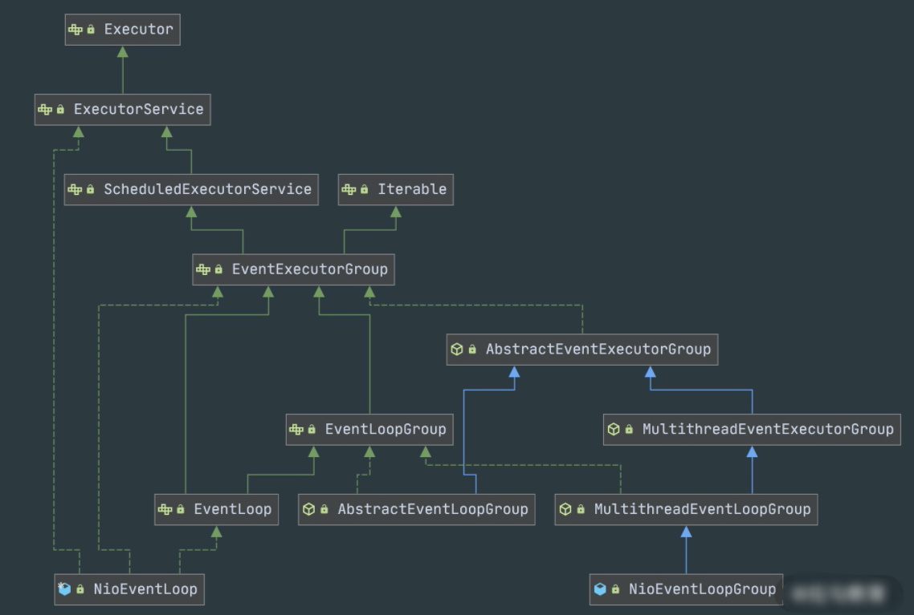

  - Reactor三种线程模型

    1. **单线程模型**：EventLoopGroup 只包含一个 EventLoop，Boss 和 Worker 使用同一个EventLoopGroup；

    2. **多线程模型**：EventLoopGroup 包含多个 EventLoop，Boss 和 Worker 使用同一个EventLoopGroup；

    3. **主从多线程模型**：EventLoopGroup 包含多个 EventLoop，Boss 是主 Reactor，Worker 是从 Reactor，它们分别使用不同的 EventLoopGroup，主 Reactor 负责新的网络连接 Channel 创建，然后把 Channel 注册到从 Reactor。

- 服务编排层

> 服务编排层的核心组件包括 ChannelPipeline、ChannelHandler、ChannelHandlerContext。

1. ChannelPipeline

   - 负责组装各种 ChannelHandler，实际数据的编解码以及加工处理操作都是由 ChannelHandler 完成的。ChannelPipeline 可以理解为ChannelHandler 的实例列表——内部通过双向链表将不同的 ChannelHandler 链接在一起。当 I/O 读写事件触发时，ChannelPipeline 会依次调用 ChannelHandler 列表对 Channel 的数据进行拦截和处理。

   - ChannelPipeline 是线程安全的，因为每一个新的 Channel 都会对应绑定一个新的 ChannelPipeline。一个 ChannelPipeline 关联一个 EventLoop，一个 EventLoop 仅会绑定一个线程。

   - 客户端和服务端都有各自的 ChannelPipeline。以客户端为例，数据从客户端发向服务端，该过程称为出站，反之则称为入站。

   - 客户端和服务端一次完整的请求应答过程可以分为三个步骤：客户端出站（请求数据）、服务端入站（解析数据并执行业务逻辑）、服务端出站（响应结果）。

     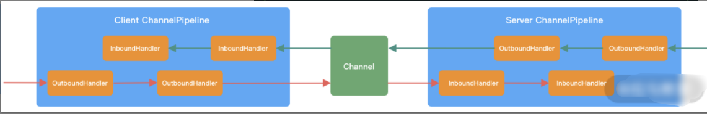

2. ChannelHandler & ChannelHandlerContext

   - ChannelHandlerContext 用于保存 ChannelHandler 上下文，通过 ChannelHandlerContext 我们可以知道 ChannelPipeline 和 ChannelHandler 的关联关系。ChannelHandlerContext 可以实现 ChannelHandler 之间的交互，ChannelHandlerContext 包含了 ChannelHandler 生命周期的所有事件，如 connect、bind、read、flush、write、close 等

     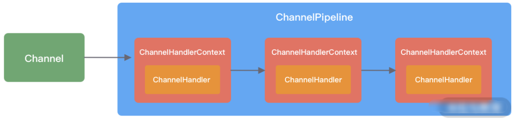

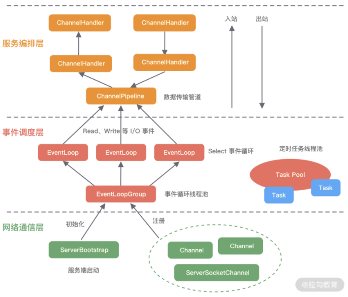

##### 组件关系梳理

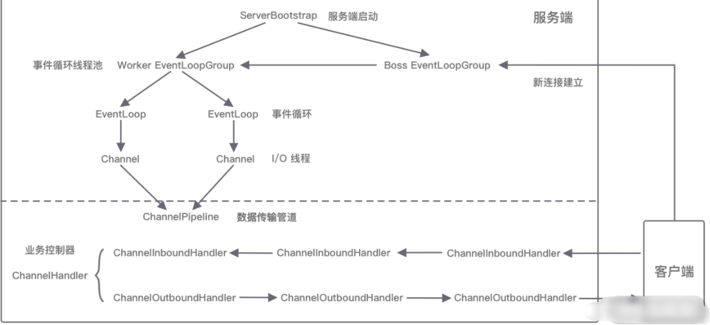

### Reactor模式

**单线程模型**

- 一个线程支持处理的连接数非常有限，CPU 很容易打满，性能方面有明显瓶颈；

- 当多个事件被同时触发时，只要有一个事件没有处理完，其他后面的事件就无法执行，这就会造成消息积压及请求超时；

- 线程在处理 I/O 事件时，Select 无法同时处理连接建立、事件分发等操作；

- 如果 I/O 线程一直处于满负荷状态，很可能造成服务端节点不可用。

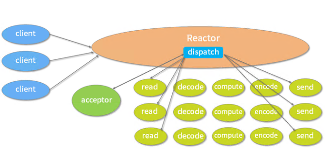

**多线程模型**

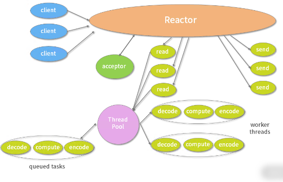

**主从多线程模型**

- 主从多线程模型由多个 Reactor 线程组成，每个 Reactor 线程都有独立的 Selector 对象。MainReactor 仅负责处理客户端连接的 Accept 事件，连接建立成功后将新创建的连接对象注册至 SubReactor。再由 SubReactor 分配线程池中的 I/O 线程与其连接绑定，它将负责连接生命周期内所有的 I/O 事件。

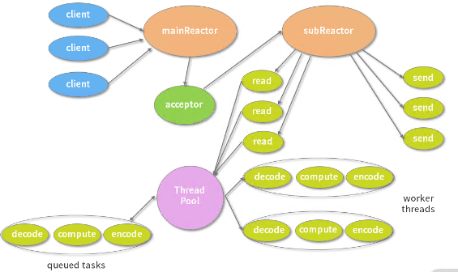

**Reactor 线程模型运行机制的四个步骤**

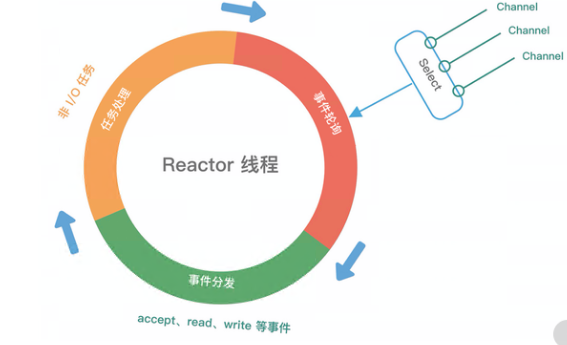

1. 连接注册、
   - Channel 建立后，注册至 Reactor 线程中的 Selector 选择器。
2. 事件轮询、事件分发、任务处理
   - 轮询 Selector 选择器中已注册的所有 Channel 的 I/O 事件。
3. 事件分发
   - 为准备就绪的 I/O 事件分配相应的处理线程
4. 任务处理
   - Reactor 线程还负责任务队列中的非 I/O 任务，每个 Worker 线程从各自维护的任务队列中取出任务异步执行。

### 黏包与拆包

- 接收与发送数据都有一个缓冲区

ByteToMessageDecoder 提供的一些常见的实现类：

1. **FixedLengthFrameDecoder**：定长协议解码器，我们可以指定固定的字节数算一个完整的报文
2. **LineBasedFrameDecoder**：行分隔符解码器遇到\n 或者\r\n，则认为是一个完整的报文
3. **DelimiterBasedFrameDecoder**：分隔符解码器，分隔符可以自己指定
4. **LengthFieldBasedFrameDecoder**：长度编码解码器，将报文划分为报文头/报文体
5. **JsonObjectDecoder**：json 格式解码器，当检测到匹配数量的“{” 、”}”或”[””]”时，则认为是一个完整的 json 对象或者 json 数组  

- Nagle 与 TCP_NODELAY 
  -  当发送数据的缓冲区满或者超时，则把缓冲区数据丢给网络发送出去

#### netty优化

1、不要阻塞 EventLoop
2、系统参数优化
ulimit -a /proc/sys/net/ipv4/tcp_fin_timeout, TcpTimedWaitDelay
3、缓冲区优化
SO_RCVBUF/SO_SNDBUF/SO_BACKLOG/ REUSEXXX
4、心跳周期优化
心跳机制与短线重连
5、内存与 ByteBuffer 优化
DirectBuffer与HeapBuffer
6、其他优化

- ioRatio 做IO操作的比例
- Watermark
- TrafficShaping  