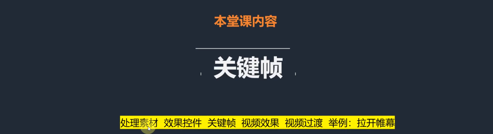

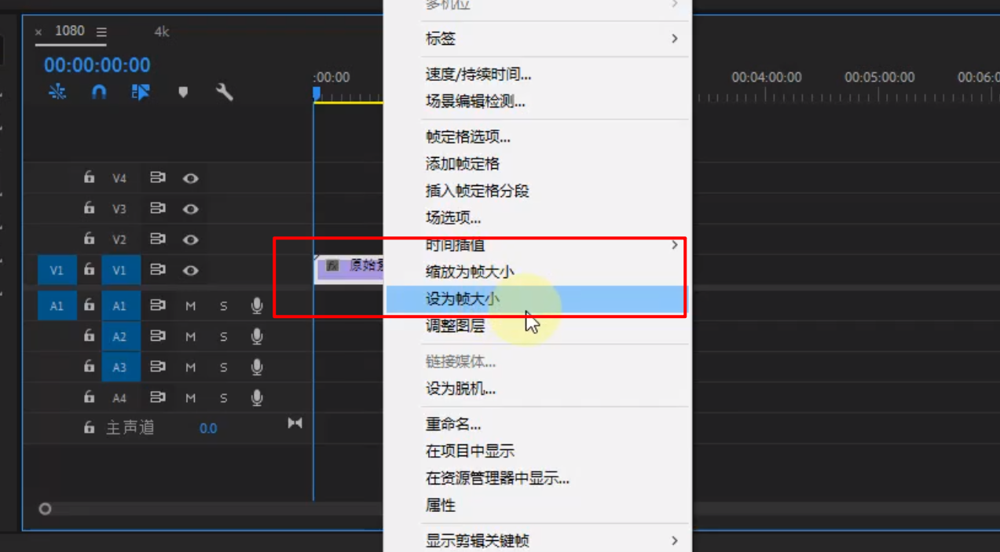

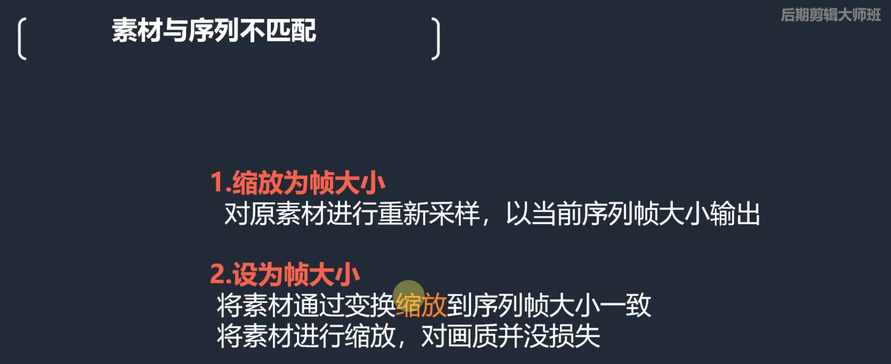

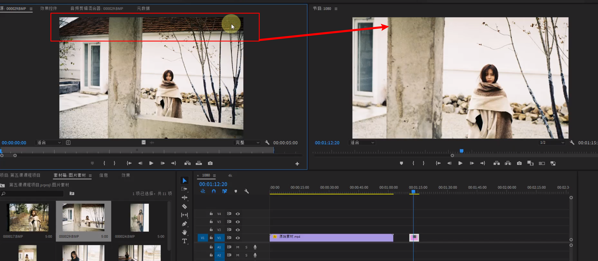

- 横或者纵坐标靠近序列的边缘就会停止填充

- 长宽比，分辨力需要达成一致

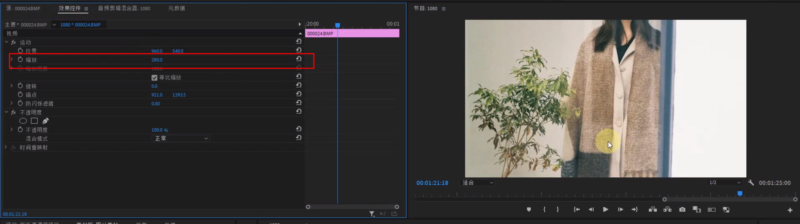

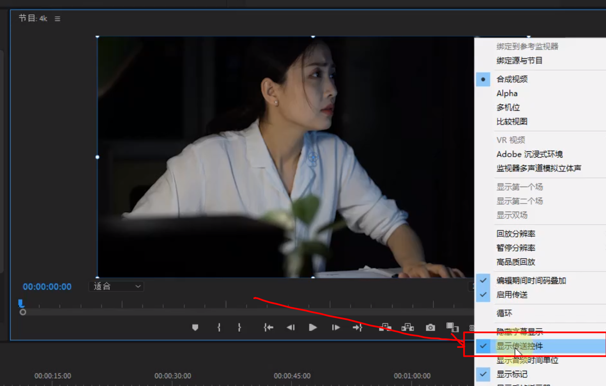

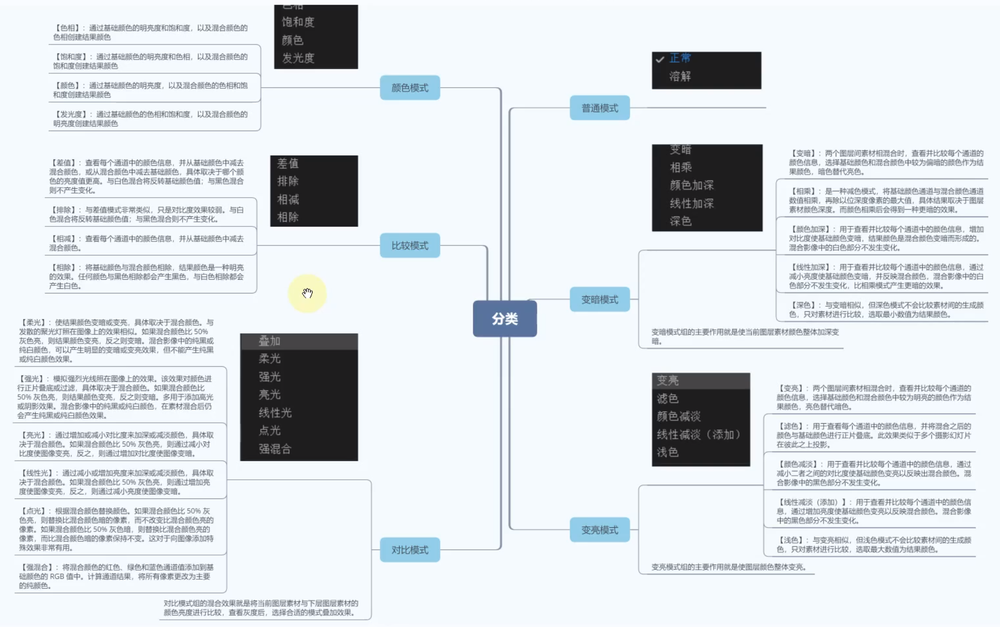

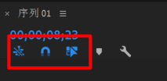

- 音浪正常的区间值： -6/-12之间最合适

打开关键帧

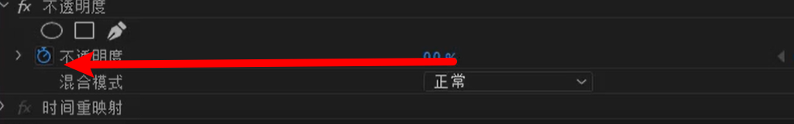

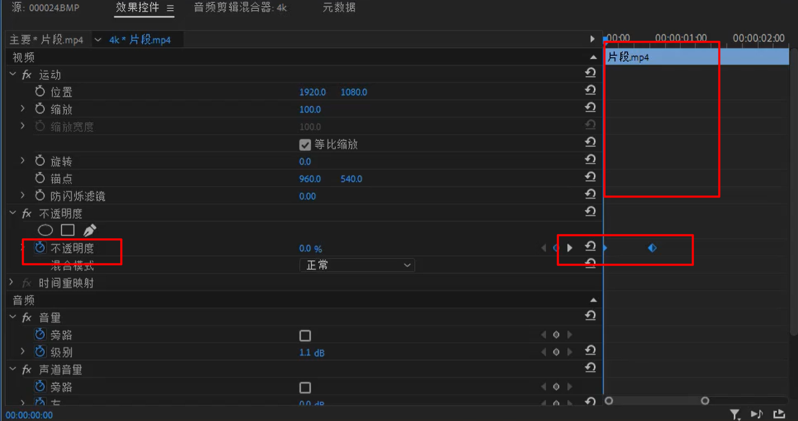

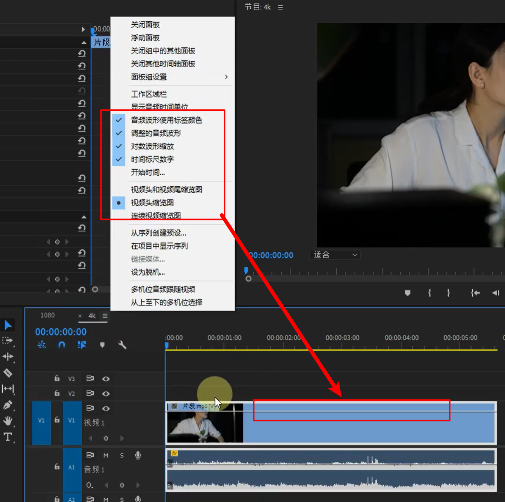

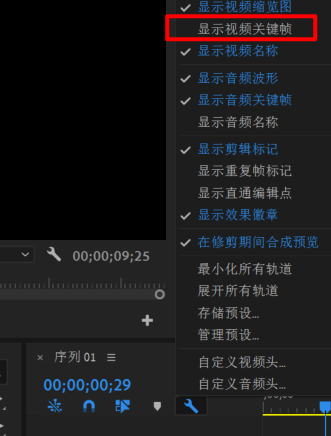

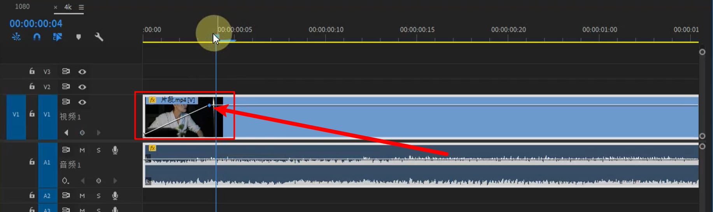

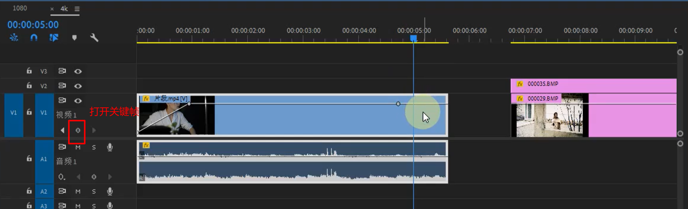

- 只要产生变化就需要关键帧

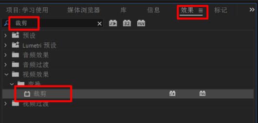

### 拉开帷幕

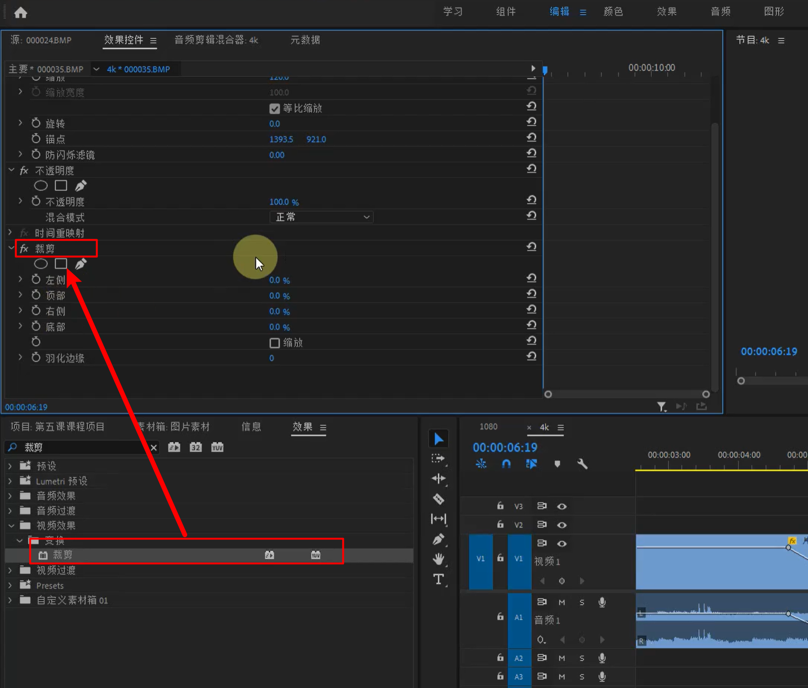

- 删除效果： 点击素材，点击按键delete

- 删除部分属性

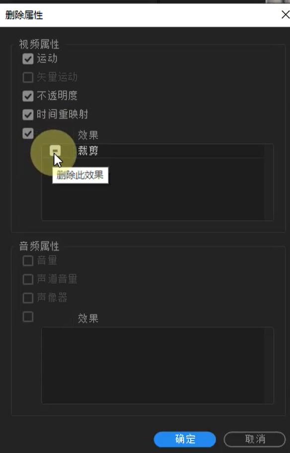

- 属性复制和粘贴

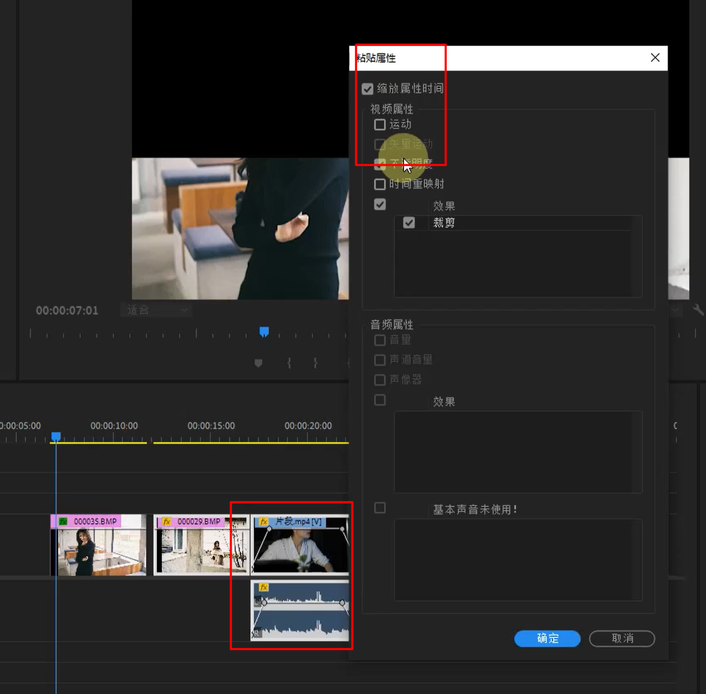

在视频的收尾部分

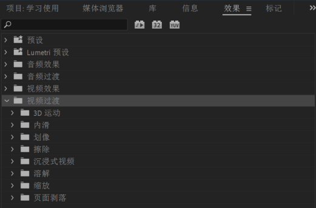

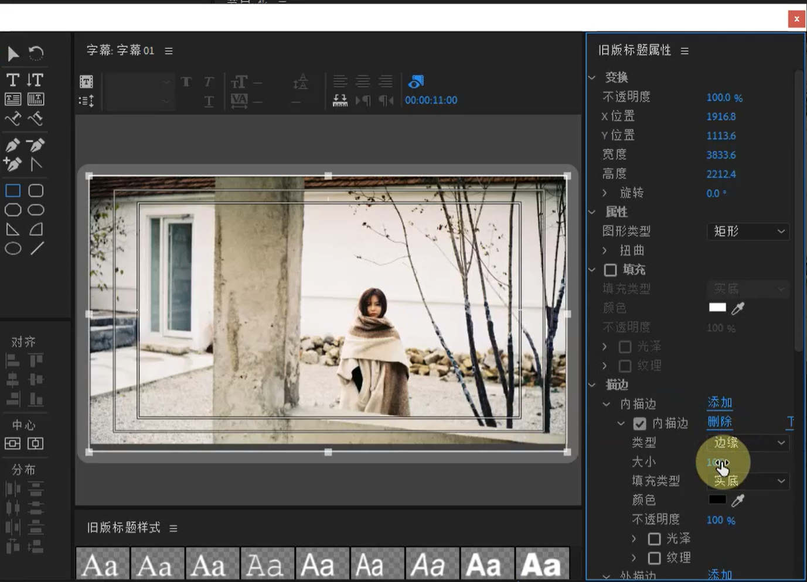

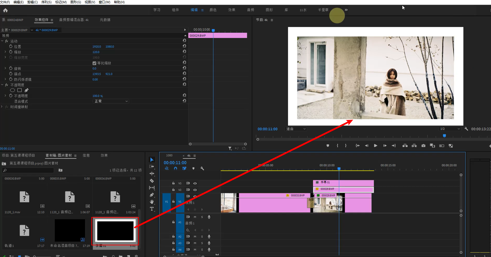

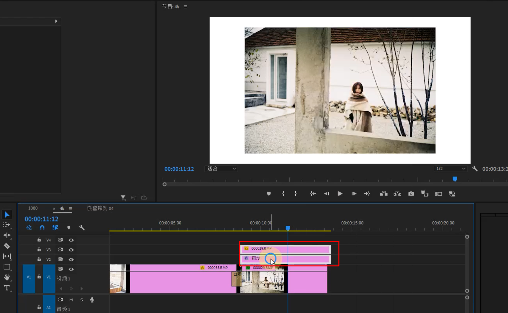

- 嵌套素材

