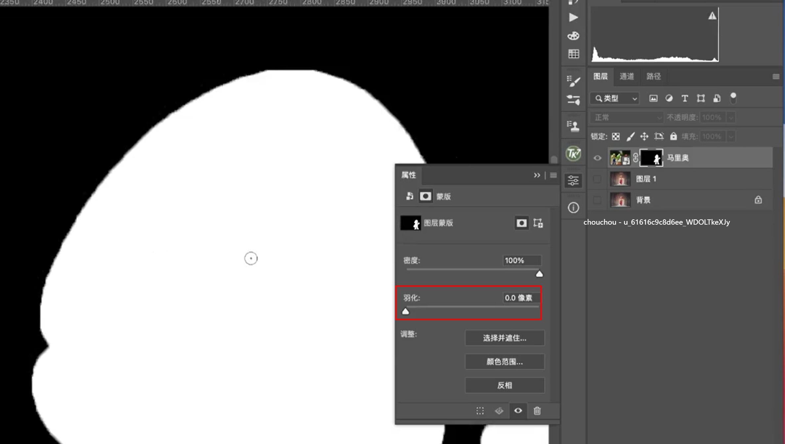

### 钢笔工具

1. 控制柄一边可以调节： alt+鼠标
2. shift，鼠标只会水平和垂直方向
3. ctrl+j 复制图层，ctrl+t变换图层
4. 切换参考点。。。。。旋转度数
5. ctrl+alt+shift+T 选中其中一个 图层
6. 同心圆： alt+shift
7. ctrl+enter  路径转为选区

### 蒙版

- 剪切蒙版，鼠标在指向图层，然后操作

- 快速蒙版，q退出快速蒙版

- 白色是显示，黑色是不显示

黑蒙版： alt+ 蒙版，直接点击添加为白蒙版

复制蒙版： 鼠标选中远蒙版+alt键+拖动到对应的图层

移动蒙版： 鼠标选择+拖动蒙版到目标图层

停用蒙版： shift+选择蒙版

只显示蒙版： alt+选择蒙版缩略图

选择蒙版选区： ctrl+缩略图

蒙版羽化

### 换天空

ctrl+shift+a 反选

渐变工具

涂抹工具，解决猫周边的毛发问题

