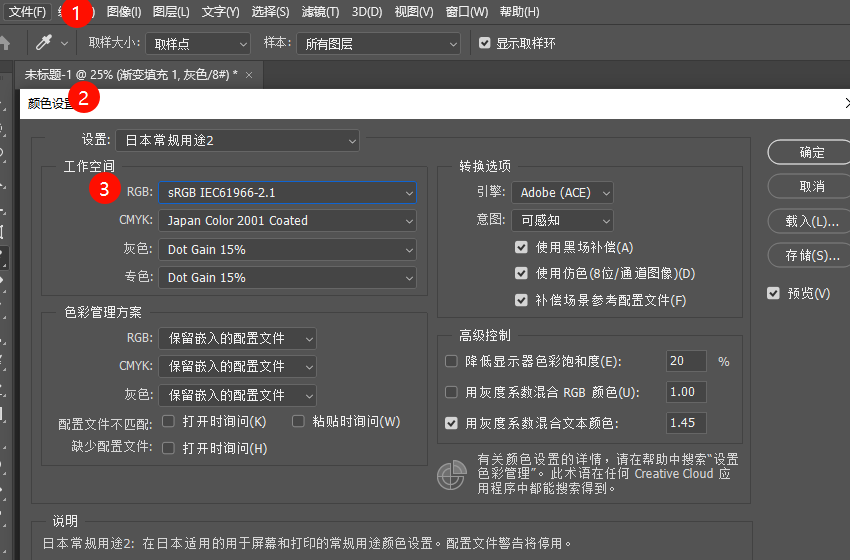

- 统一相机，PS和显示器的色彩空间，编辑-指定配置文件/颜色设置

- 更高的设置为adobe rgb

- prophoto rgb----> adobe rgb-->srgb

- **色彩深度**： 在计算机图形学中，1像素的颜色所用的位数，称为位、像素 bpp，位数为2的n次方

  - 色彩深度越高，可用的颜色就越多，色彩过渡就越顺滑

  - 6bits, 26w； 8bits 16.7M，**10 bits 1.07B，**

  - 通常会在16位上面处理

  - 图像位数设置，越大要求性能越高，否则处理会特别慢

    

- 色温，光照学中，当黑体收到不同温度的热力的时候这个黑体会就发出不同的颜色，黑体加热的温度称之为光源的颜色温度，3000K，开尔文温度
- 火柴光： 1700K，蜡烛，1850K，白炽灯，2800k，卤素灯和暖黄日光灯 3000k，月光，浅黄色 4100K，日光，5000K，有效太阳温度：5770，白光日光灯，6500K

