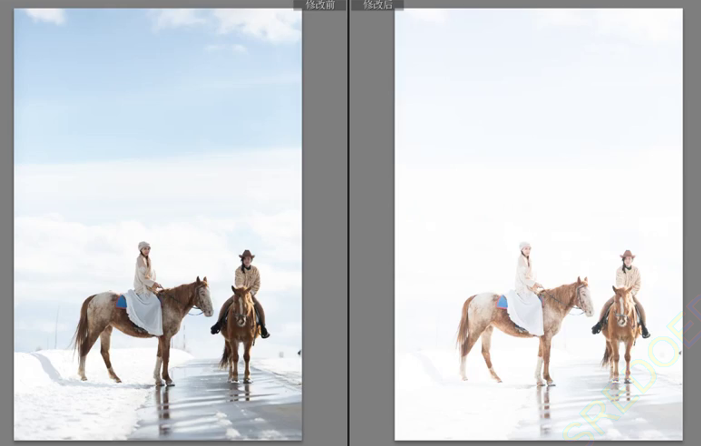
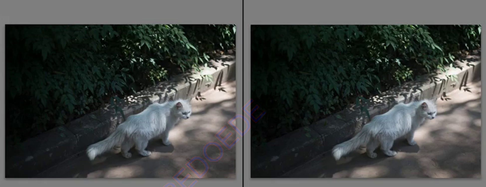
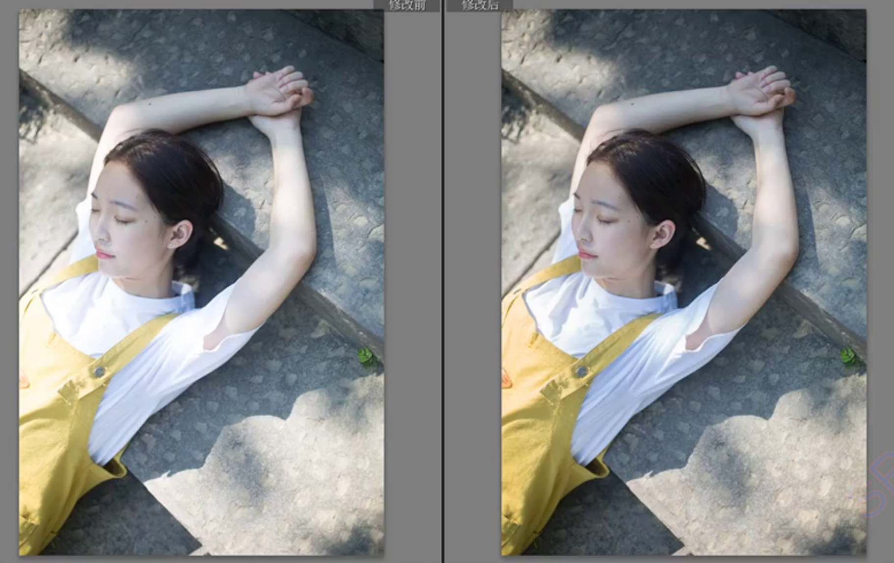
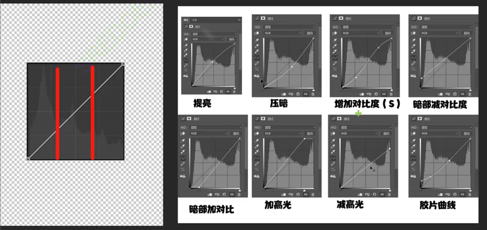
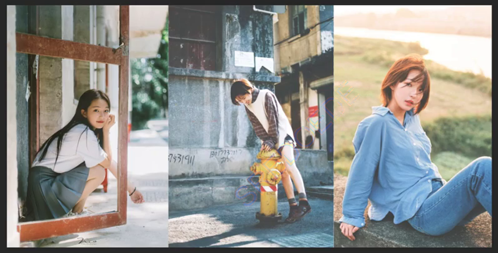
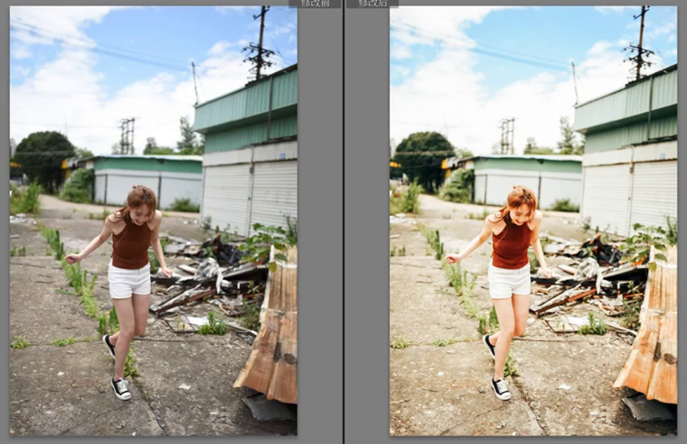
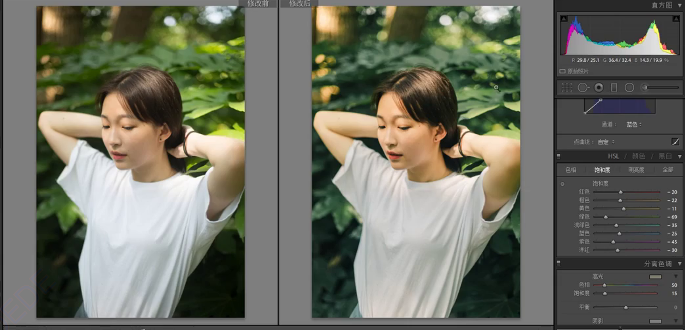
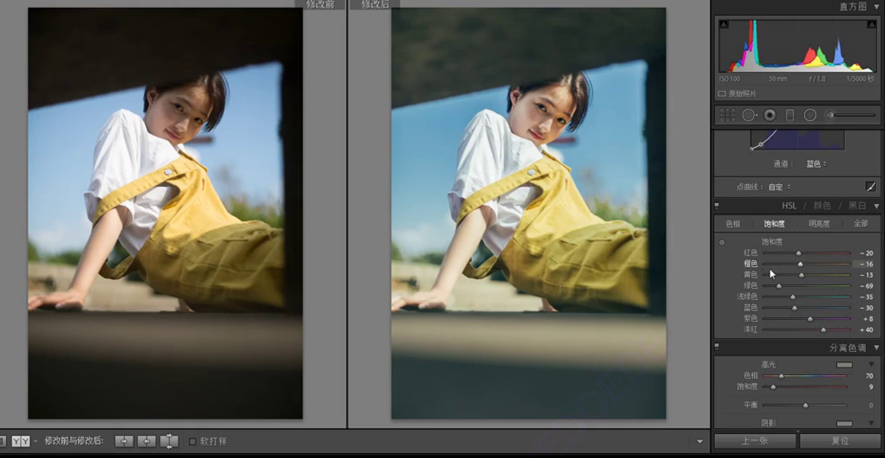
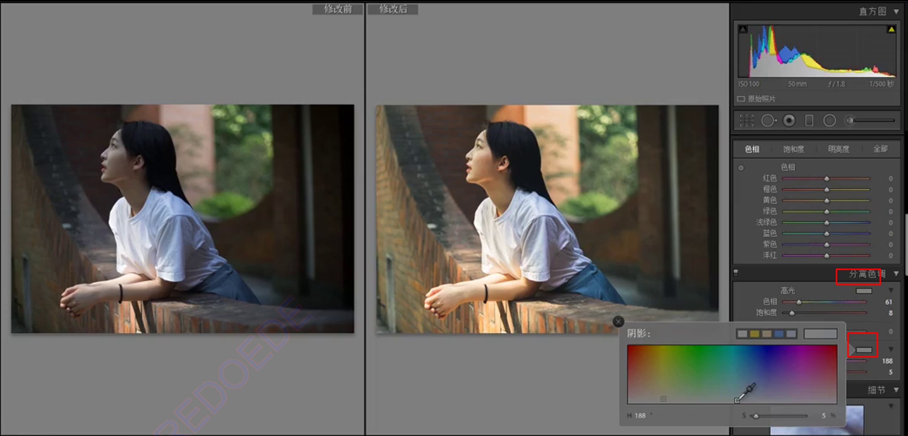

色相，明度，饱和度

- 色相： 固有色，第一眼看到的颜色

- 饱和度为0 的时候为黑白灰颜色，饱和度底，偏向高级效果

- 明度：提升，饱和度降低；降低，饱和度增高

- 莫兰迪色，高级灰

- 高饱和度--小清新照片风格，给人一种活泼感觉

- 饱和度不高

> 高级灰色彩，莫兰迪

- 画面总不要太杂，构图简单

### 色系干净

> 色系越少，越干净，越舒服

### 摄影师拍的照片

> 前期构图干净，画面中元素要少，不要太杂；后期合理的饱和度，颜色不跳

- 暗调

### 影调

> 黑白灰

对比度：画面更浓重的明暗对比

### 批量处理照片风格

1. 处理好一张照片，然后使用ctrl键选择希望处理的照片，单击右边的同步按钮即可批量应用预设

### 白平衡

1. 色温越低，冷色，高则为暖色

2. 色调：

3. 白平衡恢复： 吸管工具，在比较中性颜色的地方选择

4. 控制整体画面颜色的偏向

### 色调

- 一般在画面偏青或者洋红的时候使用

### 曝光度和对比度

- 小清新： 滨田英明 日本摄影师

### 高光和阴影

- 高光不爆，阴影不死

### 色调曲线

### 胶片曲线

- 色调曲线，r/g/b曲线

画面应该包含：亮暗灰

- HSL

饱和度和明亮度的关系： 相反的

- 分离色调

