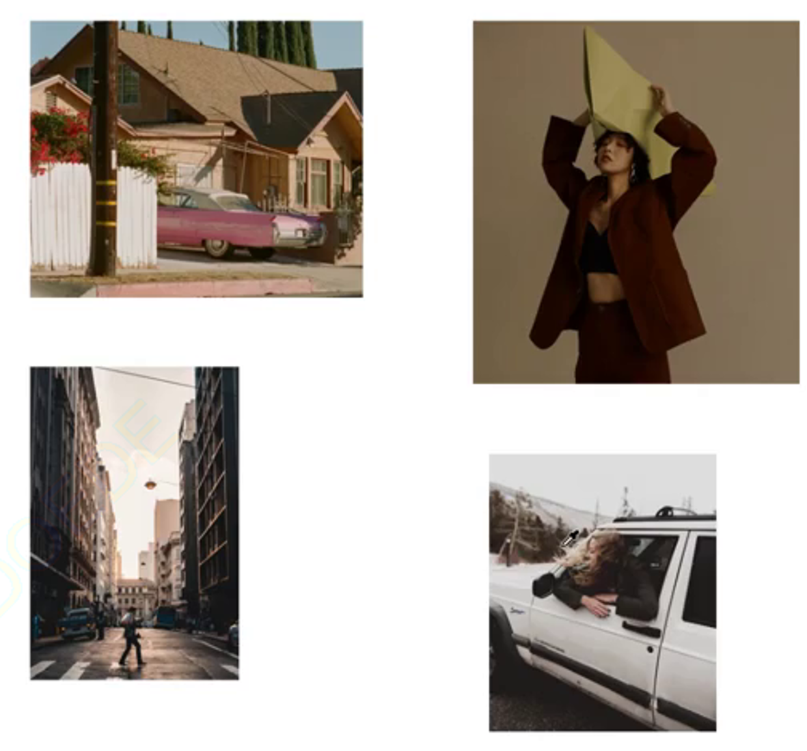

色相，明度，饱和度

- 色相： 固有色，第一眼看到的颜色

- 饱和度为0 的时候为黑白灰颜色，饱和度底，偏向高级效果

- 明度：提升，饱和度降低；降低，饱和度增高

- 莫兰迪色，高级灰

- 高饱和度--小清新照片风格，给人一种活泼感觉

- 饱和度不高

> 高级灰色彩，莫兰迪

- 画面总不要太杂，构图简单

### 色系干净

> 色系越少，越干净，越舒服

### 摄影师拍的照片

> 前期构图干净，画面中元素要少，不要太杂；后期合理的饱和度，颜色不跳

- 暗调

### 影调

> 黑白灰

对比度：画面更浓重的明暗对比

