1. 被视为机动车的是摩托车
2. 信号员除了信号盘外，还可以使用红光灯发出信号
3. 交通标牌可以使用黄色反光背景
4. 行人在密集区以外的公路上，在其顺行方向的左侧

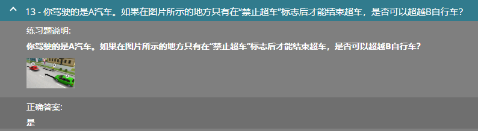

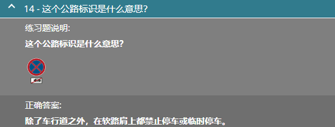

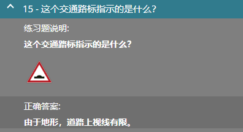

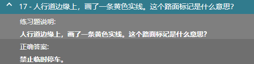

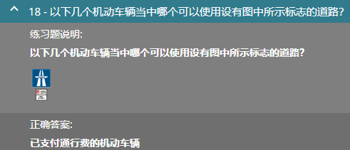

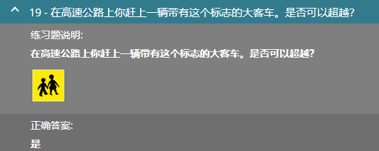

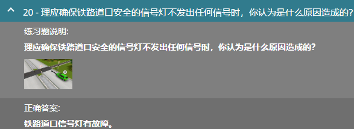

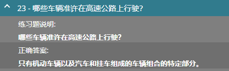

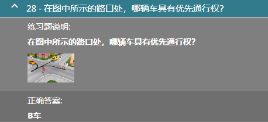

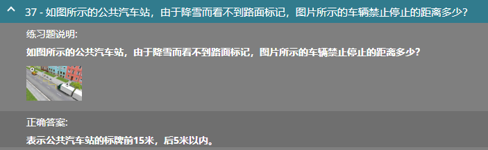

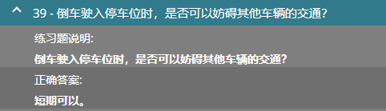

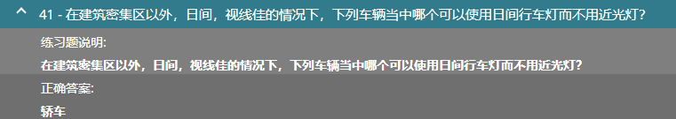

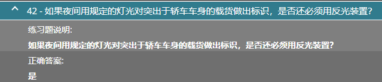

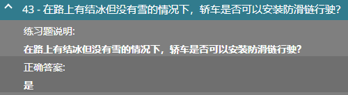

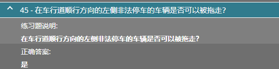

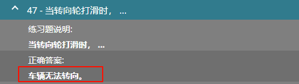

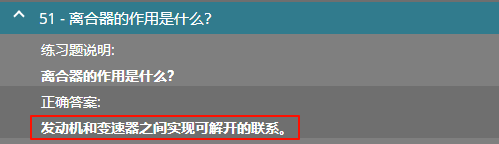

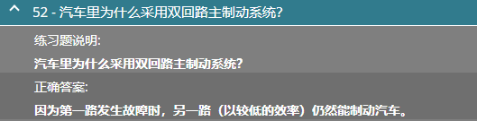

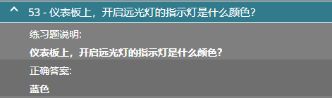

- 轿车的定义是9坐，专供客运的汽车

- 机动车，牵引挂车轿车限速 70km/h

- 解除限制，转弯，30km、40km限速，拖车

- 至少5km/h

