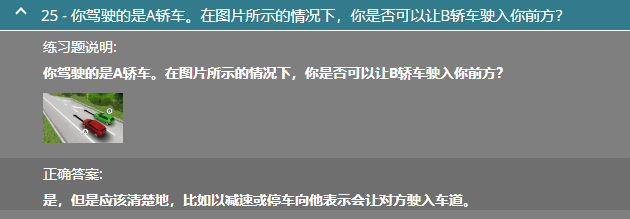
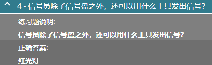
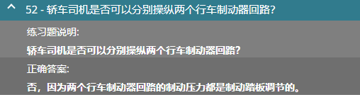
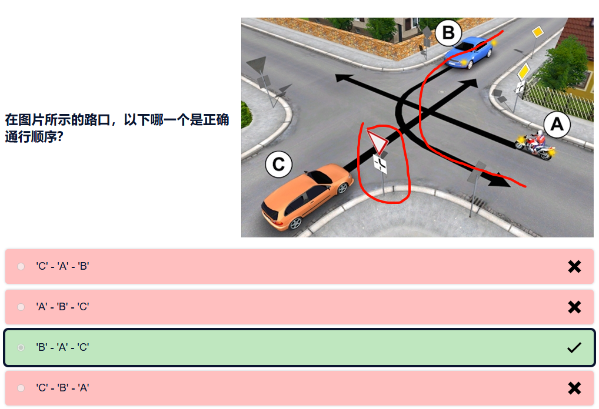
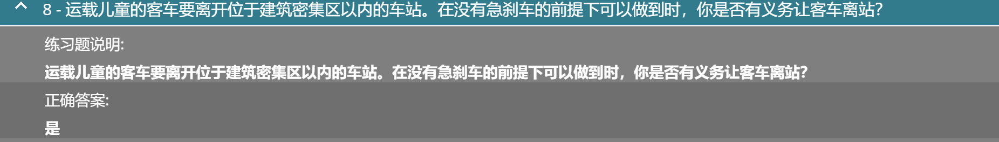

1. 被视为机动车的是摩托车
2. 信号员除了信号盘外，还可以使用红光灯发出信号
3. 交通标牌可以使用黄色反光背景
4. 行人在密集区以外的公路上，在其顺行方向的左侧

- 轿车的定义是9坐，专供客运的汽车

- 机动车，牵引挂车轿车限速 70km/h

- 解除限制，转弯，40km限速，70米车距限制，小车与小车超车，小车与大车超车

- 至少5km/h

- 需要选择第三个，**因为行车道封闭而改变的交通秩序**

- 由于已经过了路口，30km/h限制结束,在城市密集区以外是50km/h限制

