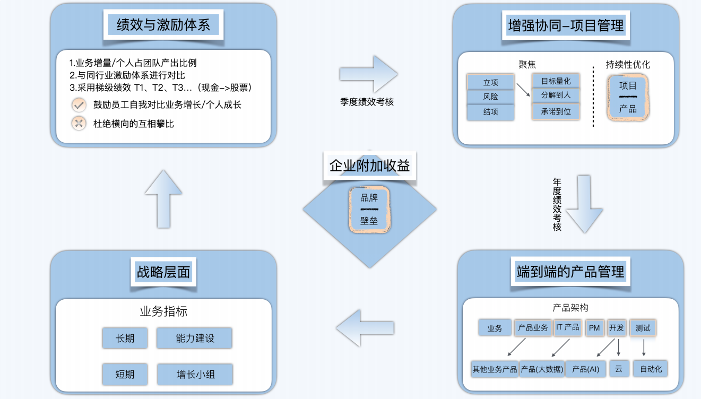

- http://90.84.198.196/162-%E4%B9%94%E6%96%B0%E4%BA%AE%E7%9A%84CTO%E6%88%90%E9%95%BF%E5%A4%8D%E7%9B%98%EF%BC%88%E5%AE%8C%E7%BB%93%EF%BC%89/03-%E5%AF%B9%E7%AE%A1%E7%90%86%E5%B7%A5%E4%BD%9C%E7%9A%84%E5%A4%8D%E7%9B%98%20%2810%E8%AE%B2%29/07%E4%B8%A8%20%E7%AE%A1%E7%90%86%E8%80%85%E6%9C%80%E9%87%8D%E8%A6%81%E7%9A%84%E4%B8%89%E4%B8%AA%E4%BB%BB%E5%8A%A1%EF%BC%88%E4%B8%80%EF%BC%89%EF%BC%9A%E7%BB%84%E7%BB%87%E8%B0%83%E6%95%B4%E5%88%B0%E4%BD%8D.pdf

**推荐阅读书籍：** 

1. 关键对话
2. SOLID 和 Twelve-Factor 介绍
3. 终身成长
4. 数据化决策
5. 《《别让猴子跳回背 上》》

### 三大管理任务

1. 组织协调到位
2. 加强协同效率
3. 激发团队活力

### 拆解IT能力建设的增长飞轮

### 立项

1. **目标清晰**： 每个业务目标、产品目标、技术目标都要清晰且可量化
2. **责任到人**： 上述每个目标都要责任到人，不能都是项目经理抗，项目经理没法抗住所有
3. **承诺到位**，如果需要外部组织配合，要得到外部组织的明确承诺

### Smart原则

- S=**Specific**，目标必须是具体的；
- M=**Measurable**，目标必须是可以衡量的；
- A=**Attainable**，目标必须是可以达到的；
- R=**Relevant**，必须要与其他目标有一定的关联性；
- T=**Time-bound**，目标必须具有明确的截止期限；

### 职能型研发组织架构的特征

- 每个研发中心为一个最大产品团队；
- 二级部门按岗位职能划分为多个专业职能部门，比如产品经理团队、研发团队，还有进
- 一步把研发团队划分成开发团队、测试团队的；
- 每个人员仅归属到一个职能组织；
- 三级部门人员按编制无限扩充；
- 三级部门团队 leader 任命从岗位职能中挑选 / 竞聘，比如研发能力强的当研发团队
- leader，测试能力强的当测试团队 leader；

### 产品型研发组织架构的特征

- 每个研发中心为一个最大产品团队；
- 二级部门按产品下分多个产品组织为三级部门，每个产品组织均形成一 个产品团队；
- 每个人员至少归属到一个产品团队，暂不限制归属产品数量；
- 每个产品团队约为 7 ~ 8 人，人数受限，最多 10 人；
- 每个产品团队产品经理、开发、测试齐备，是一个可以独立作战的小分队；
- 三级部门产品团队 Leader 可以是团队任意成员；
- 产品团队 Leader 要求（综合能力）：专业能力、领导力、汇报能力；
- 团队 Leader 任命原则为能者居之，能上能下；

**企业做增长，个人看成 长；鼓励每个人凭借自己的成长，在团队内贡献更大的能量，赢得企业的发展，最后在越 来越大的蛋糕里，共享利益。**

帮助企业增长、扩大市场份额的工作属于开源类工作，这些事情能做就做，要优先处理。 比如让企业内连接、协同效率更高，让数据共享更透明，帮助决策更高效之类的任务，基 本都属于**开源工作**

**节流类**工作的优先级次之，具体是指人效提升、人力节省等。当然，有些工作既能开源， 又能节流，效果最好。

**协同，就是让所有人向着同一个目标狂奔，并妥善解决奔跑过程中的合作问题**

### 4 大协同手段

- **沟通协同**：一般通过飞书等即时通讯软件来实现；
- **日历协同**、会议协同：这里是指全员、尤其是管理者要做到日历公开，只要空白的时间段，就意味着可以预约会议，减少协调成本；
- **文档协同**：一般通过石墨文档、飞书文档等共享文档实现高效协同；
- **目标协同**：一般通过 OKR 来实现上下目标对齐。在彩食鲜，中高层每月、每季度对齐目标；执行层每日、每周对齐目标。

---

### 如何激活团队

**如何选择候选人**

第一，要关注这方面内容，意识方面要有，而不仅仅是关注专业、做事、沟通、协作

第二，具体要问是否了解现在公司的方向，如何看待

第三，看过去是否有坚持的习惯，每家公司就呆1-2年的，我是大概率不招聘的

第四，询问冲突、挑战的事情，如果回答的避重就轻，说明也没有这方面的考虑，在一家公司不可能没有冲突的时刻

第五，问候选人，如果录用，是否愿意一起共同努力，得到承诺

第一，同路人的团队建设很重要

第二，压力和动力要持续有，缺了就不行

第三，现在很多工作都是不确定性的，定目标，看关键产出，复盘，评定绩效，尤其是复盘的公开、反馈很重要。

---

**小善乃大恶，大善似无情**

### 一个优秀的CTO

- 带领团队，帮助公司成功的决心
-  战略洞察，商业模式的理解
-  激发团队的能力
- 技术的掌控能力，上面讲了， 至少要懂如何应用好技术
- 生态建设，利用技术的生态带来公司的业务增长的额外动力
- 让信任你的兄弟们收入都大幅增加，两年后说跟着你是正确的选择

**当你批评下属时，越严重的批评越要选择私密场合进行，一定不要骂人**

### SOLID 和 Twelve-Factor

团队 Leader 的必备能力之一就是**汇报能力**

一则，就算是技术人，也要把语言表达能力重视起来，对团队协作和职位晋升都有好处；

二则，很多时候，表面看是说不清楚，实际是没想清楚。所以这个绩效考评机制，还是相对公平的。

---

第一，自己的价值贡献；

第二， 协同价值； 

第三， 如果自己的价值还没有被高度肯定，汇报、沟通让自己能力展现也很重要

---

吵架，只是**缺乏全局思维**造成的众多问题之一

**真正的向上管理，是培养全局思维，把自己的思维拔高，和老板站在同一个维度看待问题，同时保持密切、顺畅的沟通**

### 如何培养全局思维呢

- 所谓**时间维度**，是指遇事不要只看当下得失，要学会站在未来六个月、一年甚至三年的维度看得失。很多让人难以决断的问题，只要站在更长的时间维度去看，就会豁然开朗。
- **空间维度**，则是指，不要只站在自己的视角看待问题，要时常做好身份转换。比如技术人员要考虑，站在业务部门的角度，会如何考虑这个问题？站在财务部门的角度，会如何考虑这个问题？站在 CEO 的角度，会如何考虑这个问题？这是个人所处空间上的变换

---

**既然大家都通过了公司面试，就说明基础能力还是有的，没人真的是傻瓜。团队是能进步的，要给团队进步的时间**

一个组织就如同一个人，如何让这个组织有格局，并且能快速学习、持续迭代，是管理者一个重要的能力。迭代，就意味着前面有不完美的地方，在全局视角下具备纠错能力，用更短的周期、更快的速度持续完善，这样组织能力也会随着时间，不断登上新的台阶

### 拉波波特批评法

1. 说清楚对方在说什么
2. 说出对方的优点
3. 说出哪些值得学
4. 再说你的观点或评价

**管理者“三板斧”、管理哲学、全局思维、战略聚焦等内容，都是关联在一起的**

接任务的同时，要学会聚焦，在企业战略上聚焦、在管理工作上聚焦、在个人成长上聚焦，先实现单点突破，再横向扩展至其他领域

这个社会不会奖励面面俱到，但都很平庸的人，光环永远属于那些有明显优势、有明显长处的人

**成长就是为了变得更优秀，而优秀的含义是：做同样的事情，表现比别人更好。**

技术钻研到什么程度，才可以放心聚焦管理技能呢？**我认为，当你的技术深度，足以辅导团队做技术选型和决策时，就可以聚焦管理了。**

在大部分情况下，**没有放弃，就意味着没有真正聚焦；有舍弃，才有收获**

### 辩证看待如下问题

第一，所谓**聚焦，不是让你随心所欲地乱选发展方向**。要多问问自己，企业现阶段最需要的能力是什么？行业目前最稀缺、最有市场的能力是什么？如果公司目前需要 Golang 开发，结果你去学了三个月 Java 开发，学完以后发现工作中用不上，就有点尴尬了；

第二，不要因为做了聚焦，就回避其他一切任务和需求。该付出的时间和精力，还是不要吝啬，只是要时刻记得：自己是有目标的，自己是做过聚焦的，要为之努力。

---

π型人才和T型人才本质可以说是一样的，π型人才更强调结果，其实可以有好几条专业线的； T型人才更强调过程，我认为更具备可执行性，先竖后横，长期下去，就是π型人才

---

今天，可以说我们做的任何决定都存在风险，风险可能会成为真的“险情”，也可能永远都只是个风险，这只是个概率性事件。但“墨菲定律”告诉我们：**如果事情有变坏的可能，不管可能性有多小，它总会发生。**

---

**一定要做好调研、做好风险控制，绝不接受自己不熟悉的方案**

---

**为什么要按时上班？从目标和结果来看，这是为了让团队有一个稳定的工作产出，也就是说，要给组织的价值产出定一个下限。**

---

打卡是为了收集数据，作为团队健康度评定的重要依据

---

**高层应该给予团队一个关键且唯一的价值导向：我们需要并奖励那些自驱力强、有 Owner 意识、不需要我去管理的团队成员**

---

- 一定要做好调研、做好风险控制，绝不接受自己不熟悉的方案
- 对于任何一名走管理路线的技术人来说，工作状态长期过于饱和，都是一个危险的信号：说得功利些，这会导致你很难升职。试想一下，如果你管理 100 人都难以抽身，又怎么管理 1000 人、10000 人，并承担更多的决策任务呢？
- 在新台阶工作了一定时间后，还是很辛苦，就要好好反思自己的工作方法和认知了
- 针对“工作 / 需求做不完”这个问题，我认为初 / 中级管理者和高级管理者应该区别看待。前者主要解决效率问题，后者主要解决价值问题。同时，效率问题要和价值问题围绕同一目标进行对齐。

---

**对于脑力劳动者——尤其是管理者来说，更好的方法是从月度、季度工作目标中寻找成就感。**

优秀的高级管理者 永远希望下属有思考、有权衡，能优先做最重要的事情，能成就业务；而不是只知道听老 板的话，不懂得思考

- 专注，解决效率问题----初中级管理者 60分
- 时间管理法 									 -----80分
- 思维陷阱和认知灌输                       -----100分
  - 培养强力骨干
  - 解决下属为何这么笨的问题

**持专注、学会时间管理、做好授权审查**，在我眼中，这是初 / 中级管理者解决效率问题 最有用的手段。

### 高级管理者，要在战略认知能力、看清全局能力和抗压能力等方面接受考验。

1. 坚持处理线上问题半年，熟悉业务最快的方式，同时通过这个认识的人，提高自己的影响力，为后续做一些决策提供基础，
2. 找到团队的瓶颈，来自人解决人的问题，来自事情，解决事情；
3. 做几个大项目的技术负责人，熟悉公司的管理流程；

---

管理过程中都是按照授权和审查这个机制在思考和执行。

**授权**是给团队其他人机会，也是分担自己的工作，不然很累并且项目大概率会失败(团队成员没有成就感和项目任务堆积)。

**审查**是保证团队执行结果在一定的水准上的机制，只要过了一定的水准我一般都不审查了，偶尔会抽查或者让团队成员给我知会一下具体情况就行了

#### **定目标->抗压力->分责->授权 -> 审查->奖惩**

**专注--->授权---->时间管理**

---

表面上公司是在为了需求积压而焦虑，实 际上是在为业务发展的困境承受煎熬和困扰

**高级管理者解决价值问题，初 / 中级管理者解决效率问题，一切取 决于个人定位**

这一句话感同身受，一直以来业务部门都是在说技术满足不了业务，主要反映在几个方面：

1）技术做一个需求太慢了；

2）讨论业务问题时，经常听到业务部门说“这个需求我们早就提了”；

3）需求立项评估价值时，业务部门会说“这个是系统基本功能，必须要有”。

如何区分一个需求属于业务需求还是基础功能？如何在立项时评估需求价值？

---

FAB

- Feature 特征，指产品的特点和属性
- Advantage 优势，指产品的优势如何帮助客户
- Benefit 利益，为客户带来的好处。

---

抽象地看，**架构**是由**元素（element）**和**关系（relationship）**组成的。在架构设计中，那些稳定、可复用的部分应该变成组件或应用模块，对应着架构中的「元素」；而面向不确定性的设计，则需要变成协作方式，为可能的扩展作准备，对应着架构中的「关系」

对架构层面的「专业分工」和「协作精神」的理解，是一名架构师的基础与核心能力

**架构设计的终极目的： 快速响应业务需求，对业务达到可持续的稳定的支撑！**

以理论为基础，以实践为抓手，优秀架构师都是苦炼出来的！兵无常势水无常形，从事架构工作也不应给自己设限，多吸取本行业及其它行业的优秀实践经验，通用思维与专业深度两手抓两手硬！

架构还是一门权衡的艺术，需要根据业务场景选择合适的架构，同时还需要兼顾组织结构。

---

### 产品

产品是企业对外提供服务的载体，也是企业核心竞争力具象化的载体

一般来说，随着产品能力的提升，内部产品有机会演变为外部产品。我认为，这也是培育公司“第二曲线”业务非常切实可行的办法。

**培养产品思维的目标在于重构自己的部分认知，**并把它应用于自己的日常工作、生活中，不一定非要成为乔布斯，或是独立开发一个爆款 APP

**构建产品思维：**有两个关键词最重要，一个叫做“**契约精神**”，一个叫做“**洞察人性**”，前者让你拥有入门级的产品思维，后者让你可以成为卓越的“产品经理

**契约精神**

- 自己的每个工作成果都当作产品，并将产品交付或售卖；
- 尝试理解这个产品的用户到底是谁；
- 在用户付出了时间、精力或金钱后，明确你的产品到底交付了什么？又承诺交付了什么？
- 不惜代价信守这个承诺

把简单的事情重复做到位，就可以超过绝大多数人和企业

一个好的产品经理，通常有着极强的同理心，能够设身处地替用户着想：用户在这个场景下的诉求是什么？有什么痛点？目的是什么？

**产品经理的个人价值观不同，就会塑造出有着所谓“不同世俗意义”的成功产品**。但我一直认为：科技是向善的，产品应该让人们的生活变得更美好

**洞察人性**

​        要树立“以人为本”的理念，了解产品使用者的真正诉求，用户通过使用产品，会觉得自己更棒了，让自己变得更卓越。先成就用户，然后成就产品。

### 产品思维六步法

1. **实践产品思维的第一步，就是面对所有的工作，都要习惯性自问：我到底要交付一个什么样的产品？**
2. 明确产品的用户到底是谁
3. 明确服务契约
4. 将产品打磨至卓越
5. ，要习惯于成就用户，时刻谨记：以人为本
   - 技术人需要时刻提醒自己，产品设计的第一驱动力应该来自于用户价值，而不是技术方案的优劣
6. 关注数据，持续完善

**没有产品导向的项目建设如同没有灵魂的肉体，会让工作流于平庸**

产品思维，本质上是一种长期的利他主义思维

**要把自己当做一个产品来打磨，不断发挥自己的长处，提高自己的认知，建立思维框架，不断的实践，总结**

### **架构设计能力，产品思维，项目管理能力，最终成就业务。**

- 产品是公司落地战略的载体，架构设计解决扩展持续发展的问题，项目管理能力是解决落地执行效率问题 
- 高可用意味着对系统全部元素、连接都进行高可用设计，在物理实例层面主要表现为冗余和集群设计，在代码逻辑层面，方法则多种多样。当你的资源和精力不足以实现全链路高可用时，提供“降级服务”和“熔断服务”，优先保证高可用，其次保证高可靠。

#### 提高系统抗风险能力

- 由代码逻辑导致的系统风险，是如何进入生产环境的？

  - 风险是经由开发环境、SIT  环境、压测环境、PRE  环境，进入生产环境的。所以我们要做的，是严格检查各个环境下的异常，研发管理规范，应该为代码版本进入下一个环境设置准入标准，对于任何异常，都有负责人进行修正。如果异常通过了评估，审核者要对其负责

- 生产环境出现严重故障，是不是毫无征兆地发生的？

  - 系统Bug 在导致生产故障前，也往往会有各类异常，我们要做好监控并正式的处理掉它。

  

### 高性能

**契约精神是高性能架构设计的“拦路虎”**

**衡量指标**

- **系统响应时间**，一般指服务 / 交易处理的时间，也包括网络响应时间；
- **系统吞吐量**，一般指系统的每秒交易量，通常需要结合并发量共同描述；
- **系统容量**，通常代表系统的可用资源数量，包括硬盘容量、网络带宽等。

对于系统响应时间，我们还有一个更直观的监控指标，**叫做 Top 百分数** （TopPercentile），简称 TP。比如， TP 90 = 2s，意思是，90% 的请求的响应时间都在 2s内；那么  TP  99 = 2s 的意思就是 99%  的请求的响应时间都在  2s 内；

**四大步骤去思考所谓高性能架构的设计问题**

第一步，当服务器不超过 200 万并发用户时，TP 90 = 2s 。

第二步，当连接服务器的并发用户数量超过 200 万，达到 250 万时，保证有 200 万用户的 TP 90 = 2s ，拒绝其他用户的连接请求。

第三步，为设计容量外的用户提供服务器排队机制，并附带具体、明确的系统提示。

第四步，3 分钟内完成扩容，保证并发用户数量小于等于 250 万时，任何在线用户的 TP90 = 2s。

> 无论流量波动如何，该架构始终支持 200 万用户的 TP 90 = 2s；高峰时期，其他用户会被拒绝访问或进行排队，但系统能在三分钟内完成扩容，支持 250 万并发在线用户，并且保证其中任何一个用户的 TP 90 = 2s

**要做高性能设计，一定要明确目标，并交付给用户；没有清晰的目标，也就没有针对性的设计，怎么能实现高性能的架构呢**

#### 实现高性能架构的关键技术点

- 为架构做好“保护系统”；
  - 保护系统，是为应对容量规划外的过载而设计的，通过流量控制来具体实现
  - 所谓**流量控制**，就是当实际并发压力，超过设计性能的时候，人为阻断服务器连接，告知用户需要排队或“稍后再试”
  - 流量控制有两种具体的实践，
    - 一种是**面向连接数**做控制，
    - 一种是**面向用户数**做控制
- 使架构具备扩容能力；
  - 一般要包括储备额外的计算资源和具备快速弹性扩容能力全
- 提升系统各组件处理能力

### 性能设计准备工作

- 需求早期收集
- 容量分析
- 估算与建模
- 技术研究
- 设计、开发、跟踪
- 测试计划执行
- 风险与绩效管理
- 实时监控与容量管理

**对于无状态的服务，理论上可以通过集群扩容，无限增加系统的并发处理能力，简单、直接地解决问题；但对于有状态的数据服务而言，比如缓存或数据访问，就要考虑资源争抢问题，并针对性地设计、处理**

1. 缓存机制，适用于部分场景，可以解决数据库资源的争抢问题；
2. DA 架构，适用于处理时间较长的代码逻辑，需要提前区分哪些模块可以做同步处理，哪些模块可以做异步处理；
3. 提前进行预处理，以空间换时间，这也是一种卓有成效的处理手段。

**一名追求卓越的技术人，应该学会思考：我的工作是如何成就业务的，我的产品如何让用户变得更卓越？如果对业务、对用户没有帮助，做再多的技术工作都是无用功**

#### **要提升扩展性，需要在以下四个层面进行设计**

- 公司的年度 / 季度业务发展目标；
- 企业级产品建设；
- 企业级应用架构设计；
- 企业级技术架构设计。

所谓“扩展性设计”，通常是当大环境或创始团队的认知出现变化时，公司需要重新调整业务目标，各团队也要配合调整。具体到每个季度的目标，则一定要**清晰、聚焦、上下对齐**

#### 确定了业务目标后，在规划产品建设时，团队可以通过三步做好扩展性设计

- 通过架构思维，将产品拆解为一个个功能模块；
- 针对每个模块，用穷举法思考其他扩展可能；
- 以 ROI 为出发点，对所有可能进行收敛，最终确定要落实的扩展性设计

任何业务架构都存在**确定性**和**不确定性**的部分，但二者并不是恒定不变的。所谓的确定性部分，可能无法适应业务的演进和发展，因此出现大量改动；而所谓的不确定性部分，也可能随着时间的推移，逐渐固化为产品能力，变成设计内的确定性内容

#### 企业级应用架构设计可以包含

- 交易体系； 
  - 交易体系处理确定性问题，一般采用 **SOA 架构**
- 协同体系；
  - 协同体系用于处理不确定性问题，一般**采用 EDA 架构**，且要和交易体系进行集成
- 监控指挥体系；
- 生产体系

**分离不代表完全无关，交易体系和协同体系的集成点，我称之为 CP（control point）。一般来说，任何一个 CP 都要被监控、分析、控制，这就是企业的监控指挥体系**。监控指交易体系；1.协同体系；2.监控指挥体系；3.生产体系。4.监控挥体系和公司的管理密切相关，往往是公司数据化管理的重要抓手

**监控指挥体系**可以分为监控、分析、洞察、控制等几大功能，大数据和  AI  部分的技术内容也在这个体系中

**真正优秀的扩展性设计，建立在看透业务本质的基础上，面向不确定性，但要从不确定性中寻找确定性**

### 认知到位 + 彪悍执行 = 成功交付

无法交付的原因可能有很多：或许，该需求远远超出了团队现阶段的技术能力；又或许，是该需求违背了项目执行的客观规律，等等。总之，因为你承诺了自己根本做不到，或风险极高的“契约”，因而导致自己无法按约交付，

无论是什么问题，只要存在，就一定有其合理性；进一步讲，无论是什么问题，只要合理，就一定有专业的解决办法，因为那些专业人士总是能确保自己不掉入陷阱

#### 限制产品的输入与输出

**业务限制**

第一，Time（时间）、Resource（资源）、Scope（范围）三要素。

第二，法律法规与政策限制

- 好的产品设计是向善的，这是始终不变的

第三，组织文化限制

第四，地域因素限制。

第五，风险承受能力。

第六，市场因素限制

**技术限制**

第一，遗留系统限制

- 究其原因，主要是架构设计缺乏、研发管理缺失。遗留系统越多，对于后来迭代开发速度影响越大

第二，团队技能限制

第三，现有基础设施限制

第四，标准规范限制

第五，实施限制

### 生产环境出现问题，原因通常只有两个字：变化。常见的“变化”大致有三类：

- 外部用户请求量增大；
-  产品发布，一般包括代码发布、配置发布、SQL 脚本发布等； 
- 依赖资源变化，一般是计算、存储、网络基础设施情况变差，比如磁盘存在坏道等。

### 发现问题时，修复建议方法

1. 发现问题后，立即联系各相关系统负责人，以便共同排查问题； 
2. 要求大家在一分钟之内回复：自己治下的系统或服务是否健康（这里要将“健康”的定 义想清楚，如，响应时间是否增加超过 30% 等）
3. 此处组织两批研发力量，并行工作。第一批解决专业问题，继续跟进问题的定位和调 试；第二批负责消灭变化，对有变化的模块进行回退，对于外部请求数量升高的模块启 动流控； 
4. 恢复系统。

**生产环境出现问题，原因通常只有两个字：变化。常见的“变化”大致有三类：**

- 外部用户请求量增大； 
-  产品发布，一般包括代码发布、配置发布、SQL 脚本发布等； 
- 依赖资源变化，一般是计算、存储、网络基础设施情况变差，比如磁盘存在坏道等。

**恢复环境必须具备的手段**

1. 流控手段；
2. 发布回退手段。

**在生产环境，研发人员应该寻找并消 灭“变化”。从寻找 bug 到寻找变化，是一个非常大的认知转变。**

**即使找不到 bug，依然可以做好故障恢复。**

**生产环境永远不允许调试问题，出现问题立刻回退，查问 题要去测试环境。**

监视一切，分析一切，控制一切，“眼”能看见所有，“脑”能洞察一 切，“手”能一手遮天，一切业务数字化，一切数据可视化，一切控制可触发，

**监控的目的是让系统一直处于健康状态，具体手段则可分为“监视”和“控制”两种；要 做好控制，一个重要的方法是做好流控和版本回退。因为在大部分情况下，消除变化就等 于消除异常。**

---

**产品思维+架构设计+项目管理+专才**，可能你说的专业知识指的是专才部分的知识，但是我想说的是，这四部分都是专业知识。

---

### 异常管理

异常，指的就是那些让产品**无法履行当初承诺用户的契约**的问题

那些用户经历的坏体验，对于开发人员来说，可能只是一个简单的错误 提示而已。

---

到底怎么做好异常设计呢？我们大致可以分为三部分来理解，分别是**认知、方案和 治理**。

1. 异常一定要消灭：有异常，基本就意味着系统存在风险，一定要消灭异常； 
2. 异常一定要管理：消灭异常是个长期工程，短期要通过管理行为来进行控制； 
3. 对异常的处理水平，会极大影响产品的用户体验：用户规模越大，异常的影响往往越 大； 
4. 每个异常都要有具体的负责人：没有和具体的负责人一一对应，往往就意味着管理流于 形式； 
5. 与终端用户相关的异常，要以最高优先级处理：即便是 IT 研发，也要以用户为中心。

**异常设计一般包含异常注册、异常事 件触发、异常协作流程以及异常统计。**

**对于直接影响用户体验的问题，要有契约精神，快速迭代；对于企业宏观角度的异常治 理，要坚持长期主义，不断优化。**