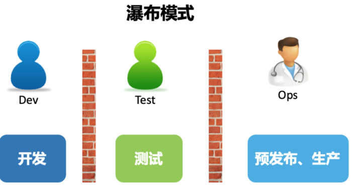
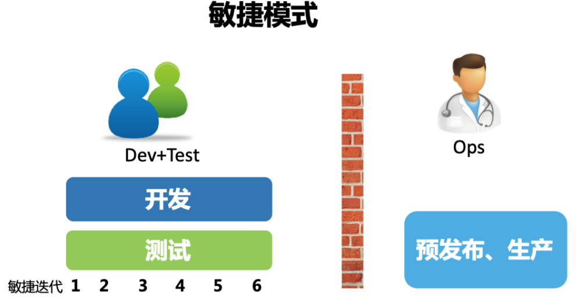
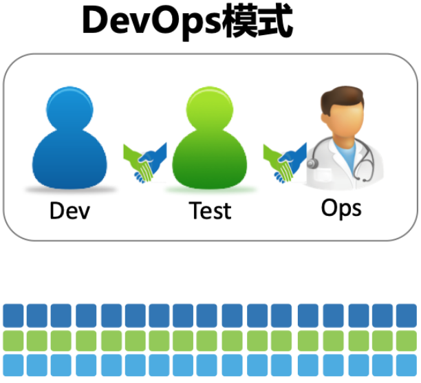
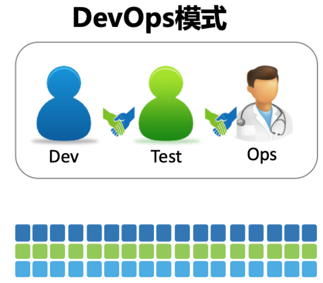
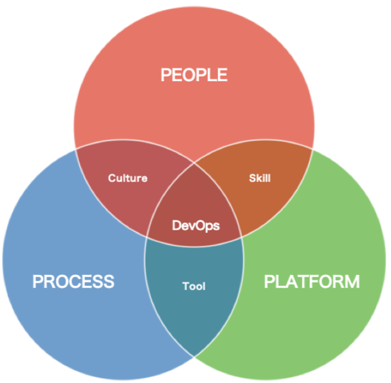

### SRE与DevOps区别于联系

- https://cloud.google.com/blog/products/gcp/sre-vs-devops-competing-standards-or-close-friends
- https://blog.overops.com/devops-vs-sre-whats-the-difference-between-them-and-which-one-are-you/

- The main difference here is that SREs revolves around the concept that operations is a software problem, which led them to define prescriptive ways for measuring availability, uptime, outages, toil, etc.

- SREs also ensure that everyone in the company agrees on how to measure reliability, and what to do when availability falls out of specification. This includes contributors at every level, from developers, through team managers and all the way up to VPs and executives.

---

00>>>>>>

### DevOps

- 如何梳理出一套清晰的 DevOps 理念和完整的知识体系？
- 如何获得一线大厂的实践经验，让 DevOps 真正落地？
- 如何获得一条渐进式的 DevOps 学习曲线，让自己在正确的方向上不断增值？

**敏捷之所以更快，根本原因在于持续迭代和验证节省了大量不必要的浪费和返工**

### **DevOps 是通过平台（Platform）、流程（Process）和人（People）的有机整合，以 C（协作）A（自动化）L（精益）M（度量）S（共享）文化为指引，旨在建立一种可以快速交付价值并且具有持续改进能力的现代化 IT 组织。**

- DevOps要解决的还是软件研发交付能力和业务需求快速多变之间的矛盾
- 无论是精益创业的MVP理论，还是反脆弱中的从不确定中收益的角度来说，企业以可控的成本不断试错，以博取一个无限的收益，已经成为了常态。
- 寻找志同道合的一帮人，达成共识，实现目标，研发，测试，运维的所做所为，这很DevOps
- 以更快更好的构建、测试、发布软件交付价值为目标
- 高效率和高质量是 DevOps 的核心价值，而工具和自动化就是提升效率最直接的手段，让一切都自动化可以说是 DevOps 的行为准则
- **一切软件交付过程中的手动环节，都是未来可以尝试进行优化的方向**。

### DevOps三大支柱

