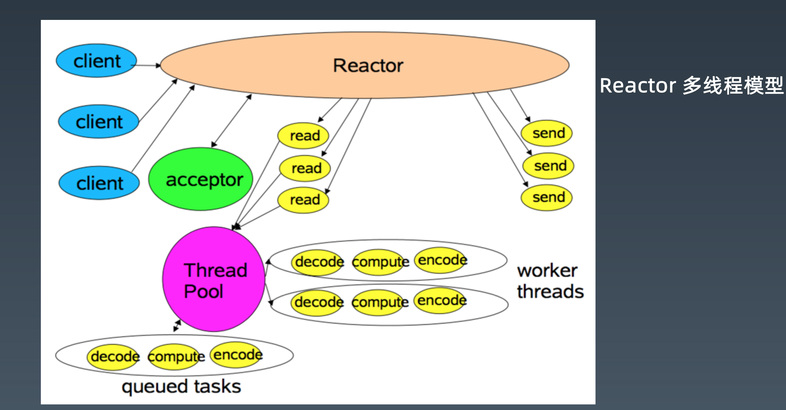

- work group 配置数量默认： cpu数量*2

---

### 工作中问题

1. 问题是否是真的问题还是情绪问题？
2. 技术问题还是管理问题？
3. 技术复杂度还是业务复杂的的问题？

DSL  针对莫一块的东西使用特定的语法实现

网关，负载均衡设计

1. 随机
2. 权重

### 线程和进程趋区别

#### Netty启动与处理流程

#### netty线程模型

#### netty运行原理

- worker数量的配置：cpu核心数*2  

##### 自己实现API网关

- 技术复杂度与业务复杂度
- 概念理清、正确命名
- 组件之前的互相关系
- DSL规则
