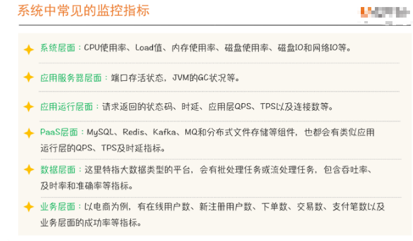
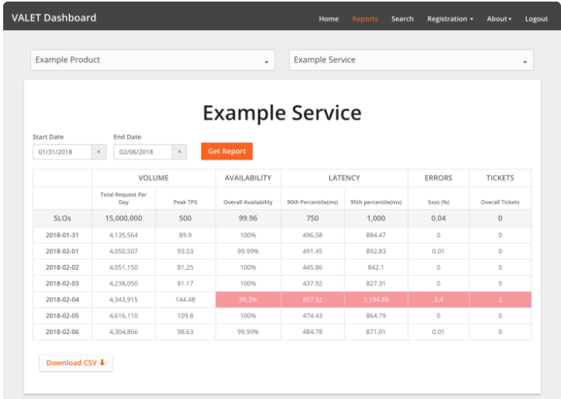
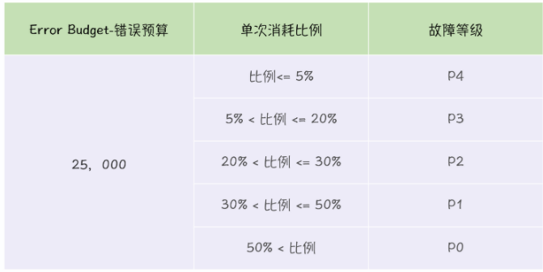

- google sre： https://landing.google.com/sre/workbook/toc/

### 衡量系统可用性

- 时间维度

  - uptime/(uptime+downtime)

  - 是从故障角度出发对系统稳定性进行评估。

    > 衡量指标，比如系统请求状态码
    >
    > 衡量目标，比如非5XX占比，也就是成功率
    >
    > 影响时长，当前问题持续多久。

- 请求维度

  - successful request/total request
  - 是从成功请求占比的角度出发，对系统的稳定性进行评估。

**故障意味着不稳定，但是不稳定，并不意味着一定有故障发生**

### 系统稳定性目标三要素

**成本因素**

**业务容忍度**

**系统当前的稳定性状况**

> 定一个合理的标准比定一个更高的标准会更重要

### SLI

- Service level Indicator 服务等级指标，其实就是我们选择那些指标来衡量我们的稳定性

  

### SLO

- Service level Objective 服务等级目标，指的就是我们设定的稳定性目标

- SLO是SLI要达成的目标。

### 快速识别SLI指标的方法：VALET

> Volume 容量

指服务承诺的最大容量是多少。

> Availability 可用性

代表服务是否正常

> Latency 时延

服务请求的响应是否足够快

> 错误率

> 人工介入

如果一项工作或者任务需要人工介入，那说明一定是抵消或者有问题的。

**基于VALET设计出来的SLI的DashBoard**

### 系统可用性计算方法

**1. 直接根据成功的定义来计算**

- successfull = 状态码非5XX & 时延<=80ms

**2. SLO方式计算**

- SLO1 : 99.95% 状态码成功率
- SLO2 :  90% Latency <= 80ms
- SLO3: 99% Latency <=200ms
- **Availability = SLO1 &SLO2 &SLO3**

### Error Budget

> 落地SLO，先转化为Error Budget

- 直接翻译为错误预算，提示你还有多少次犯错的机会
- **在实际落地实践时，我们通过把SLO转化为错误预算，以此来推进稳定性目标达成。**

**如何应用Error Budget **

1. 稳定性燃尽图，直观形象可以看到还有多少次可以犯错的机会。

2. 故障定级，把错误预算应用在故障定级中。

   

3. 稳定性共识机制，用错误预算来确定稳定性共识机制。

   - 剩余预算充足或未消耗完之前，对问题的发生要有容忍度
   - 剩余预算消耗过快或即将消费完之前，SRE有权中止或拒绝任何线上变更。---此实开发要与SRE指定目标，解决稳定性问题当作首要任务。
   - 保障系统稳定性不时单独某一方就可以完成的，需要多方共同认可并且愿意配合才能真正执行到位。

4. 基于错误预算的告警
   - 相同相似告警，合并后发送，同一个应用集群内同一时间内，同一异常高级，就先合并，对外指发送一条告警。
   - 基于错误预算来做告警，我们指关注对稳定性有影响的告警。

### 如何衡量SLO的有效性

### SLO落地

- 核心链路，设定SLO，大的原则就是先设定核心链路的SLO，然后根据核心链路进行SLO的分解。
  - 核心链路，确定核心应用与强弱依赖关系。
- 