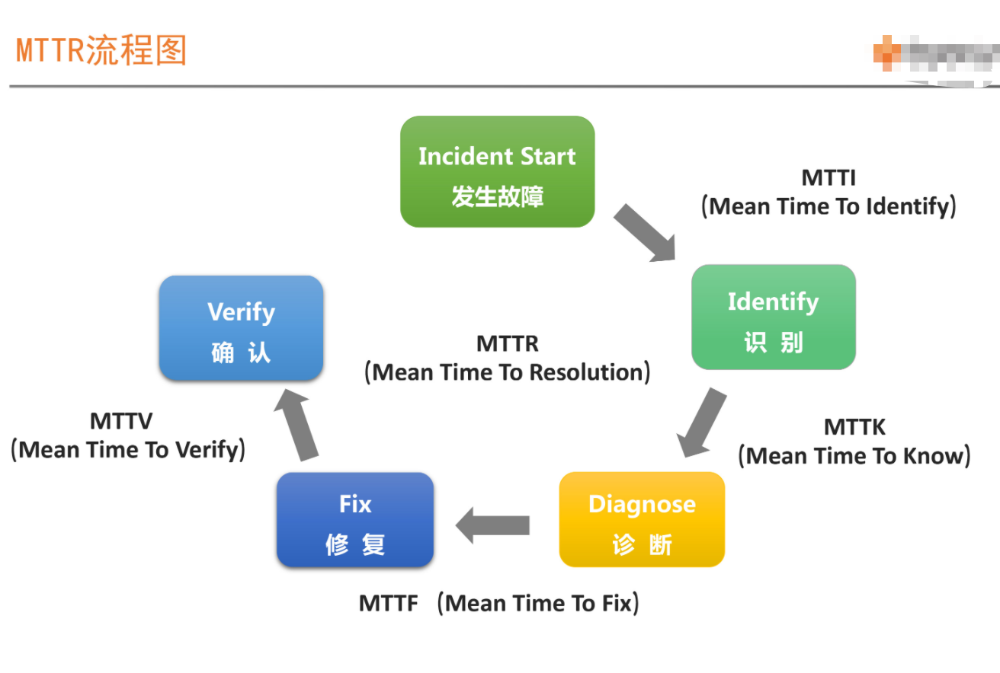
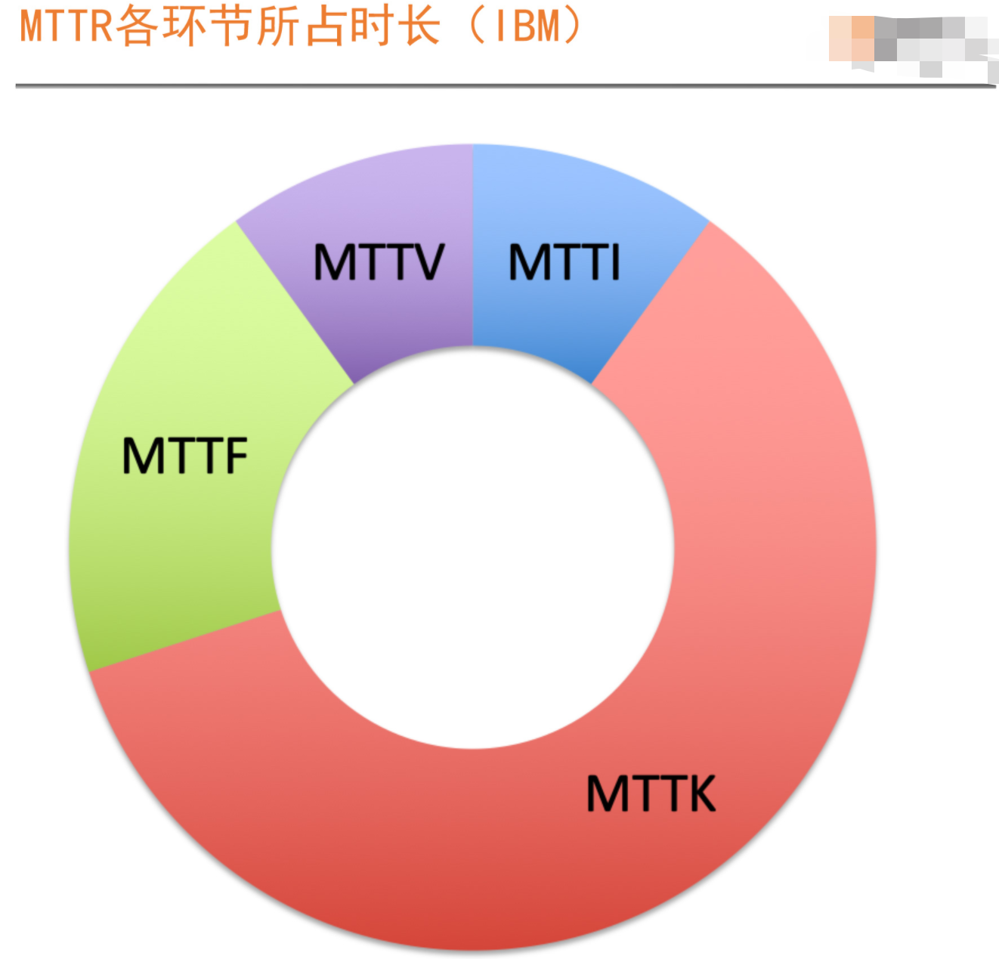
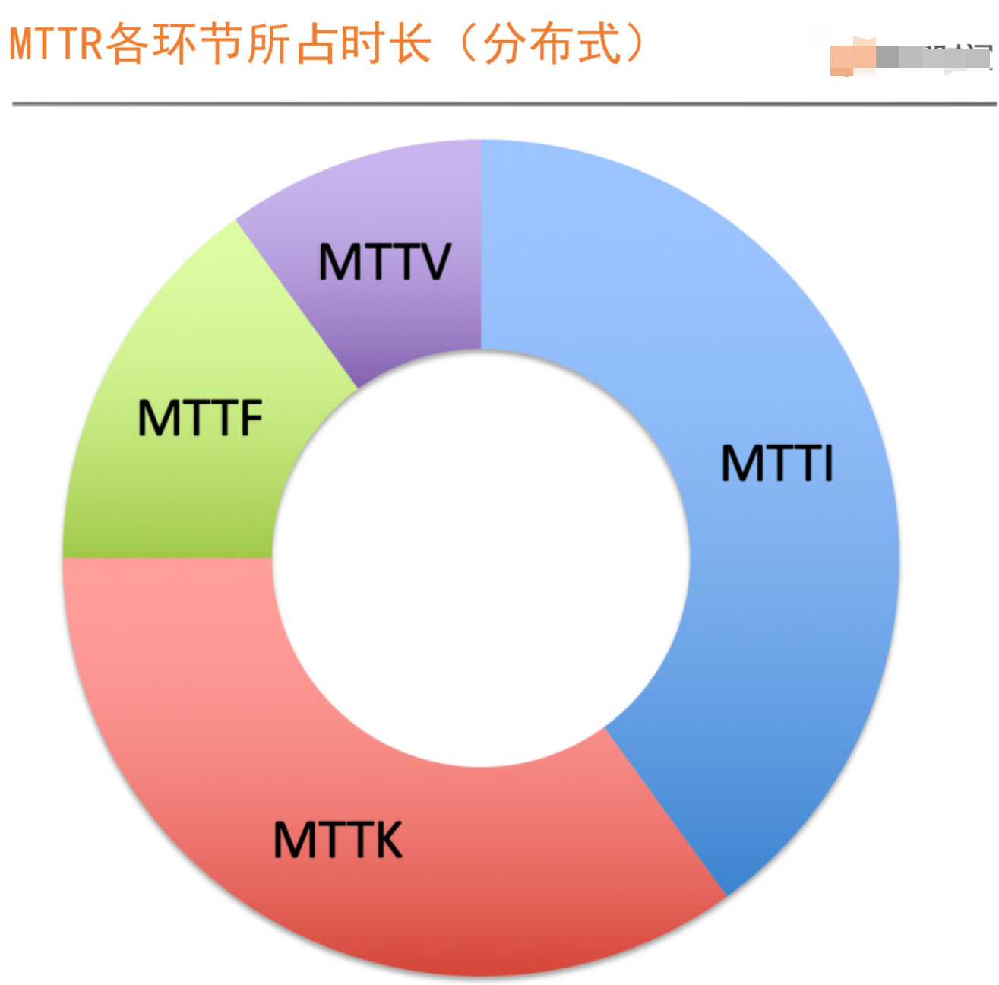
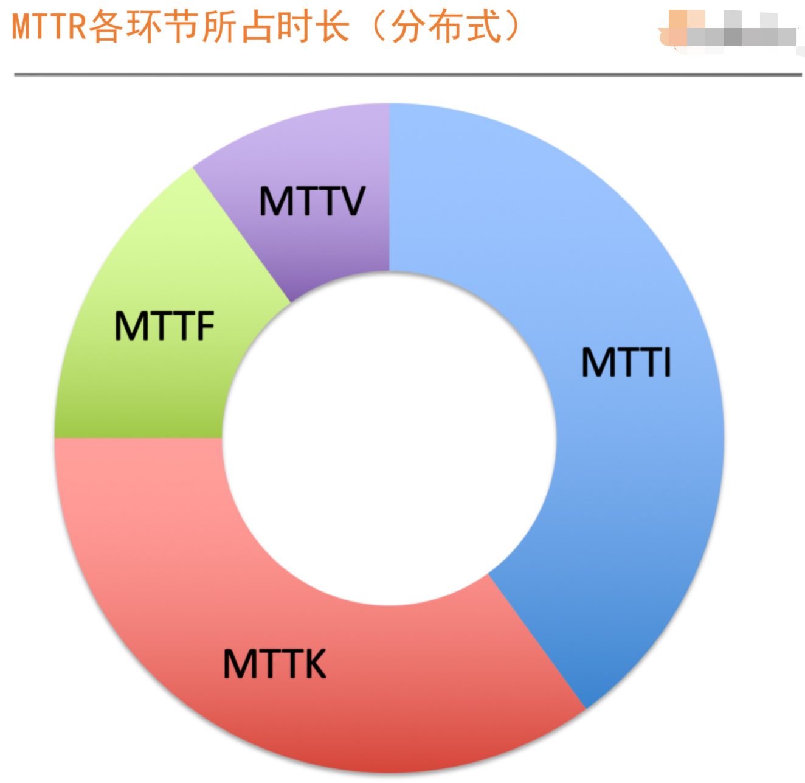
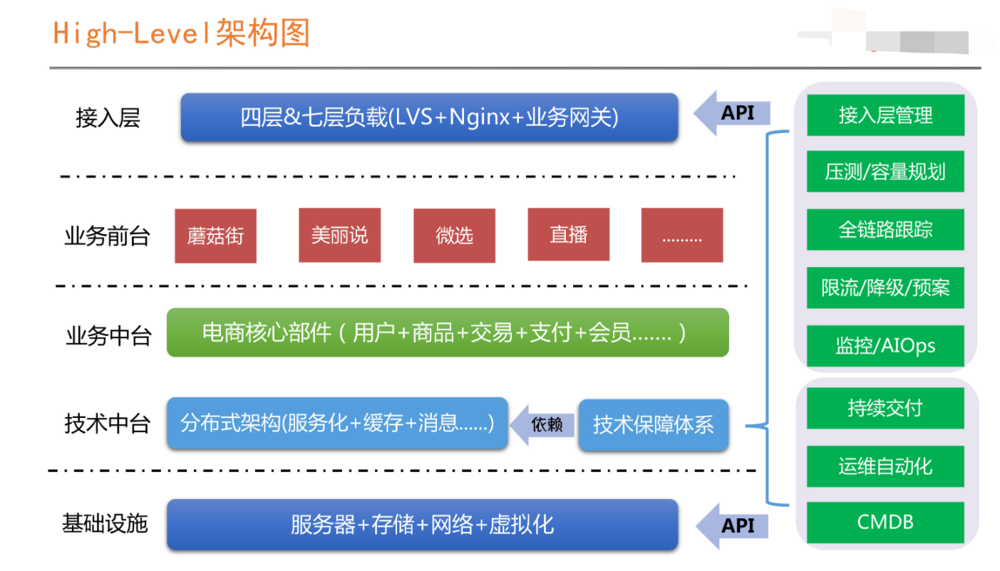
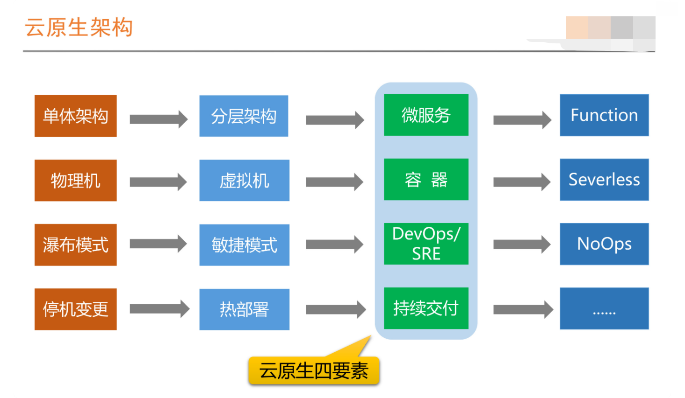
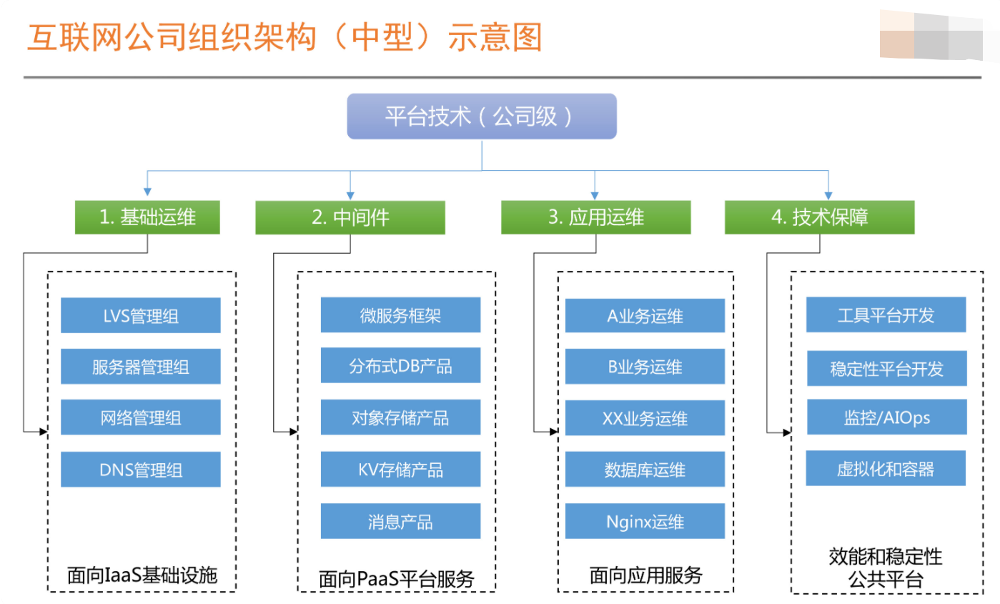

- google sre： https://landing.google.com/sre/workbook/toc/
- MTTR, MTBF, or MTTF? – A Simple Guide To Failure Metrics: https://limblecmms.com/blog/mttr-mtbf-mttf-guide-to-failure-metrics/#

### 衡量系统可用性

- 时间维度

  - uptime/(uptime+downtime)

  - 是从故障角度出发对系统稳定性进行评估。

    > 衡量指标，比如系统请求状态码
    >
    > 衡量目标，比如非5XX占比，也就是成功率
    >
    > 影响时长，当前问题持续多久。

- 请求维度

  - successful request/total request
  - 是从成功请求占比的角度出发，对系统的稳定性进行评估。

**故障意味着不稳定，但是不稳定，并不意味着一定有故障发生**

### 系统稳定性目标三要素

**成本因素**

**业务容忍度**

**系统当前的稳定性状况**

> 定一个合理的标准比定一个更高的标准会更重要

### SLI

- Service level Indicator 服务等级指标，其实就是我们选择那些指标来衡量我们的稳定性

  

### SLO

- Service level Objective 服务等级目标，指的就是我们设定的稳定性目标

- SLO是SLI要达成的目标。

### 快速识别SLI指标的方法：VALET

> Volume 容量

指服务承诺的最大容量是多少。

> Availability 可用性

代表服务是否正常

> Latency 时延

服务请求的响应是否足够快

> 错误率

> 人工介入

如果一项工作或者任务需要人工介入，那说明一定是抵消或者有问题的。

**基于VALET设计出来的SLI的DashBoard**

### 系统可用性计算方法

**1. 直接根据成功的定义来计算**

- successfull = 状态码非5XX & 时延<=80ms

**2. SLO方式计算**

- SLO1 : 99.95% 状态码成功率
- SLO2 :  90% Latency <= 80ms
- SLO3: 99% Latency <=200ms
- **Availability = SLO1 &SLO2 &SLO3**

### Error Budget

> 落地SLO，先转化为Error Budget

- 直接翻译为错误预算，提示你还有多少次犯错的机会
- **在实际落地实践时，我们通过把SLO转化为错误预算，以此来推进稳定性目标达成。**

**如何应用Error Budget **

1. 稳定性燃尽图，直观形象可以看到还有多少次可以犯错的机会。

2. 故障定级，把错误预算应用在故障定级中。

   

3. 稳定性共识机制，用错误预算来确定稳定性共识机制。

   - 剩余预算充足或未消耗完之前，对问题的发生要有容忍度
   - 剩余预算消耗过快或即将消费完之前，SRE有权中止或拒绝任何线上变更。---此实开发要与SRE指定目标，解决稳定性问题当作首要任务。
   - 保障系统稳定性不时单独某一方就可以完成的，需要多方共同认可并且愿意配合才能真正执行到位。

4. 基于错误预算的告警
   - 相同相似告警，合并后发送，同一个应用集群内同一时间内，同一异常高级，就先合并，对外指发送一条告警。
   - 基于错误预算来做告警，我们指关注对稳定性有影响的告警。

### 如何衡量SLO的有效性

### SLO落地

- 核心链路，设定SLO，大的原则就是先设定核心链路的SLO，然后根据核心链路进行SLO的分解。
  - 核心链路，确定核心应用与强弱依赖关系。
- 核心应用之间的依赖关系，我们称之为**强依赖**

### MTTR

### MTTI

这个环节主要有两件事情

1. 判断出现的问题是不是故障。
2. 确定由谁来响应和召集。

### On-Call的流程机制建设

1. 确保关键角色在线。随时应急响应。
2. 素质War Room应急组织。
3. 建立合理的呼叫方式。
   - 熟悉某个系统的最快最好的方式就是参与On-Call，而不是看架构图和代码。
4. 确保资源投入的升级机制。
5. 如果服务有上云，与云厂商联合的On-Call机制。

### 在故障处理过程中采取的所有手段和行动，一切以恢复业务为最高优先级

### Design For Failure

- https://queue-it.com/blog/design-for-failure-developer-perspective/

### 问题处理关键步骤

- 故障隔离手段

  系统设计的时候需要考虑问题，否则到出问题的时候，找不到合适的业务恢复技术手段。

- 关键角色和流程机制

  - 当出现问题时，需要有一个关键角色决策问题处理，分工明确，反馈与通报机制要完善

- 平时故障演练

  1. 总结故障隔离手段，限流与服务降级。
  2. 完善应急流程，提升团队配合和协作的能力。

### 如何建立有效的故障应急响应机制

1. 关键角色分工
   - **Incident Commander**，故障指挥官，曾哥指挥体系的核心，最重要的职责是组织和协调，而不是执行，下面的所有角色都要接受他的指令并严格执行。
   - **Communication Leader**, 沟通引导，负责对内和对外的信息收集及通报。
   - **Operations Leader**，负责指挥或者指导各种故障预案的执行与业务恢复。
   - **Incident Responders**, 简称IR，所有需要参与到故障处理中的各类人员，真正的故障定位和业务恢复执行者。
2. 流程机制
   - 故障发生时，On-Call的SRE或者运维，召集相应的业务开发或者其他必要资源，快速组织WarRoom
   - 如果问题和恢复过程非常明确，由Incident Commander来指挥每个人要做的具体事情，以优先恢复业务优先。
   - 如果问题复杂，影响范围很大，请求更高级别主管介入指挥。
3. 反馈机制
   - 一般以团队为单位，每隔10-15分钟反馈一次，反馈当前的进展以及下一步计划。如果中途有执行操作，实现通报，评估影响，再决策是否执行。
   - 没有进展也是进展，要及时反馈。
   - 除了做好快速恢复业务，信息同步的及时和透明也非常关键，并且有效的安抚促使必须快速执行到位。
   - 以尽量业务化的语言描述，并且要给到对方大致的预期。比如当前正在做什么，需要多久恢复，如果不能评估恢复时间，大约多久反馈一次。

### 故障复盘

> 结合Timeline，按照MTTI，MTTK，MTTF，MTTV做分类，然后对耗时长的环节，反复套路改进，最后定好责任人和时间点，后续持续跟进执行情况。

**故障复盘三个问题**

1. 故障的原因有哪些？
2. 我们做什么，怎么做才能确保下次不会再出现类似故障。---具体的改建建议，针对问题  头脑风暴。
3. 当时如果我们做了什么，可以用最短的时间恢复业务。

**问题改进与判定原则**

1. 健壮性原则
   - 每个部件自身都要具备一定的自愈能力，比如主备，集群，限流，降级与重试。
2. 第三方默认无责
   - 判定改进责任时，分为两部分，对内谁的服务受影响谁改进，并对外推进第三方改进。稳定性一定要做到相对自我可控，不是完全依赖外部。
3. 分段判定原则

> 故障复盘时，不要纠结于故障根烟到底是哪个，而是把更多的注意力放在左哪些事情，可以提升故障处理的效率，缩短业务故障时长。

**故障时系统运行的常态，正常才是特殊的状态**

### 微服务和分布式技术架构图

1. 组织架构与技术架构相匹配。

   技术架构实现组织目标，组织架构服务并促成技术架构的实现。

2. SRE是微服务和分布式架构的产物。

云原生架构

1. 想要引入SRE体系，并做对于国内的组织架构调整，首先要看我们的技术架构是不是在朝着服务化和分布式方向演进。
2. 原有技术团队的组织架构，或者至少是协作模式必须要做出一些变革才可以。

##### 技术保障体系

1. 工具平台

   负责效能工具的研发，比如CMDB,运维自动化，持续交付流水线已经部分技术运营报表的实现，为基础运维和应用运维提供效率平台支持。

2. 稳定性平台团队

   负责稳定性保障相关的标准和平台，比如监控，服务治理相关的限流降级、全链路追踪、容量压测和规划

### SRE = PE(Production Engineer) +平台工具开发+稳定性平台开发

