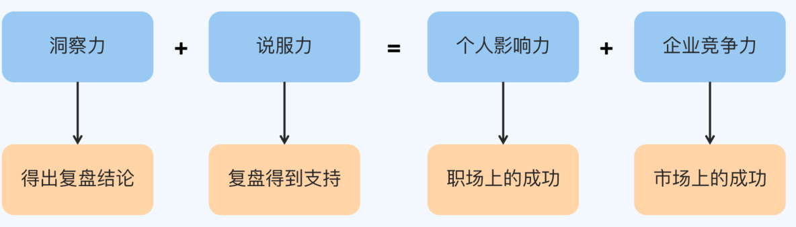

复盘的目的应该是**对未来的优化**。所以，复盘虽然也包括**对过去事实的总结**，但更重要的是**对原因的分析**和对**认知的修正**。  

**第一个问题是**，复盘变成了甩锅和背锅  

**第二个问题是**，不知道怎么得到有价值的复盘结论  

**第三个问题是**，复盘结论得不到别人支持  

**对市场的洞察力和对别人的说服力，才是复盘的核心能力**  ，它们最终也将体现为你个人在职场中的影响力，以及你
的公司在市场上的竞争力。  

