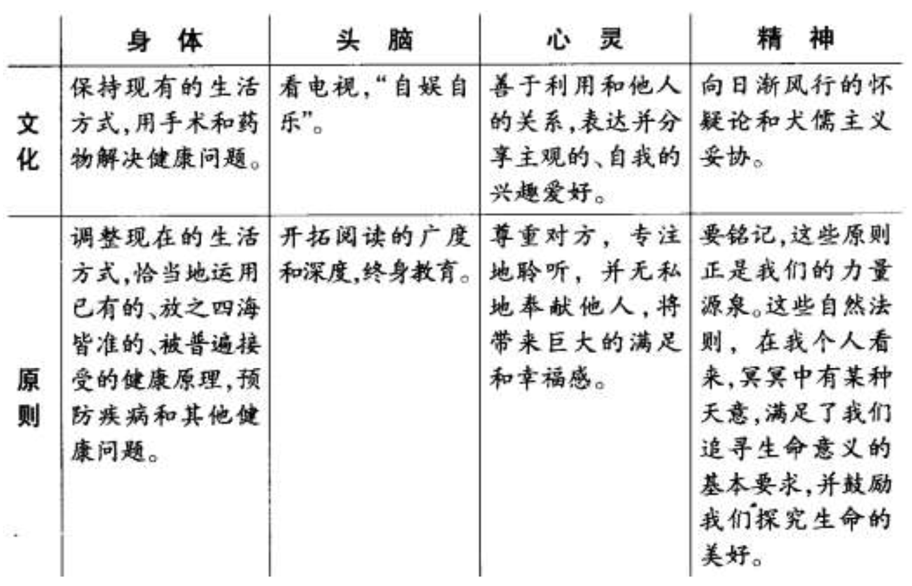
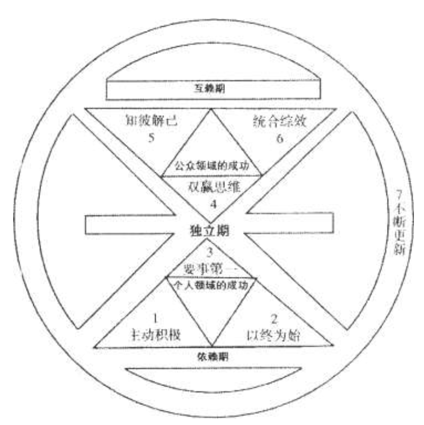

人类面临的最普遍的几种挑战  

### 恐惧感和不安全感  

> 太多的人饱受恐惧感的折磨。他们恐惧将来，恐惧失业，恐惧无力养家。这种弱点，常常助长了一种倾向：无论在工作时，还是回到家中，**都倾向于零风险的生活，并逃避与他人互相依赖和合作**  

### 我现在就想得到  

> 潜在的、持久的、不断上升的成功才是值得称颂的  ;我们的文化以及华尔街引领的一切行业都强烈地要求：今天的结果，今天的成功。但一个不争的事实是，我们**绝对不能无视平衡的原则** ．我们要**平衡现在和将来**两种需要，前者满足今天的需求，后者满足投资并提高竞争力，以取得将来持久成功的需求。**平衡原则同样适用于健康、婚姻、家庭生活以及你所处的社区的需要**  

### 谴责和抱怨  

### 绝望无助  

> 谴责周围人和事的必然结果是变成**犬儒主义**（不要对生活期望过高，这样你就不会对周围的人或事失望  ） ，绝望无助  。历史上那些鼓励人们怀抱希望、励志成长的原则却提倡‚**我就是我生命的创造力**

### 缺乏人生平衡  

> 心灵的平和宁静远非这些技巧所能带来的，而是取决于人们是否明白什么是最重要的事情，是否懂得轻重缓急，并能抓住生活的重点。客观地面对现实  

### 我的定位在哪儿  

### 渴望理解  

### 冲突和分歧

### 个人的停滞不前

> 人的本质是四维的——身体、精神、智力、社会，情感  

**只学不做等于没学，只知不做也等于无知**

- 当你不再介意别人怎样看你时，反而会去**关心别人对他们自身、他们所处环境以及与你关系**的看法。你不再让别人影响情绪，反而更能接受改变，因为你发现有一些恒久不变的内在本质，可以作为支柱  
- **得之太易者必不受珍惜。唯有付出代价，万物始有价值**  

### 7个习惯

1. 积极主动（be proactive）

   > 主动积极即采取主动，为自己过去、现在及未来的行为负责，并依据原则及价值观，而非情绪或外在环境来下决定。主动积极的人是改变的催生者，他们扬弃被动的受害者的角色，不怨怼别人，发挥了人类四项独特的秉赋——**自觉、良知、想象力和自主意志**，同时以由内而外的方式来创造改变，积极面对一切。他们选择创造自己的生命，这也是每个人最基本的决定  

2. 以终为始  (begin with the end in mind)

   > 所有事物都经过两次的创造——**先是在脑海里酝酿，其次才是实质的创造**。个人、 家庭、团队和组织在做任何计划时，均先拟出愿景和目标，并据此塑造未来，全心投注于自己最重视的原则、价值观、关系及目标之上。对个人、家庭或组织而言，使命宣言可以说是愿景的最高形式，它是主要的决策，主宰了所有其他的决定。**领导工作的核心，就是在共有的使命、愿景和价值观之后，创造出一个文化**  

3. 要事第一（put first things first ）

   > 要事第一即**实质的创造，是梦想（你的目标、愿景、价值观及要事处理顺序）的组织与实践**。次要的事不必摆在第一，要事也不能放在第二。无论迫切性如何，个人与组织均针对要事而来，重点是，把要事放在第一位  

4. 双赢思维（think win）

   > 双赢思维是一种基于互敬，寻求互惠的思考框架与心意，目的是**更丰盛的机会、财富及资源，而非敌对式竞争**。双赢即非损人利已（赢输），亦非损已利人（输赢）。我们的工作伙伴及家庭成员要从互赖式的角度来思考（“我们”，而非“我”）。双赢思维鼓励我们解决问题，**并协助个人找到互惠的解决方法，是一种资讯、力量、认可及报酬的分享**  

5. 知己知彼（seek  first to understand ，then to be understood）

   > 当我们舍弃回答心，改以了解心去聆听别人，便能开启真正的沟通，增进彼此关系。对方获得了解后，会觉得受到尊重与认可，进而卸下心防，坦然而谈，双方对彼此的了解也就更流畅自然。知彼需要仁慈心，解己需要勇气，能平衡两者，则可大幅提升沟通的效率。  

6. 统合综效

   > 统合综效谈的是创造第三种选择 ——即非按照我的方式，亦非遵循你的方式，而是第三种远胜过个人之见的方法。它是互相尊重的成果 ——不但是了解彼此，**甚至是称许彼此的差异，欣赏对方解决问题及掌握机会的手法**。个人的力量是团队和家庭统合综效的利基，能使整体获得一加一大于二的成效。**实践统合综效的人际关系和团队会扬弃敌对的态度**（ 1+1=1/2），不以妥协为目标（ 1+1=3/2），也不仅止于合作（ 1+1=2），他们要的是创造式的合作（ 1+1>2）  

7. 不断更新（sharpen the saw）

   > 如何在四个基本生活面向（**身体、精神、智力、社会/情感**）中，不断更新自己。这个习惯提升了其他六个习惯的实施效率。对组织而言，习惯提供了愿景、更新及不断的改善，使组织不至呈现老化及疲态，并迈向新的成长之径。对家庭而言，习惯七透过固定的个人及家庭活动，使家庭效能升级，就像建立传统，使家族日新月异  

