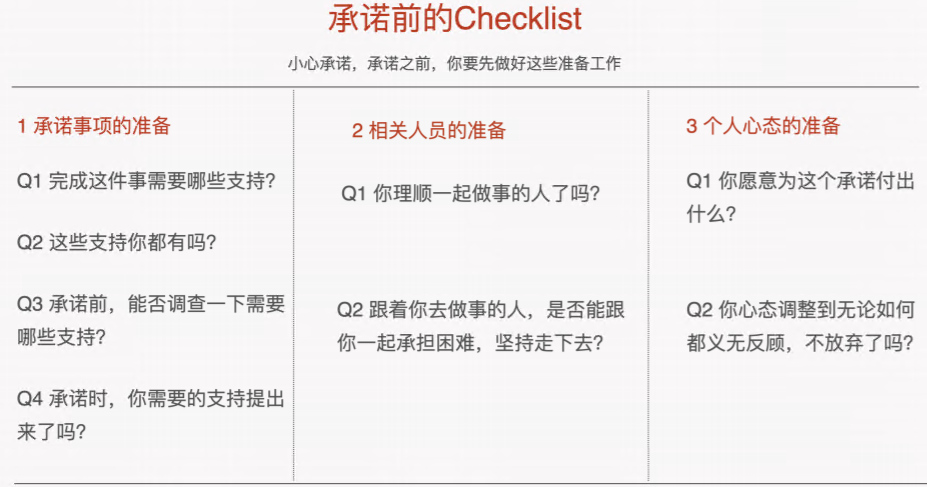
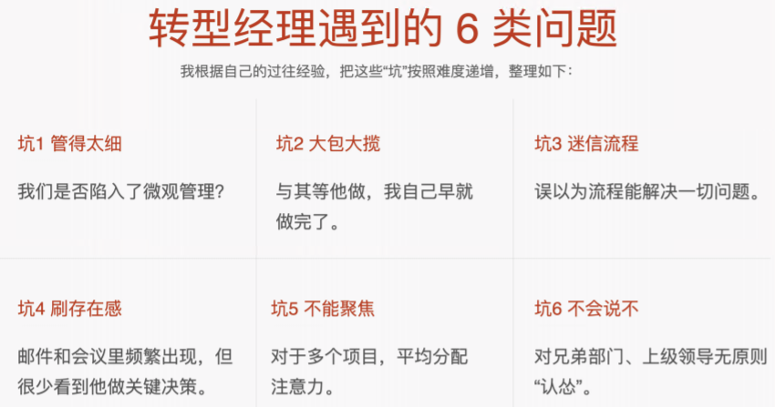

### 技术管理有效的学习方式

- 实战中自己反思与总结
- 一对一分享经验

### 遇到问题解决方案

- 想好对策
  - 问题记录
  - 总结
  - 复盘，提升优化自己的管理能力
- 调整心态
  - 控制情绪，直面困难
- 理顺思路
- 求助上级

> 管理就是通过培养人来做成事。交付业务价值，培养人。
>
> 管理更多时一份沉甸甸的责任，你的决策，情商，逆商很多程度决定了你的团队和团队成员的发展。想法脾气的时候你要忍，遇到困难想放弃的时候你要坚持。

### 领导力的层次

##### 不得不听你的

##### 认同你的观点

##### 跟着你能做出成绩

##### 跟着你能提升个人综合能力

##### 你已经成为时代的楷模

>知道再多，没有实际经验，都是白搭

> 什么时候使用经理权？业务拖不起的时候。

###  假民主

- 负责人已经明确表露出意向，然后还征询意见。
- 会消耗领导值的公信力。

### 真独裁

### 经理权

- 要么不用，要用必须落实它。

- 慎用经理权

  - 人员离职的风险，员工可以接受偶尔使用经理权，如果你经常使用，有想法的人一定会离开。
  - 个人地位的风险，万一你难得使用一次经理权，还把事情搞砸了，组织威信不再。

  ---

  1. 把握关键人物的态度。
     - 一对一沟通和开小会方式沟通，取的支持或者听取意见。
  2. 持续跟进进度。
     - 跟踪进度。
     - 看执行细节。

- 权力是公器，不到万不得已最好不要使用，一旦使用了，就必须保证他能够成功。使用的时候，做好希望，做最坏的准备，跟进到结果出来为止，权力使用才算是真正完成。

### 合格经 理人应有的 4 个待人处事原则

- ##### 待人真诚

怎样的行动才会真正地体现出待人真诚呢？具体来说，**如果一件事我没有办法说服我自己，我是不会试图去说服你**

- ##### 雪中送炭

**不以别人位高权重而阿谀奉承，不以别人落魄潦倒而让关系疏远**。

- **小心承诺**

- **意志坚定**

**事情本身的难度：**一个技术难题解决不了，于是你要承受很大的交付压力。 

**应对压力的难度**：和人相处不顺利，甚至是委屈，你要承受很大的精神压力。 

**稳住团队的难度**：如果你放弃了，你的队伍很可能也会垮，怎么办？

**取得协同的难度**：完成承诺的事情依赖外部协同，缺少资源（人手、资金）是肯定不行 的。

-> 对策

1. 对于事情本身的难度，想好对策；
2. 面对压力，调整好心态
3. 理顺思路，稳住团队
4. 求助上级，取的帮助

### 提高组织效率

- #### 选择做正确的事情

  正确的事情就是在做决策的那个时刻，管理者所能选择的可以最大化交付业务价值的事情

- #### 确定合适的技术方案

  技术方案是否始终聚焦在最开始的那个问题上，不要打移动靶，而是要聚焦。尽量减少依赖，不要轻易扩大问题范围，总之就是减少变量数目。

- #### 激励好员工

  第一给高级别技术人员授权并且给决定权

  第二给 高潜质员工更高的标准和火线提拔的机会

  第三要淘汰组织内业绩和潜力差的员工。

很多事情看上去有很多表现，其实根子里都是**信任问题**

**无论碰到什么事情，切忌冲动，一冲动你就输了，而且 会坏事。**

### 冲动是魔鬼，不管碰到什么事情，都不要冲动，一定要控制好自己的情绪

- ##### 想要维护个人面子

保证自己的情绪不失控，再有理**有据地反驳**。做反驳也是有诀窍的，你的**态度要 好，但话要重**。

- 有理有据反驳
- 抓住对方的逻辑漏洞

你可以注意分析对方的话是不是在技术上没有问题，但是在待人处事上有问 题？比如：你要判定，对方是说你的技术决定有问题，还是在怀疑你的动机有问题。同时 你还要看对方的话是不是扩大了打击范围？ 

举个简单的例子，你可以说我有问题，但是你不可以说上海的经理有问题，你不可以 说中国的团队有问题。 

最后，就算吵了架也不应该因为这个而辞职，你辞职了你团队的成员怎么办？作为一个负 责任的经理，你既要敢于说真话，敢于为团队争取资源，又不能把事情搞砸，我们不能做 悲剧英雄。

##### **急于干出成绩**

没拿到下属的真实反馈

表扬和批评的场合不对

