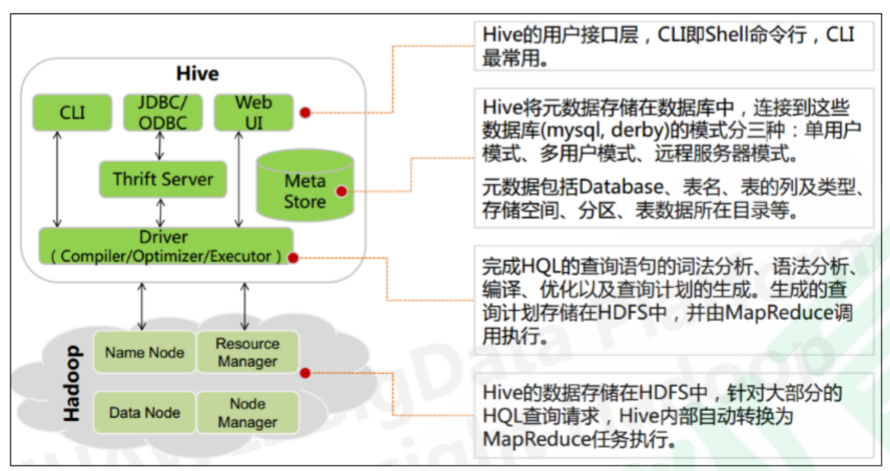

Hive

一、Hive的介绍
（一）Hive的概念

- Hive 由 Facebook 实现并开源
- 基于 Hadoop 的一个数据仓库工具
- 可以将结构化的数据 映射 为一张数据库表，
- 并提供 HQL(Hive SQL)查询功能，
- 底层数据是存储在 HDFS 上。
- Hive 的本质是将 SQL 语句转换为 MapReduce 任务运行，
- 使不熟悉 MapReduce 的用户很方便地利 用 HQL 处理和计算 HDFS 上的结构化的数据，适用于离线的批量数据计算

select count(*) from student;

基于 Hadoop 的一个数据仓库工具:
    ①基于hadoop ②数据仓库 data warehouse
    数据仓库之父比尔·恩门（Bill Inmon）在 1991 年出版的“Building the Data Warehouse”（《建 立数据仓库》）一书中所提出的定义被广泛接受——数据仓库（Data Warehouse）是一个面 **向主题的** （Subject Oriented）、**集成的**（Integrated）、**相对稳定的**（Non-Volatile）、**反映历史 变化**（Time Variant）的数据集合，用于支持管理决策(Decision Making Support)。

    student.txt 
    最终目的：用于支持管理决策(Decision Making Support)

大数据的发展：
    1、历史数据
    2、预测未来

基于 Hadoop 的一个数据仓库工具
    ①HDFS为hive存储数据
    ②MapReduce为hive提供了计算引擎
    ③YARN为hive提供了资源调度

    hive可以将结构化的数据映射成一张数据库表
    
    二维：通过两个条件就能够唯一确定值

并提供 HQL(Hive SQL)查询功能：

底层数据是存储在 HDFS 上

OLAP：Online Analytical Processing  联机分析处理 （查询）

OLTP：Online Transaction Processing 联机事务处理 （增删改）

Hive 的本质是将 SQL 语句转换为 MapReduce 任务运行
    select count(distinct department) from student;

    select * from student;

使不熟悉 MapReduce 的用户很方便地利 用 HQL 处理和计算 HDFS 上的结构化的数据，适用于离线的批量数据计算

Hive依赖于HDFS存储数据，Hive将HQL转换成MapReduce执行。
select、 from 、 join、 group by

（二）为什么使用Hive
直接使用 MapReduce 所面临的问题：  

- 人员学习成本太高  
- 项目周期要求太短  
- MapReduce 实现复杂查询逻辑开发难度太大 

为什么要使用 Hive：  

- 更友好的接口：操作接口采用类 SQL 的语法，提供快速开发的能力  
- 更低的学习成本：避免了写 MapReduce，减少开发人员的学习成本  
- 更好的扩展性：可自由扩展集群规模而无需重启服务，还支持用户自定义函数 

（三）Hive的特点
Hive是一个工具，不是一个分布式的集群，让用户编写sql语句，帮sql语句翻译成MapReduce，然后提交到hadoop集群。
优点：课件中
缺点：
1、Hive 不支持记录级别的增删改操作，但是用户可以通过查询生成新表或者将查询结果导入到文件中 
2、Hive 的查询延时严重，因为 MapReduce的启动过程消耗很长时间，所以不能用在交互查询系统 中。 
3、Hive 不支持事务

数据仓库  数据库 

Hbase 不是行存储的，是列存储的。

NoSQL：no sql ， not only sql 

小总结：Hive 具有 SQL 数据库的外表，但应用场景完全不同，Hive 只适合用来做海量离线数 据统 计分析，也就是数据仓库。 

下面提出一个问题：
    mysql当中sql语句存在优化，
    优化hql语句能不能使用优化sql语句的技能？-------不能。
     **sql的执行引擎是关系型数据库的执行引擎，hql的执行引擎是MR**

（四）Hive的架构

1. 用户接口
   CLI
   JDBC或者说ODBC
   Web UI

2. Thrift Server
   跨语言的服务

3. 元数据存储

from后面的表名称和MapReduce的程序的输入文件对应
select后面的字段跟文件当中的按照某个特定的分割符分割出来的对应位置上的值对应起来。

域

第一个是表名和文件的对应关系
第二个是字段名和对应的域值的关系

描述数据的数据

元数据的存储介质：RDBMS

select count(distinct department) from student;

4. Driver：编译器（Compiler），优化器（Optimizer），执行器（Executor） 
   **解释器、编译器、优化器、执行器**

​    底层就是：hdfs + MapReduce + YARN 

5. 执行流程 
   
       HiveQL 通过命令行或者客户端提交，经过 Compiler 编译器，运用 MetaStore 中的元数 据进行类 型检测和语法分析，生成一个逻辑方案(Logical Plan)，然后通过的优化处理，产生 一个 MapReduce 任务 

（五）Hive的存储数据模型
    数据库、 数据表 、 分区和分桶、表数据

    库 + 表 + 分区 ： 对应到HDFS上面的一个目录
    分桶 + 表数据： HDFS上面的一个文件
    
    数据存储系统： 数据库 + 数据仓库 
    
    数据库（写模式）:支持CRUD，存储的数据量相对较少
    数据仓库（读模式）：支持查询
    
    模式问题：
    1、读模式 schema on read
    2、写模式 schema on write
    
    在关系型数据库当中的事务操作，如果事务操作不符合数据库表的规范。那么在做这个操作的时候，就会给你做检测，如果不符合规范，执行引擎给你抛出错误。
    在数据仓库当中的场景中，hive的引擎在添加的时候不会进行校验是否符合规范。
    
    hive会在数据读的时候进行校验，如果没有通过，就会给你排除错误。
    
    数据模式：文件
    
    derby数据库
    
    Hive 中的表分为内部表、外部表、分区表和 Bucket 表
    
    内部表、外部表：
    
    分区表和 Bucket 表
        默认的数据仓库的存储目录：/user/hive/warehouse
    假设创建一个myhive数据库：
        myhive数据库对应HDFS上面的目录：/user/hive/warehouse/myhive.db
    假设在myhive库下创建一个表student
        表对应的hdfs上面的目录：/user/hive/warehouse/myhive.db/student/
    放数据进去：
        load data local input "/home/data/student.txt" into table student;
    数据加载进去之后：
        /user/hive/warehouse/myhive.db/student/student.txt
    
    分区表：
        1、概念：对表的一种细化管理
        2、分区就是对应HDFS上面的一个目录
    
    student_ptn
        分区一：sex = M
        这个分区表对应的目录是：
            /user/hive/warehouse/myhive.db/student_ptn/sex=M/
    
        分区二：sex = F
        这个分区表对应的目录是：
            /user/hive/warehouse/myhive.db/student_ptn/sex=F/
    
        /user/hive/warehouse/myhive.db/student_ptn/student.txt 看不见
    
        往分区表当中导入数据：
            load data local input "/home/data/student.txt" into table student_ptn partition(sex=M);
        上面这个导入之后对应的HDFS上面的文件位置：
            /user/hive/warehouse/myhive.db/student_ptn/sex=M/student.txt

​            
    分桶表：
        student_bucket
        分桶数据：对应的HDFS上面的某个目录下面的一个文件
        HashPartitioner：
            key的哈希值 模除以 分区的个数 
        字段的哈希值 模除以 分桶的个数

        同一个值的hash值一定是一样的。
    
        1、如果一个字段的某个值，在一个分桶当中，那么所有的改字段的值的所有记录都在这个分桶表中。
        hello,1
        hello,1
        world,1
        2、某些分桶中有可能有多个字段的值，也有可能没有。
        桶1：hello 桶2；world
        桶1：hello world 桶2；null 空的
        桶1：null 空的桶2；hello world
    
    内部表和外部表区别：
        删除内部表，删除了元数据和真实的数据
        删除外部表，删除的是元数据，真实数据还存储。

1. Hive 的存储结构包括数据库、表、视图、分区和表数据等。数据库，表，分区等等都对 应 HDFS 上
   的一个目录。表数据对应 HDFS 对应目录下的文件。
2. Hive 中所有的数据都存储在 HDFS 中，没有专门的数据存储格式，因为 Hive 是读模式 （Schema
   On Read） ，可支持 TextFile，SequenceFile，RCFile 或者自定义格式等
3. 只需要在创建表的时候告诉 Hive 数据中的列分隔符和行分隔符，Hive 就可以解析数据
   Hive 的默认列分隔符：控制符 **Ctrl + A，\x01**
   Hive 的默认行分隔符：换行符 \n
4. Hive 中包含以下数据模型：
   database：在 HDFS 中表现为${hive.metastore.warehouse.dir}目录下一个文件夹
   table：在 HDFS 中表现所属 database 目录下一个文件夹
   external table：与 table 类似，不过其数据存放位置可以指定任意 HDFS 目录路径
   partition：在 HDFS 中表现为 table 目录下的子目录
   bucket：在 HDFS 中表现为同一个表目录或者分区目录下根据某个字段的值进行 hash 散列之后的
   多个文件
   view：与传统数据库类似，只读，基于基本表创建
5. Hive 的元数据存储在 RDBMS 中，除元数据外的其它所有数据都基于 HDFS 存储。
   默认情况下，Hive 元数据保存在内嵌的 Derby 数据库中，只能允许一个会话连接，只适合简单的
   测试。实际生产环境中不适用，为了支持多用户会话，则需要一个独立的元数据库，使用 MySQL 作为
   元数据库，Hive 内部对 MySQL 提供了很好的支持。
6. Hive 中的表分为内部表、外部表、分区表和 Bucket 表  

二、Hive的安装与注意事项
提前安装好了
你在直播间扣3
没有安装好的扣4

Hive的安装

三、Hive的基本使用
现场演示完成。